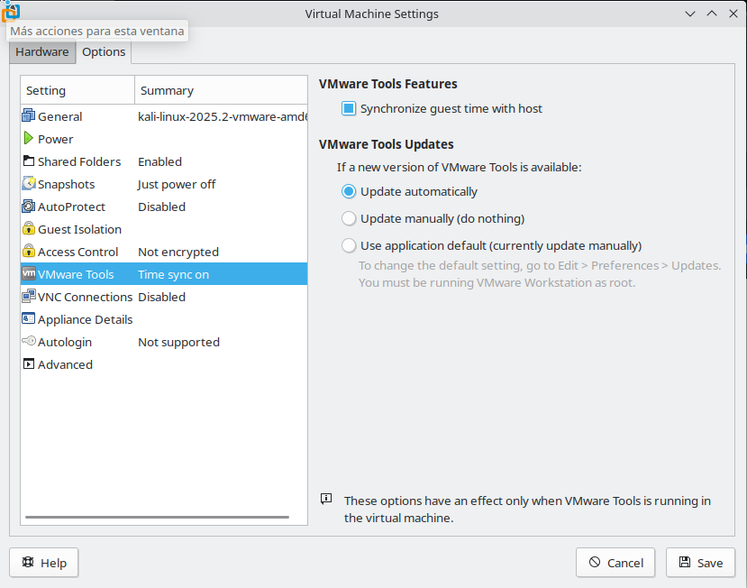
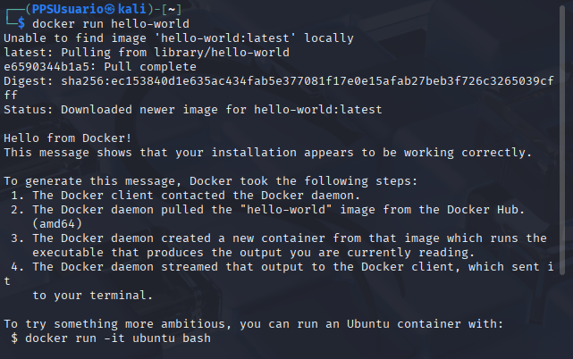

# Actividad Unidad 0 - Creación de Máquina Virtual de Kali

Para realizar las actividades, siempre que podamos, vamos a utilizar una máquina virtual de Kali Linux.

El uso de la máquina virtual nos permite:

- Aislar, en cierto modo, el entorno de pruebas, de nuestra máquina anfitriona.
- Tener un entorno común, esto facilitará que todos tengamos un único entorno y será más fácil identificar los problemas que podamos tener, ya que nos deberían de surgir a todos.
- La MV es independiente de la plataforma, por lo que debería de funcionar igual en Sistemas Operativos Linux y Windows.

Los vídeos de ayuda a la resolución de actividades, estarán realizados en dicha máquina, por lo que si el alumnado utiliza otro medio/Sistema Operativo, será más difícil la detección y solución de problemas y errores.

Tenemos a nuestra disposición imágenes de `Kali` para diferentes Hypervisores. He decidido utilizar la herramienta `VMware` para la virtualización, por lo que se aconseja utilizarla también.

Por último, realizaremos varias labores de administración en nuestra máquina virtual para actualizarla e instalar `Docker`, ya que lo necesitaremos en la siguiente actividad.

**Índice**

[Objetivos](#objetivos)

[Resultados de aprendizaje y Criterios de Evaluación](#resultados-de-aprendizaje-y-criterios-de-evaluación)

[Desarrollo](#desarrollo)

[Entrega](#entrega)

---

# Objetivos

- Ser capaz de intalar `VMWare Workstation` en nuestra máquina anfitriona.
- Crear Máquina Virtual de `Kali Linux` en `VMware Workstation`.
- Conocer cómo realizamos la instalación de `Docker` en `Linux`.

--- 

# Resultados de aprendizaje y Criterios de Evaluación

Esta actividad se relaciona con el resultado de aprendizaje y criterio de evaluación RA5b y RA5d.
---

# Desarrollo

## Descarga de la imagen de la MV de Kali Linux

Desde la página oficial de Kali [https://www.kali.org](https://www.kali.org/get-kali/#kali-virtual-machines) tenemos disponibles imágenes preparadas para diferentes hypervisores.
Como he comentado antes, yo voy a utilizar el hypervisor `VMware`. Si eres usuario avanzado, utiliza el que quieras, si no lo eres tanto, te aconsejo utilizar el mismo que yo.

> 

Se descarga un archivo comprimido, deberás descomprimirlo.

## Descarga de VMware Workstation

- Registrarte en Broadcom.com para poder acceder al área de descargas: <https://profile.broadcom.com/web/registration>.

> En la actualidad, `VMware` pertenece a `Broadcom` por lo que hay que **crear una cuenta**, **acceder al área de `Descargas`** y una vez allí ir al sección de `Free Software Downloads`.
>
> 
>
> Una vez allí buscamos el producto `VMware Workstatio Pro`. Debería estar en  [este enlace](https://support.broadcom.com/group/ecx/productdownloads?subfamily=VMware%20Workstation%20Pro&freeDownloads=true).
> Para que te deje descargar deberas ** hacer click en el enlace de las condiciones de Licencia** y **aceptar las condiciones de uso**.
> 
>
> Al pinchar el enlace comenzará la descarga.


## Instalación de VMware Workstation en Windows

Sencillo, tan sólo hacer doble clik sobre archivo descargado.

## Instalación de VMware Workstation en Linux

Nos situamos en el directorio donde hemos descargado el instalador, damos permiso de ejecución al archivo descargado, actualizamos las listas de repositorios, instalamos paquetes necesarios, y por último ejecutamos el instalador.


```bash
sudo chmod +x VMware-Player-*.bundle
sudo apt update
sudo apt install gcc build-essential linux-headers-$(uname -r)
sudo ./VMware-Player-*.bundle
```

## Creación de la máquina virtual de Kali

Hasta el momento hemos:

- Descargado la imagen de la MV de `Kali Linux`.
- Instalado en nuestro equipo el hypervisor `VMware Workstation`

Tenemos ya lo necesario para crear la máquína virtual.

1. Abrimos `VMware Workstation`.
2. Pulsamos el icono de "Open a Virtual Machine". También lo tenemos accesible desde el menú `File` opción `Open`.
3. Se nos abrirá el navegador de archivos y le indicamos el archivo con extensión `.vmx` que estará ubicado en la carpeta de la imagen que __hemos descomprimido__. 


4. Después del tiempo necesario para la creación de la máquina, la tendremos disponible.

Lo primero, para acceder a `Kali` utilizamos el *usuario+ **kali** con *contraseña* **kali**.


## Instalación de VMTools y cambio en configuración.

1. Comprobamos que en el proceso de creación de la MV se ha instalado el paquete `VMtools`.

    ```bash
    sudo apt-get install open-vm-tools-desktop fuse

    ```

Esta utilidad nos permite cortar y pegar entre anfitrión e invitado, arrastrar archivos, etc...


1. Podemos modificar las características de la MV desde el Menú `VM/Settings` o bien desde la opción `Settings` que se nos abre al pulsar con botón derecho en la MV.
    

    > Como vemos, por defecto se nos crea una máquina con 2 GB de RAM y 80 GB de disco duro. Desde esté menú podemos cambiar estas características.  
    > Puedes probar a subir la RAM si tu equipo tiene más de 8 GB. No te aconsejo subirlo, como norma general a más del 50 % de tus recursos.  
    > También podemos indicarle en el apartado de `VMware Tools` que se mantenga siempre actualizado y que se sincronice la hora con la máquina anfitriona.  

     


## Primeros pasos

Vamos a hacer algunas modificaciones en nuestra distribución:

1. Cambiar idioma:  
    Abrimos un terminal `CTRL + ALT + T`  
    Introducimos el siguiente comando:
!!!OJO¡¡¡ como el teclado está en Inglés los símbolos de puntuación no se corresponden con los del Tecaldo en Españos.
Para usar el guión medio `-`utilizamos la tecla de la comilla ' (a la derecha del 0 y encima de la P). Para usar la barra invertida `/` usamos la tecla guión `-` debajo de la tecla `ñ`
    ```bash
    sudo dpkg-reconfigure locales
    ```
  

  Vamos abajo de la lista y vemos que está seleccionado `en_US.UTF-8 UTF-8`. Lo desmarcamos pulsando **el Espaciado** y bajamos hasta **es_ES.UTF-8 UTF-8** y lo seleccionamos.  
  En la siguiente pantalla nos indica que si queremos cambiar el idioma del sistema, y le indicamos también que queremos **es_ES.UTF-8**. 

1. Crear un usuario nuevo. Así podemos dejar de utilizar el usuario y contraseña por defecto.
> **IMPORTANTE** Debes de crear un usuario con tu nombre para que quede acreditada la autoría de las actividades, por lo que cambia **PPSUsuario** por **PPSTuNombre** en los siguientes comandos:  
    ```bash
    sudo adduser PPSUsuario
    ```  
    Introducimos la contraseña y los datos del nuevo usuario. Antes nos pedirá la contraseña del usuario `kali`.  

    Añadimos el usuario nuevo a los grupos `sudo` y `adm`

    ```bash
    sudo adduser PPSUsuario adm
    sudo adduser PPSUsuario sudo
    ```
      
    Comprobamos si todo está correcto cambiándonos a ese usuario:  

    ```bash
    su PPSUsuario
    ```

1. Después de comprobar que funciona tu usuario y que te permite hacer operaciones como superusuario, reiniciamos el equipo.
1. Y eliminamos el usuario por defecto:
    ```bash
    sudo deluser kali
    ```
> Igual es buena idea crear otro usuario de respaldo por si en algún momento hay problemas con el usuario creado.1. Sincronizar Mv con hola local:
    ```bash
    sudo ln -sfn /usr/share/zoneinfo/Europe/Madrid /etc/localtime
    ``

1. Cambiar distribución del teclado:  

    ```bash 
    sudo dpkg-reconfigure keyboard-configuration
    ```
    Dejamos la primera pantalla como está (Teclado 105 taclas)


    En la segunda panatalla, si nos aparece distribusicón `English (US)`nos vamos a `Others`


    

    Y seleccionamos `Spanish`y luego otra vez `Spanish`  
    Después dejamos las opciones por defecto y salimos.  
Estos cambios surten efectos después de reiniciar el sistema.  


1. Actualizar lista de paquetes y sistema:
    ```bash
    sudo apt update
    sudo apt upgrade
    sudo apt -yf install
    ```

    

    Tardará un buen rato en instalar todo.

## Instalar Docker

Para finalizar, vamos a instalar `Docker` en nuestra MV, ya que lo utilizaremos durante todo el curso.

- Actualizamos repositorio, instalamos paquetes de `docker` y `docker compose`, reiniciamos servicio y añadimos nuestro usuario al grupo `docker`.

```bash
sudo apt update
sudo apt install docker.io
sudo apt install docker-compose
sudo systemctl enable docker --now
sudo usermod -aG docker $USER
```
- Reiniciamos para que los cambios se efectúen.

- Comprobamos que funciona todo:
```bash
docker run hello-world
```




---

# Entrega

Sube a la plataforma una captura de pantalla completa donde se pueda ver el escritorio de tu máquina anfitriona y tu máquina virtual con un terminal abierto con tu usuario PPSTuNombre.