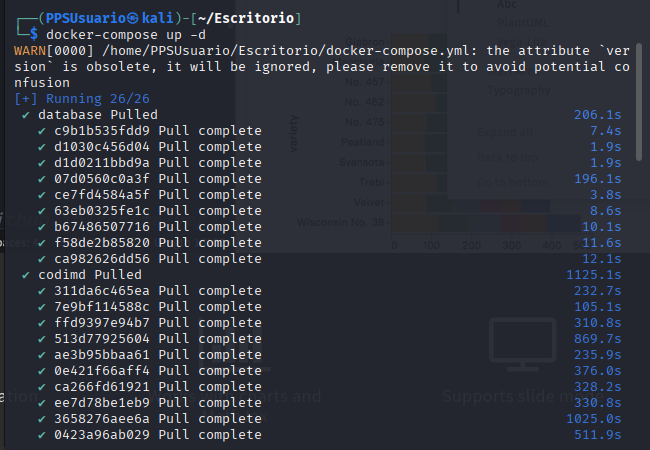

# Actividad Unidad 0 - Lenguaje de marcado MarkDown

**INDICE**

[Objetivos](#objetivos)

[Resultados de aprendizaje y Criterios de Evaluación](#resultados-de-aprendizaje-y-criterios-de-evaluación)

[Desarrollo](#desarrollo)

[Entrega](#entrega)

---

# Objetivos

- Ser capaz de levantar un escenario docker que contiene el editor de `MarkDown` `CodiMD`.   
- Comprender qué es el lenguaje de marcas `MarkDown`.  
- Ser capaz de elaborar un documento aplicando la sintaxis `MarkDown` de los diferentes elementos.  

# Resultados de aprendizaje y Criterios de Evaluación

Esta actividad se relaciona con el resultado de aprendizaje y criterios de evaluación RA5b y RA5d

---
# Desarrollo

Lee e investiga como puedes hacer una instalacion de codiMD en tu equipo mediante el docker compose que te indica el desarrollador.
https://hackmd.io/c/codimd-documentation/%2Fs%2Fcodimd-docker-deployment

- Crea una carpeta nueva en tu MV con nombre `Unidad0ActividadCodiMD`.
- Descarga [este archivo con nombre docker-compose.yml, que está en la carpeta Files](Files/docker-compose.yml).
- Abre un terminal y sitúate en el directorio que has creado.
- Levanta el escenario `Docker` con  el siguiente comando:
    ```bash
    docker compose up -d
    ```



- Abre un navegador web en tu máquina virtual y accede a la siguiente dirección: <http://localhost:3000>

> Como puedes observar al levantar el escenario `Docker` se ha creado un servidor web  que nos ofrece servicios del editor de texto `CodiMD`.


Échale un ojo a la sintaxis de markdown. PUedes utilizar el documento de ejemplo que tienes en la página de entrada de `codiMD` **Explora todas las funciones**, y también puedes ver la [chuleta de MarkDown](ContenidosTeoricos/Markdown-Cheatsheet2.pdf) que encontrarás en la sección de Recursos de la unidad 0.

- Crea un usuario en tu codiMD y accede a `CodiMD`. Lo puedes hacer pulsando en **Sign in**, y rellenando email y contraseña, para pulsar luego en **Register**, y luego vuelve a poner email y contraseña y pulsa en **Sign in** para logéarte.


> La idea de esta actividad es que practiques la sintaxis de `MarkDown`, por lo que a partir del texto sin formato que se proporciona, puedes pegarlo en un documento nuevo de `CodiMD` e ir añadiéndole las etiquetas.

- [Aquí tienes un documento sin formato, con nombre ejercicio_mardown.txt](./Files/ejercicio_markdown.txt). Puedes utilizarlo para copiar el texto en un archivo nuevo de `CodiMD`.  

- Debes de ir añadiéndole la sintaxis de Markdown para que todos los elementos se visualicen corrextamente.

- Al visualizar el documento elaborado, debe parecerse a [este documento en formato pdf](./Files/ejercicio_markdown_pdf.pdf), úsalo como guía.  

## Borrando rastros

Una vez finalizada la actividad:

- Paramos los contenedores que hemos creado. Desde la propia carpeta del proyecto:
   ```bash
    docker compose down -v
    docker system prune 
    docker rmi codimd
    ```

---
# Entrega

Comprime el directorio que contiene el documento elaborado, y lo subes a través de la plataforma.


