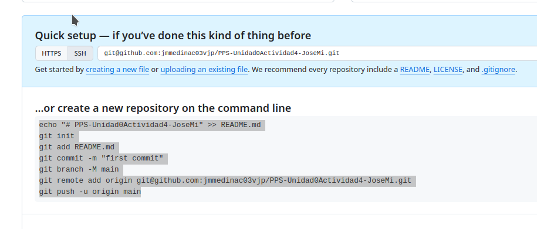

# Actividad Unidad 0 - Uso de Git
===============


Vamos a trabajar con Git.

El producto a realizar será la creación un repositorio (con nombre PPSUnidad0ActividadGitTuNombre) en la [plataforma de GitHub](https://github.com/)  que contenga un conjunto de archivos donde tendremos archivos de documentación de todo el proceso realizado (en formato .md) junto con el resto de archivos necesarios, imágenes, etc...

Para realizar la actividad te sugiero que sigas [el documento de Victor Ponz que se encuentra en la sección de recursos](../Files/1-Git.pdf). Con él puedes ver con más profundidad qué es Git, cómo se instala y cómo se trabaja. 

**Índice**

[Objetivos](#objetivos)

[Resultados de aprendizaje y Criterios de Evaluación](#resultados-de-aprendizaje-y-criterios-de-evaluación)

[Desarrollo](#desarrollo)

[Entrega](#entrega)

---

# Objetivos

- Conocer el funcionamiento de registro y creación de cuenta en Git.  
- Ser capaz de instalar git en un dispositivo y configurar nuestra cuenta en él.  
- Conocer la sintaxis de las operaciones básicas en Git.

---

# Resultados de aprendizaje y Criterios de Evaluación

Esta actividad se relaciona con el resultado de aprendizaje y criterios de evaluación RA5b.

---


# Desarrollo

## Crear Cuenta en Github.com
1. Abre una cuenta en <https://Github.com> con tu cuenta de educarex o informática.iesvalledeljerteplasencia.es

## Asignando Variables
Para que sea más rápido el proceso de copiar y pegar los comandos vamos a crear variables en el sistema y así se sustituirán automáticamente por vuestros nombres, cuenta de git y email. Sustituye los tuyos abajo:
```bash
Tu_nombre=Aquí_Pones_Tu_Nombre
Tu_mail_github=Aqui_Pones_Tu_mail_github
Tu_usuario_github=Aquí_Pones_Tu_usuario_github
```

## Instalando Git

1. Instala git en tu equipo.

```bash
sudo apt install git
```
1. Configuramos nuestro nombre, el email con el que has abierto tu cuenta de git y el editor preferido.
```bash
git config --global user.name $Tu_usuario_github
git config --global user.email $Tu_mail_github
git config --global core.editor nano
```
1. Vamos también a configurar para que cuando utilicemos  `git diff` o ``git log`se nos muestre todo el mensaje sin entrar en editor. Para ello ` ``.
```bash
git config --global core.pager ""
```

1. Para acceder a la ayuda de git tenemos tres formas: 
``` bash 
git help <verb>
git <verb> --help
man git<verb>
```

1. Comprueba qué valor tiene la variable de configuración de git email.

```bash 
git config user.email
```

1. Ajusta los valores de las  variables de Git:

```bash
git config --global color.status auto
git config --global color.branch auto
git config --global color.interactive auto
git config --global color.diff auto
git config --global init.defaultBranch main
```

1. Lo siguiente es crear una clave ssh en nuestro equipo y añadirla a nuestra cuenta de github para nuestro repositorio se sincronice con github.com. Puedes ver el proceso de generación de clave en <https://docs.github.com/es/authentication/connecting-to-github-with-ssh/generating-a-new-ssh-key-and-adding-it-to-the-ssh-agent:>
 

```bash
ssh-keygen -t ed25519 -C $Tu_mail_github
# Iniciamos el agente en segundo plano
eval "$(ssh-agent -s)"
#Nos mostrará un mensaje como 
#Agent pid 59566
ssh-add ~/.ssh/id_ed25519
```

- Y añadimos la clave generado por el siguiente comando a nuestra cuenta de github.com en apartado **Settings**/**SSH and GPG keys** y **Agregar claves .ssh**.

```bash
cat ~/.ssh/id_ed25519.pub
```


## Creación de Proyecto y repositorio

1. Crea una carpeta con el mismo nombre que la tarea y entras en ella.

```bash
mkdir PPS-Unidad0ActividadGit-$Tu_nombre
cd PPS-Unidad0ActividadGit-$Tu_nombre
```

1. Crea un nuevo repositorio público en gitHub.
 El repositorio debe de llevar por nombre PPS-Unidad0ActividadGit-TuNombre.
 El repositorio debe de ser público

Sigue las indicaciones de github para crear tu nuevo repositorio en linea de comandos, esto es:



Viene a ser como esto, pero cambiando el nombre de usuario y de repositorio:

 ~~~
echo # "PPS-Unidad0ActividadGit-$TuNombre" >> README.md
git init
git add README.md
git branch -M main
git remote add origin git@github.com:$Tu_usuario_gihub/PPS-Unidad0ActividadGit-$Tu_nombre.git
git remote set-url origin git@github.com:$Tu_usuario_gihub/PPS-Unidad0ActividadGit-$Tu_nombre.git
git push -u origin main
~~~

1. La estructura del proyecto debe de ser la siguiente:

PPS-Unidad0ActividadGit-TuNombre/   
├── calculator/   
│   ├── __init__.py   
│   └── gui.py   
├── docs/   
│   └── index.md   
├── mkdocs.yml   
├── requirements.txt   


Comenzamos:
1. Creamos la estructura:
```bash
mkdir calculator docs
touch calculator/__init__.py calculator/gui.py  docs/index.md mkdocs.yml requiriments.txt
# listamos la estructura del directorio.
 ls -l *
```

1. Comprueba el estado del proyecto:

```bash
git status
```
Vemos como nos indica que tenemos archivos sin seguimiento.

1. Añade los diferentes archivos y carpetas `git add ` o `git add -A`

```bash
# podemos añadir uno a uno
git add docs/index.md calculatos/gui.py
# o todos a la vez
git add .
```
1. Comprueba el estado `git status` y veras que ya aparecen en el area de `staged` pero están pendientes de ser confirmados.

1. Haz un listado en forma de arbol (tree -a) de todos los archivos del directorio.

```bash
# Mostrar contenido de un directorio en forma de árbol
tree -a
```

Observa cómo además de los archivos que hemos creado, aparecen también una carpeta oculta `.git` con otras carpetas y archivos. Es toda la estructura de git para guardar el proyecto.

1. Copia el contenido de los archivos del proyecto: `__init__.py`, `gui.py`, `index.md`, `mkdocs.yml` y `requirements.txt`, dentro de los archivos que hemos creado y vuelve a comprobar su estado.

```bash
git status
```
1. Ya sabes lo que tienes que hacer para añadirlos al area de `staged`:

```bash
git add .
```

1. Para confirmar los cambios, haz un `commit` como comentario indica que es la creación de archivos y vuelves a comprobar su estado.

```bash
git commit -am "creando los archivos"

```

1. Sube los cambios al repositorio remoto:

```bash
git push origin main
```
1. Comprueba en la web si todo se visualiza correctamente.

---
## Clonar un repositorio

Para ver cómo podemos clonar un repositorio:
1. Crea una nueva carpeta en tu directorio de git de PPS, con el nombre de esta actividad `PPS-Unidad0ActividadGit-TuNombreCopia`. 
1. Sitúate dentro de dicha carpeta y clonas el repositorio:

```bash
git clone git@github.com:$Tu_usuario_github/PPS-Unidad0ActividadGit-$Tu_nombre.git
```

1. Borra esta carpeta creada y vuelve de nuevo ala carpeta del proyecto original


---

## Ignorando archivos

1. Crea una carpeta con nombre `Excluded`. En ella vamos a colocar la documentación que no queremos que sea rastreada y subida al repositorio.

1. Para comprobar que funciona crea algún archivo vacío allí y también crea un archivo con nombre excluido.txt en el directorio principal del repositorio.

1. Crea un archivo con nombre .gitignore en el cual vamos a poner los archivos y directorios que no queremos que se rastreen.

1. Indica en el .gitignore que los archivos con extensión **.txt** y el directorio `Excluded` no deben de ser rastreados ni sincronizados..


```bash
# creando y añadiendo txt y Excluded en .gitignoregit 
echo "*.txt" > .gitignore
echo "Excluded" >> .gitignore

# creando carpeta excluded y archivo dentro de ella
touch  Excluded/otroarchivoexcluido
#Creando archivo excluido.txt
touch excluido.txt
# haciendo commit
git add .
git commit -am "añadiendo .gitignore"
```

1. Comprueba el estado del proyecto y comprueba que no nos indica nada del seguimiento de dichos archivos.
```bash
git status
# con short nos omite información superflua
git status --short
```


## Levantar un pequeño Servidor Web con PHP

1. Crea un archivo con nombre `index.html` con código HTML.
1. Levanta un servidor web que nos mostrará el contenido del `index.html`.
```bash
echo "<h1> hola¡¡¡ Bienvenidos a la clase de PPS</h1>" >> index.html
cp index.html index.html.save
php -S 0:8080
```

1. Abre otra pestaña en el terminal, ya que se queda ocupada con el servidor php. Cuando quieras interrumpir la ejecución pulsa Ctrl+C.
1. Visualiza la página web: <https://localhost:8080>


1. Modifica el fichero index.html para que cambie el texto mostrado en la página web y refresca el navegador para ver cómo ha cambiado el mensaje.
1. Verifica estado del proyecto y veamos las diferencias del archivo actual con la guardada en el área de `stage`

```bash
git status
git diff index.html
```

1. Hacemos un `git restore` y volvemos a refrescar el navegador y vemos como vuelve al mensaje que teníamos antes. Han desaparecido esos combios de nuestra zona local.

```bash
git restore index.html
```

1. Vuelve a refrescar navegador para ver como vuelve a versión inicial.

1. Mira el estado del proyecto y confirma todos los cambios.
1. Para ya el servidor PHP.
1. Haz un push y comprueba cómo han subido los archivos a github.com.

```bash
git push
```
1. Utiliza el comando ``git mv``para mover el archivo `index.html` a `index.html.save`.
```bash
git mv index.html index.html.save
```
1. Modifica el archivo index.php desde la página de github.com y haz un pull y comprueba cómo se ha modificado la página web en nuestro navegador.

## Git log
1. Mira la página de (Git Book sobre los comandos git log)[https://git-scm.com/book/es/v2/Fundamentos-de-Git-Ver-el-Historial-de-Confirmaciones]

1. Muestra los logs 
```bash 
git log
```
1. Muestra los logs de los últimos 3 commits

```bash 
git log -3
```

1. Muestra los logs utilizando el modificador ``--pretty`
```bash 
git log --pretty=oneline
```
1. Muestra los logs de los últimos 2 commits donde se vean las diferencias de cada una de las entradas.

```bash 
git log -p -2
```
1. Muestra los logs de las modificaciones realizadas en el último día.

```bash 
git log --since=1.day
```

## Ramas

1. Lista las ramas existentes.
```bash 
git branch --list
```

1. Elimina el archivo index.html.save y guardas modificaciones.

```bash
git rm index.html.save
git commit -am "eliminando index.html.save"
git push origin main
```
1. Crea una nueva rama con nombre `dev` a partir de la rama actual.

```bash
git chekout -b dev
```
1. Sube los cambios al respositorio remoto a la rama `dev`  

```bash 
git push origin dev
```
En este caso, desde la web, cambiando las ramas, podemos ver cómo el index.html de la rama `main` y `dev` son diferentes.

---

# Entrega


Una vez documentado todo el proceso en tu README.md, en la entrega por la plataforma, pega el enlace a tu repositorio de github.com


