# Actividad - Análisis estático de código con Santoku
```bash
cd Android-InsecureBankv2/
qark --apk InsecureBankv2.apk
```

/home/usuario/.local/lib/python2.7/site-packages/qark/report/report.html
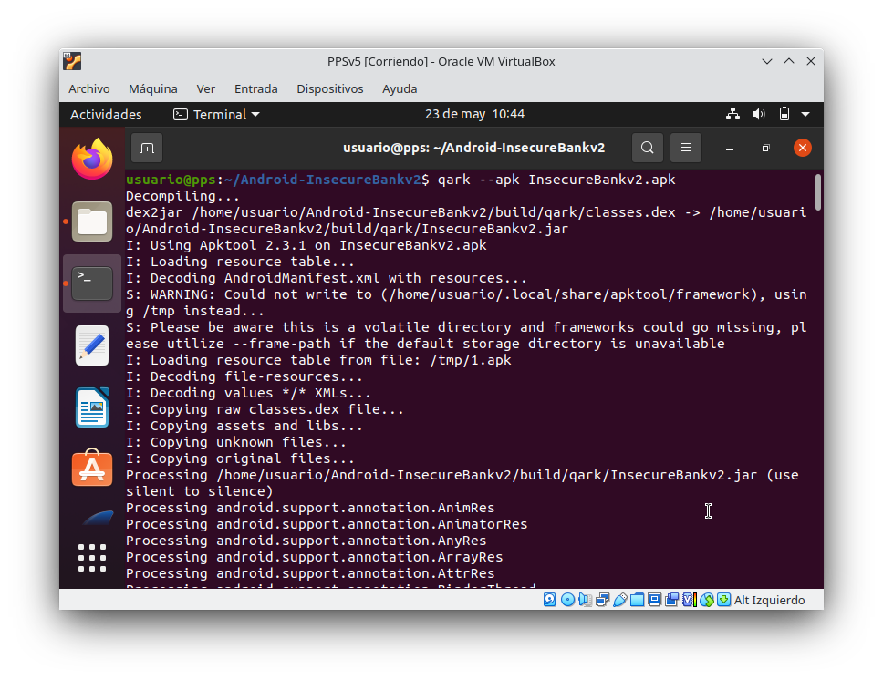 

```bash
mkdir APKDescomprimida
cp InsecureBankv2.apk APKDescomprimida/
cd APKDescomprimida/
apktool d InsecureBankv2.apk

```
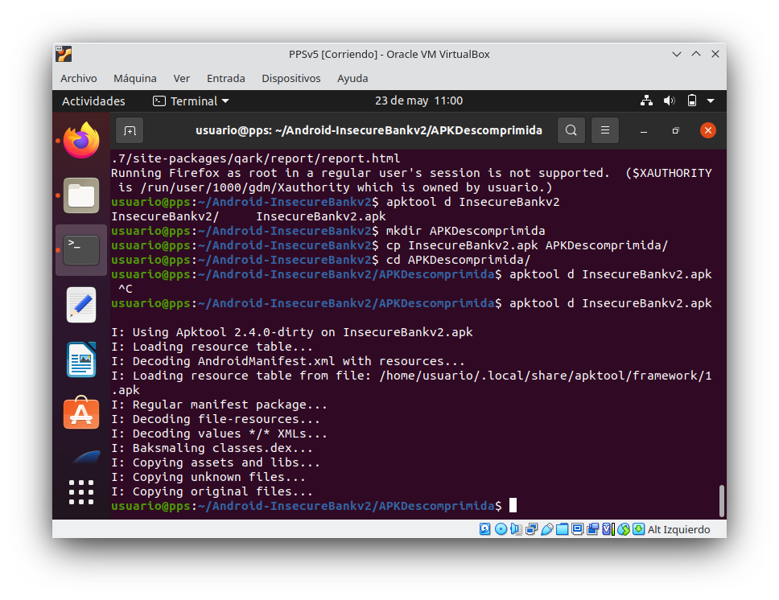
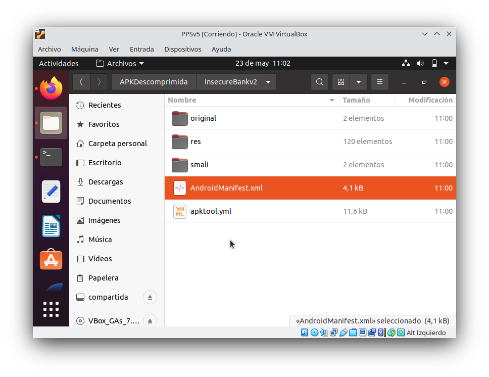


```bash
gedit InsecureBankv2/AndroidManifest.xml 
```
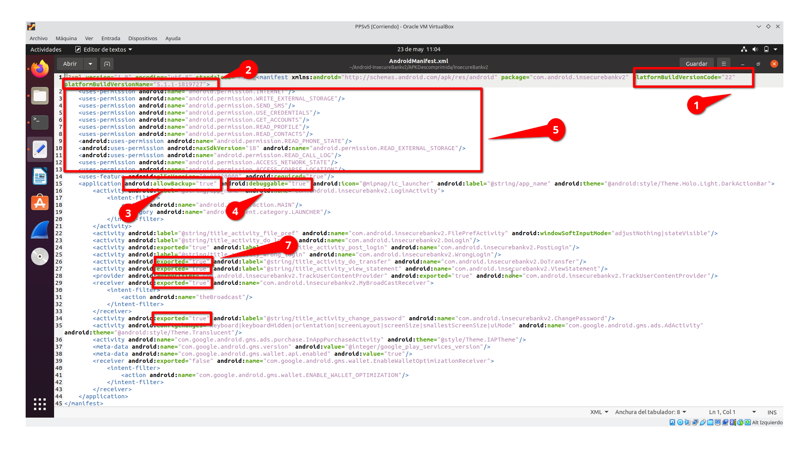
```bash
androlyze -s
```


```androlize
a, d, dx = AnalyzeAPK("InsecureBankv2.apk")
show_Permissions(dx)
quit
```

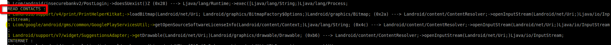


```bash
cd Descargas/
java -jar bytecode-Viewer

```
- Detectar logs
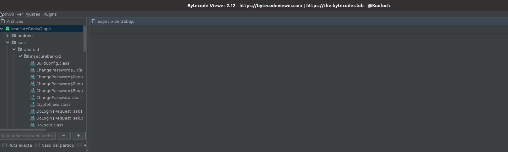

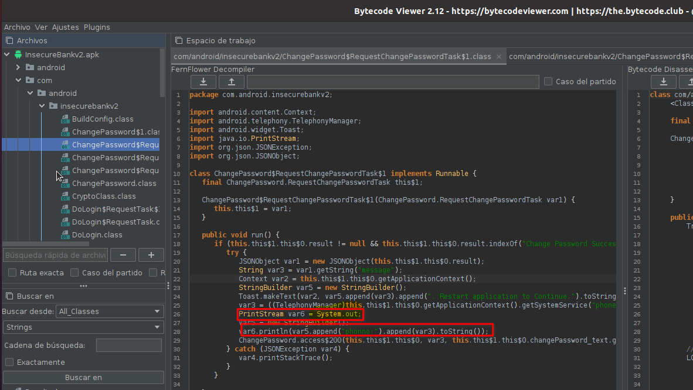
- Detectar intents
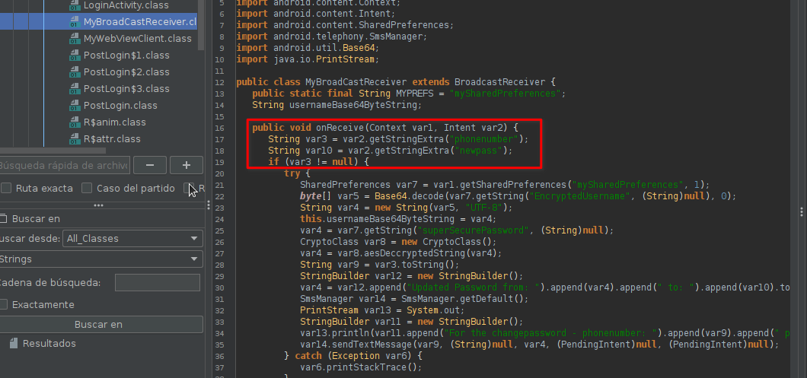

-broadcast
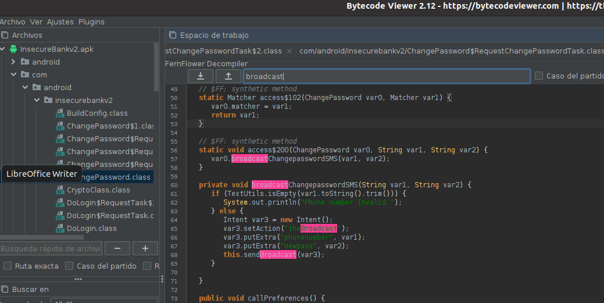

- Comunicaciones inseguras
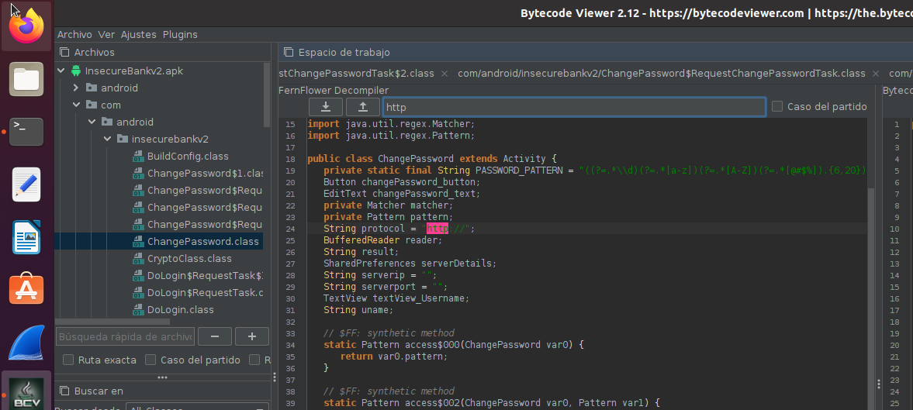

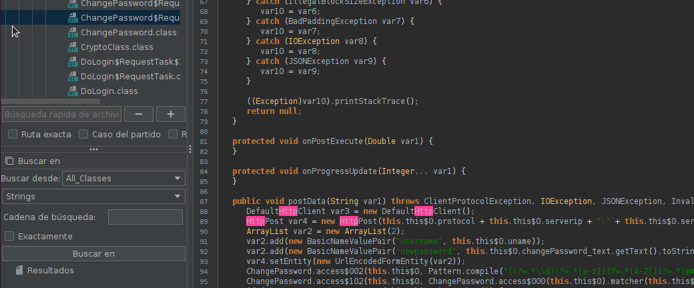
- Cifrado inseguro
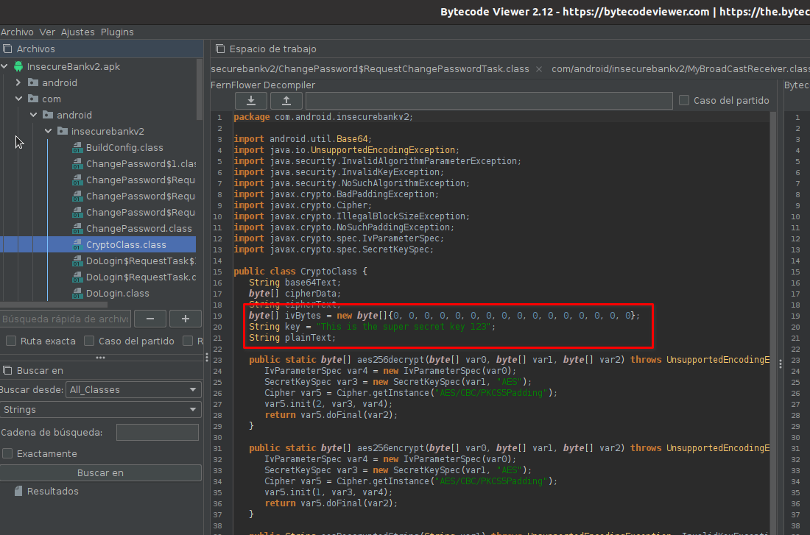

-webviews 
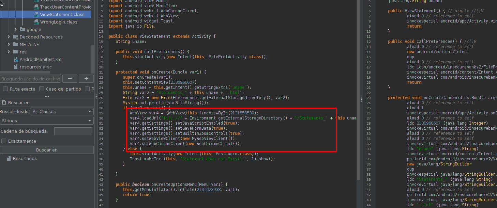

-Acceso a contenidos de Content Providers
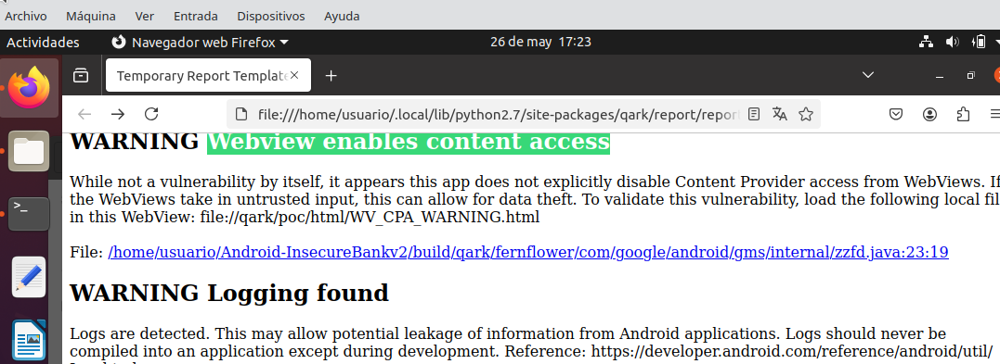

-Acceso a Ficheros
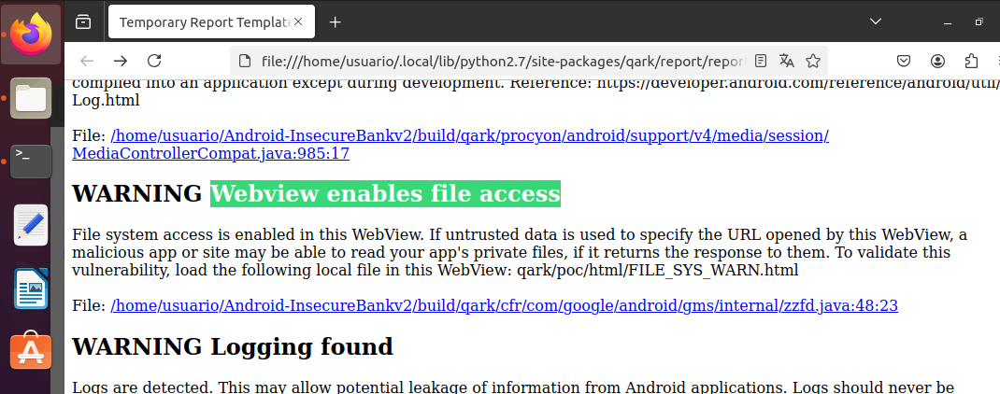
 

-Ejecución JavaScript

-Mode_world_readable
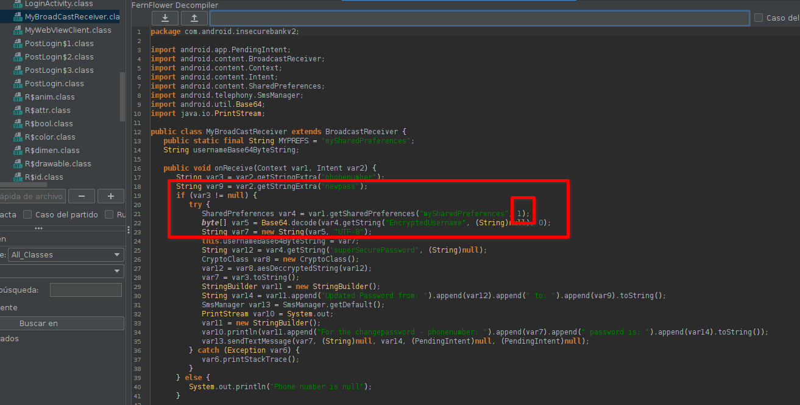

- Uso de Almacenamiento Externo
```bash
androlyze -s
```


```androlize
a, d, dx = AnalyzeAPK("InsecureBankv2.apk")
show_Paths(d, dx.tainted_packages.search_methods(".", "getExternalStorageDirectory", "."))
show_Paths(d, dx.tainted_packages.search_methods(".", "getExternalFilesDir", "."))

quit
```

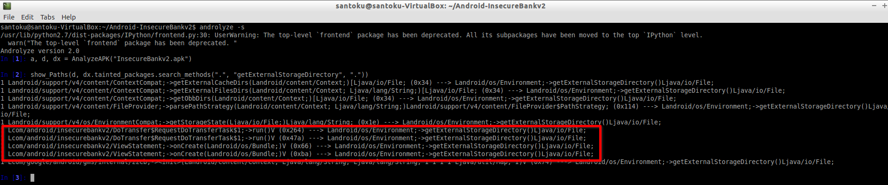
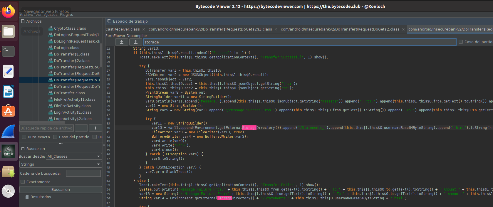
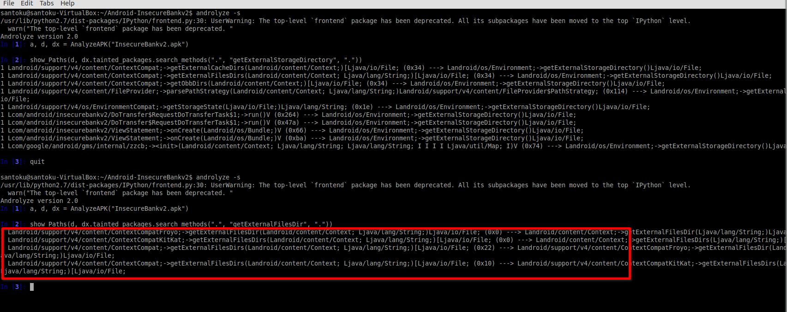

- Comprobación Emulación y rooteado
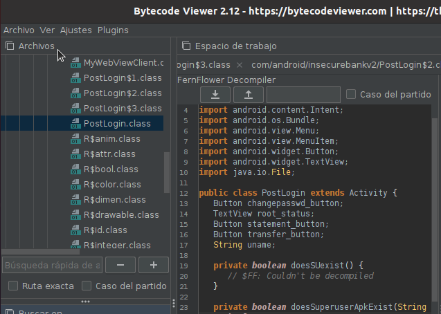
```bash
androlyze -s
```


```androlize
a, d, dx = AnalyzeAPK("InsecureBankv2.apk")
show_Paths(d, dx.tainted_packages.search_methods(".", "getRuntime", "."))

quit
```
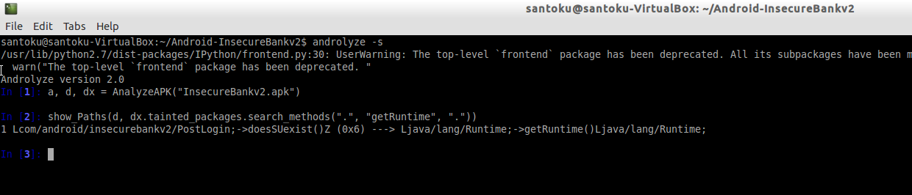

- Componente invisible en base a un recurso.

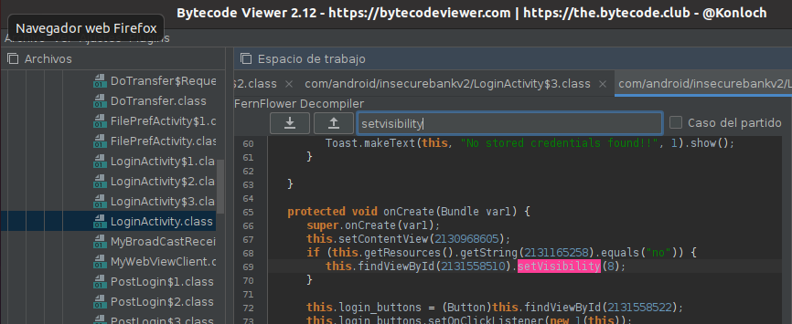

Buscamos string `2131165258`

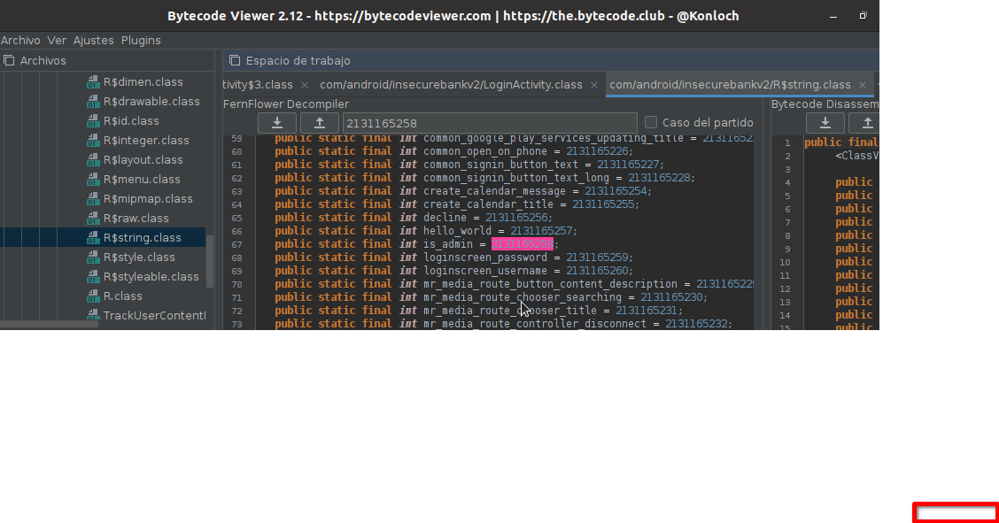
