# Actividad : Análisis de Seguridad Dinámico con DAST (Dynamic Application Security Testing)

## 🎯 Objetivo

Usar DAST para detectar vulnerabilidades en una aplicación en ejecución.

---

## 🔍 ¿Qué es DAST?

**Dynamic Application Security Testing (DAST)** analiza una aplicación en ejecución para identificar vulnerabilidades explotables, como:
- Inyecciones SQL
- Configuraciones inseguras
- Exposición de información sensible

No requiere acceso al código fuente.

---

## 🛠️ Herramienta: Nikto

Nikto es un escáner open-source para aplicaciones web.

### Instalación

```bash
sudo apt install nikto
nikto -Version
```
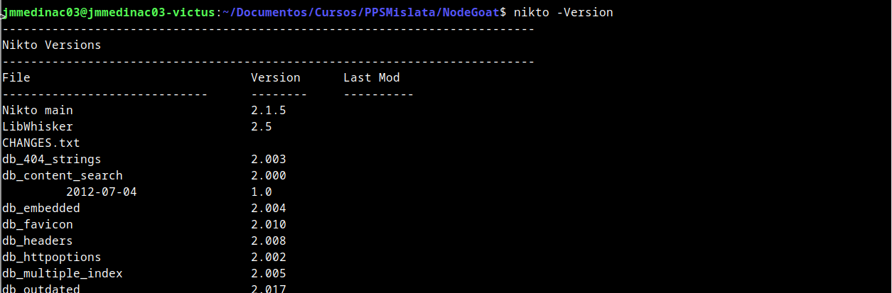
---

## 🧪 Aplicaciones vulnerables para pruebas

Aquí presentamos tres proyectos de máquinas vulnerables sobre las que poder realizar nuestro análisis dinámico de código. 
El primero `WebGoat` lo hemos descargado para la realización de la actividad <https://github.com/jmmedinac03vjp/PPS-AnalisisEstaticoCodigoSAST.git>, por lo que puedes realizar la actividad sobre esta, pasa a la sección [## 🔍 Escaneos con Nikto
](##-🔍-Escaneos-con-Nikto). También puedes repetir los escaneos con todas las máquinas.


### 1. OWASP NodeGoat

[NodeGoat](https://github.com/OWASP/NodeGoat) es una aplicación web de código abierto desarrollada por **OWASP** (Open Web Application Security Project) que sirve como plataforma de aprendizaje para la seguridad en aplicaciones **Node.js**.

Características Principales de NodeGoat
1. Aplicación Vulnerable Intencionalmente: Contiene fallos de seguridad reales para practicar y aprender. Similar a otras plataformas como OWASP Juice Shop y Damn Vulnerable Web App (DVWA).
2. Simula un Entorno de Producción: Está desarrollada con `Node.js`, `Express.js` y `MongoDB`. Permite a los usuarios comprender cómo se implementan y explotan vulnerabilidades en aplicaciones reales.
3. Vulnerabilidades Presentes en NodeGoat: NodeGoat incluye ejemplos de diversas vulnerabilidades, como:
        - Inyección MongoDB
        - Cross-Site Scripting (XSS)
        - Cross-Site Request Forgery (CSRF)
        - Almacenamiento inseguro de contraseñas
        - Fallos de autenticación
        - Mal uso de funciones de Node.js

4. Ejercicios y Laboratorios Prácticos: `OWASP NodeGoat` proporciona guías interactivas y retos para que los usuarios exploten y solucionen las vulnerabilidades.
5. Facilidad de Instalación: Se puede ejecutar localmente con ` Docker`, `Node.js` o en plataformas en la nube como `Heroku`.

#### Clonar y acceder al proyecto:
```bash
git clone https://github.com/OWASP/NodeGoat.git
cd NodeGoat
docker-compose up -d
```
Puedes a acceder a la máquina  en
 
```http://localhost:4000```

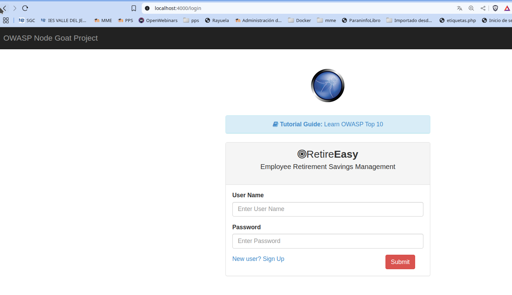

Para acceder con un usuario, creamos un usuario nuevo en nuestra aplicación
---

### 2. OWASP Juice Shop

**OWASP Juice Shop** es una aplicación web intencionalmente insegura diseñada para practicar pruebas de seguridad.

#### Instalación y ejecución de OWASP Juice Shop
```bash
git clone https://github.com/juice-shop/juice-shop.git
cd juice-shop
npm install
npm start
```

Juice Shop tiene muchas vulnerabilidades, por lo que Nikto detectará varias como:
- Exposición de cabeceras inseguras
- Cookies sin HttpOnly
- Inyecciones SQL y XSS

Disponible en `http://localhost:3000`.

---

### 3. Damn Vulnerable Web Application (DVWA)

DVWA es otra aplicación web insegura. Está escrita en PHP y  diseñada para pruebas de seguridad.

#### Instalación con Docker

```bash
docker run --rm -d -p 4000:80 vulnerables/web-dvwa
```

DVWA a la que accedemos desde <http://localhost:4000> permite probar ataques como:
- SQL Injection
- Cross-Site Scripting (XSS)
- CSRF (Cross-Site Request Forgery)

### 3. OWASP WebGoat

WebGoat es un entorno de aprendizaje donde puedes practicar exploits.

#### Instalación con Docker

```bash
docker run --rm -d -p 4000:8080 webgoat/webgoat-8.0
```

A WebGoat accedemos desde <http://localhost:4000/WebGoat>. Iincluye ejercicios para probar:
- Inyección SQL
- Configuraciones inseguras
- Fallos en la autenticación


## 🔍 Escaneos con Nikto

Todos los escaneos se hanm realizado con la máquina `OWASP NodeGoat` por lo que los realizamos sobre el puerto **4000**:`localhost:4000`. Si has utilizado otra máquina revisa si tienes que utilizar otro puerto.

### Escaneo básico
```bash
nikto -h http://localhost:4000
```

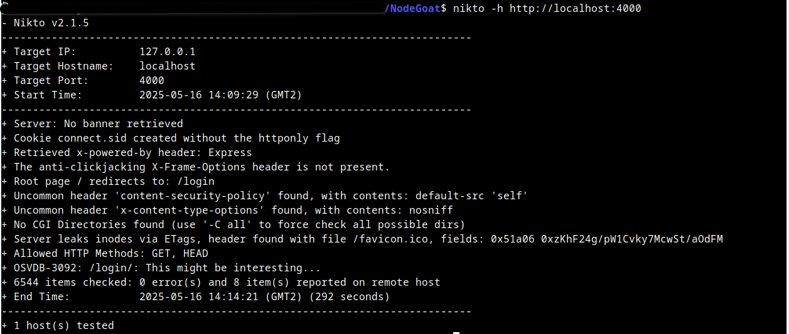

Como vemos, sobre `OWASP NodeGoat` nos ha dado información de problemas como:
+ The anti-clickjacking X-Frame-Options header is not present.
+ Uncommon header 'content-security-policy' found, with contents: default-src 'self'
+ Uncommon header 'x-content-type-options' found, with contents: nosniff
+ Server leaks inodes via ETags, header found with file /favicon.ico, fields: 0x51a06 0xzKhF24g/pW1Cvky7McwSt/aOdFM 
+ Allowed HTTP Methods: GET, HEAD 
 

###  Escaneo con detección de plugins, vulnerabilidades y exploits

Si queremos realizar escaneo para buscar sólo grupos de vulnerabilidades concretas, utilizamos `-Tuning`

```bash
nikto -h http://localhost:4000 -Tuning 123b
```

En este caso probamos los grupos 1, 2, 3 y b
 -Tuning+           Scan tuning:
                               1     Interesting File / Seen in logs
                               2     Misconfiguration / Default File
                               3     Information Disclosure
                               4     Injection (XSS/Script/HTML)
                               5     Remote File Retrieval - Inside Web Root
                               6     Denial of Service
                               7     Remote File Retrieval - Server Wide
                               8     Command Execution / Remote Shell
                               9     SQL Injection
                               0     File Upload
                               a     Authentication Bypass
                               b     Software Identification
                               c     Remote Source Inclusion
                               x     Reverse Tuning Options (i.e., include all except specified)

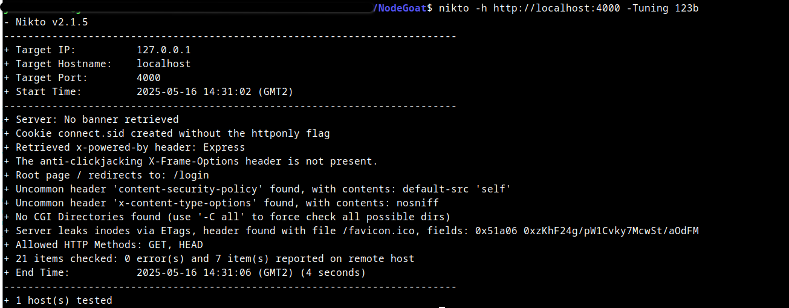

### Escaneo agresivo con detección de archivos ocultos y fuzzing


```bash
nikto -h http://localhost:4000 -C all
```
 Con los modificadores`-C all` → Analiza todas las opciones de seguridad, directorios, etc...


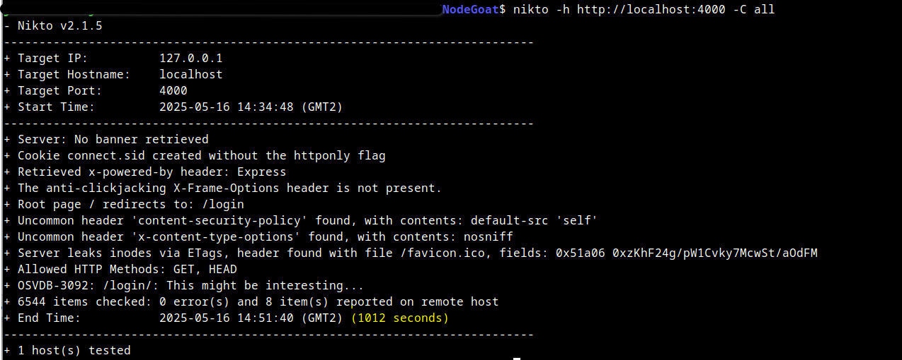

Al escanear todos los directorios, tarda considerablemente más tiempo. Vemos que 1012 s. frente a los 4 s. en escaneos anteriores.

---

### Escaneo con autenticación (si la aplicación tiene login)

Si la aplicación web requiere autenticación, se pueden incluir credenciales para evaluar la seguridad después de
iniciar sesión:

```bash
nikto -h http://localhost:4000 -id usuario:contraseña
```

Ejemplo: Si la aplicación tiene una página de login, Nikto probará el escaneo después de autenticarse.

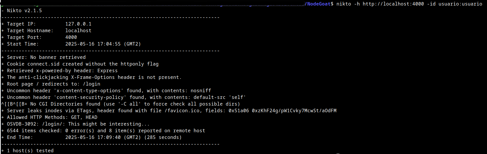

###  Escaneo con User-Agent personalizado (para evitar bloqueos)

Algunas aplicaciones bloquean ciertas herramientas de escaneo. ç
Cambiar el User-Agent para enmascarar a Nikto es una de las cosas que podemos hacer.

El UserAgent utilizado lo podemos encontrar dentro del archivo de configuración `/etc/nikto/config.txt`

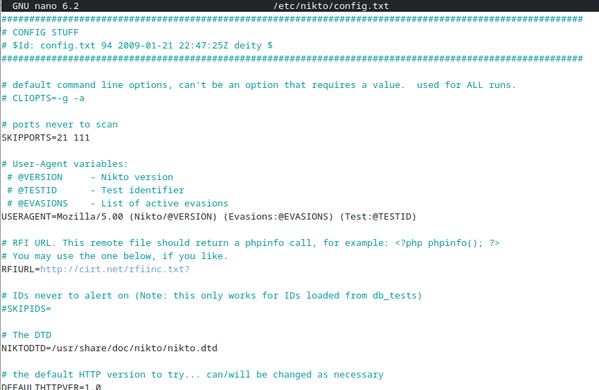

Podemos sustituir el UserAgent.

En la siguiente página tienes información: <https://gist.github.com/theMiddleBlue/502f516b38470446d07fa196d65dc79e>

### Guardar resultados

Si se desea guardar los resultados en un archivo para su revisión posterior o pasarlo a aplicaciones de explotación de vulnerabilidades.

```bash
nikto -h http://localhost:4000 -o resultado_scan.html -Format html
```
También se pueden exportar los resultados en otros formatos:

        -Format+           Save file (-o) format:
                               csv   Comma-separated-value
                               htm   HTML Format
                               msf+  Log to Metasploit
                               nbe   Nessus NBE format
                               txt   Plain text
                               xml   XML Format
                               (if not specified the format will be taken from the file extension passed to -output)
 
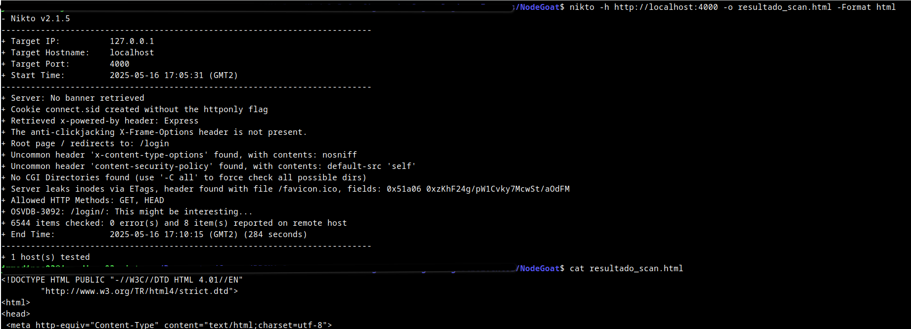

Aquí podemos ver los datos de `resultado_scan.html`

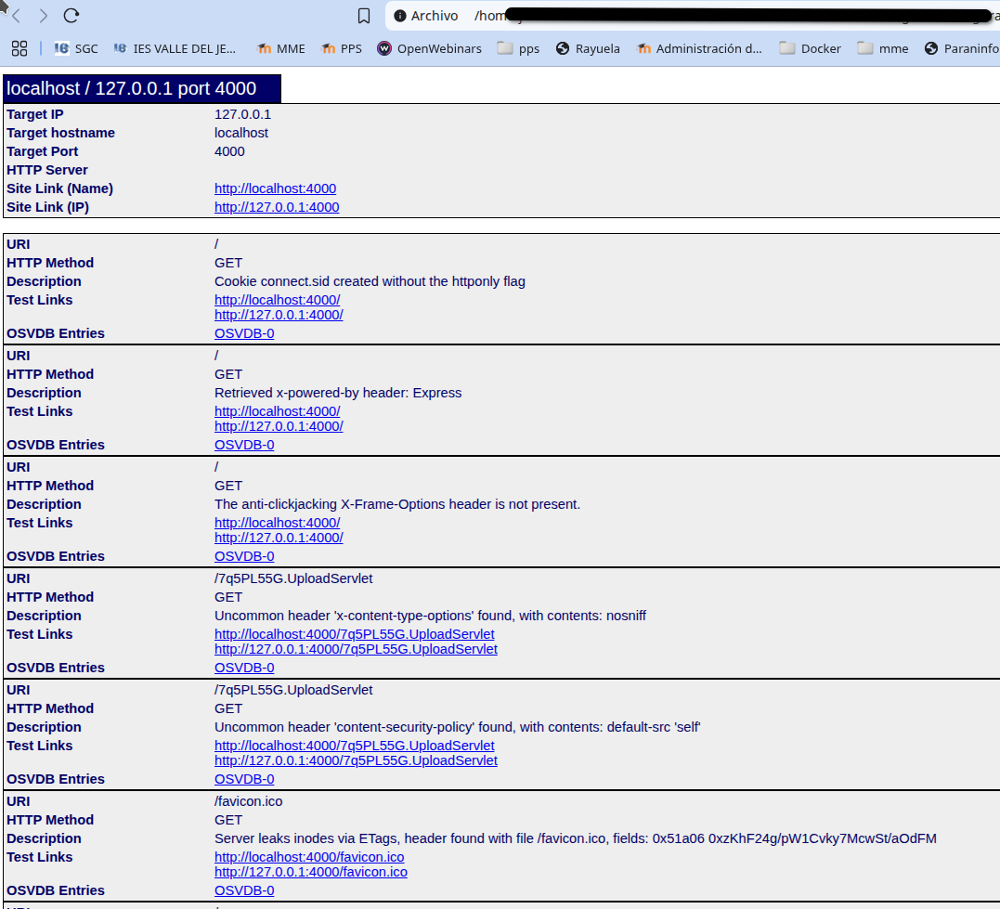


###  Escaneo en múltiples subdominios o direcciones IP

Si la aplicación usa varios subdominios, se pueden escanear de manera simultánea con un archivo de direcciones IP o dominios:
Ejemplo de archivo con varias direcciones IP o dominios llamado lista_de_objetivos.txt:

Vamos a levantar  la máquina `DVWA` con `docker`

```bash
docker run --rm -d -p 3000:80 vulnerables/web-dvwa
```

archivo `lista_de_objetivos.txt`
```
http://localhost:4000
http://localhost:3000
```
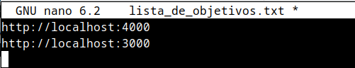

```bash
nikto -h lista_de_objetivos.txt
```
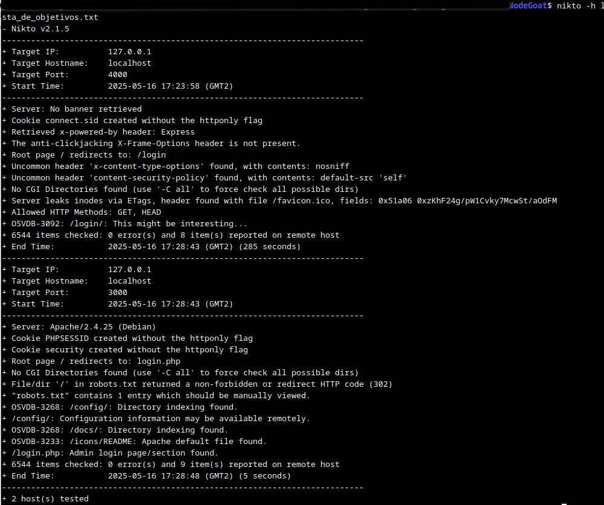

###  Escaneo con bypass de firewalls y detección de tecnologías

Si la aplicación tiene mecanismos de defensa (como WAF o IDS), intentar este escaneo:

```bash
nikto -h http://localhost:4000  -useproxy http://127.0.0.1:8080
```

Explicación:
- `-useproxy` → Si se usa Burp Suite o ZAP, redirige el tráfico a través del proxy en 127.0.0.1:8080.


---

## ✅ Mitigación y Buenas Prácticas

Después de ejecutar un análisis con Nikto, es importante corregir las vulnerabilidades detectadas para fortalecer la
seguridad de la aplicación y del servidor. A continuación, se explican con más detalle las mejores prácticas
recomendadas:

### Corregir configuraciones inseguras en el servidor

Uno de los problemas más comunes en servidores web es la configuración predeterminada, que muchas veces deja expuesta información sensible o permite ataques como clickjacking, cross-site scripting (XSS) o inyecciones.

#### Implementar cabeceras de seguridad

Las cabeceras HTTP pueden proteger la aplicación contra diversos ataques. Algunas configuraciones recomendadas:

**Ejemplo de configuración en Apache** (`.htaccess` o `httpd.conf`):

```apache
# Evita el Clickjacking
Header always set X-Frame-Options "DENY"
# Activa la protección contra XSS
Header always set X-XSS-Protection "1; mode=block"
# Restringe el contenido embebido (CSP)
Header always set Content-Security-Policy "default-src 'self'; script-src 'self'
'unsafe-inline';"
# Fuerza la conexión HTTPS
Header always set Strict-Transport-Security "max-age=31536000; includeSubDomains; preload"
```

#### Habilitar el flag HttpOnly y Secure en las cookies

Las cookies sin HttpOnly y Secure pueden ser robadas a través de ataques XSS o ser transmitidas en texto plano

Ejemplo en PHP (`php.ini` o en código PHP):

```php
session_set_cookie_params([
'secure' => true, // Solo enviar cookies a través de HTTPS
'httponly' => true, // Evita acceso desde JavaScript
'samesite' => 'Strict' // Previene ataques CSRF
]);
```

### Deshabilitar la exposición de información sobre el servidor y la versión (Apache)

Muchos servidores muestran por defecto información sobre la versión del software, lo que facilita ataques dirigidos.

**Ejemplo de configuración en Apache** (`apache2.conf` o `httpd.conf`):

```apacheconf
ServerTokens Prod
ServerSignature Off
```

#### Repetir escaneos regularmente

La seguridad es un proceso continuo. Las configuraciones y actualizaciones pueden introducir nuevas
vulnerabilidades, por lo que es fundamental realizar escaneos periódicos.
---

## 🔁 Automatización con Nikto

Nikto puede programarse para ejecutarse automáticamente en un cronjob o script CI/CD.

**Ejemplo** de `cronjob` en Linux (ejecuta Nikto diariamente a las 2 AM):


```bash
crontab -e

```
Se abre crontab, añadir la siguiente linea:

```
0 2 * * * nikto -h http://localhost:4000 -o /var/logs/nikto_scan.log
```

---

## 📚 Créditos

Adaptado de la actividad "Análisis de Seguridad Dinámico con DAST" de Raúl Fuentes Ferrer.
