# Actividad-ConfiguracionSeguraTLS
Actividad de configuración segura de TLS

Tenemos como objetivo:

> - Conocer el funcionamiento de protocolos de transimisión seguros SSL/TLS y como activarlos.
>
> - Aplicar cambios para prevenir ataques de configuración insegura.

# ¿Qué es TLS?
---

**TLS (Transport Layer Security)** es un protocolo criptográfico que proporciona comunicaciones seguras sobre redes de computadoras, especialmente en internet. Su objetivo principal es proteger la confidencialidad e integridad de los datos transmitidos entre aplicaciones, como navegadores web y servidores.

TLS es el sucesor de **SSL (Secure Sockets Layer)**. Aunque SSL fue ampliamente utilizado, sus versiones han quedado obsoletas debido a múltiples vulnerabilidades. Hoy en día, TLS en sus versiones 1.2 y 1.3 es el estándar de facto para la seguridad en la web.

**TLS proporciona:**

- **Confidencialidad:** gracias al cifrado de los datos en tránsito.
- **Integridad:** mediante funciones hash que detectan alteraciones.
- **Autenticación:** utilizando certificados digitales que identifican a las partes.

# ACTIVIDADES A REALIZAR
---
> Lee el siguiente [documento sobre Configuración Segura de TLS y Cifrado de Datos Sensibles con AES](./files/ConfiguracionTLSCifradoDatosAES.pdf)
> 
> También y como marco de referencia, tienes [ la sección de correspondiente de pruebas del **Proyecto Web Security Testing Guide** (WSTG) del proyecto **OWASP**.](https://owasp.org/www-project-web-security-testing-guide/v41/4-Web_Application_Security_Testing/09-Testing_for_Weak_Cryptography/01-Testing_for_Weak_SSL_TLS_Ciphers_Insufficient_Transport_Layer_Protection)
>


Vamos realizando operaciones:

# Iniciar entorno de pruebas

Situáte en la carpeta de del entorno de pruebas de nuestro servidor LAMP e inicia el escenario multicontendor:

~~~
docker-compose up -d
~~~

Para acceder a nuestro servidor apache:

~~~
docker exec -it lamp-php83 /bin/bash
~~~

## 1. Obtención o generación del certificado
---


Para utilizar protocolos SSL tenemos que tener un certificado que indique quienes sómos. Podemos hacerlo de dos formas:

- Obtener un certificado autofirmado que nos sirva para un entorno local o de pruebas. 

- Obtener un certificado de un entidad certificadora.

#### Método 1: Obtener certificado con **OpenSSL**

Para entornos de prueba o desarrollo, se puede utilizar un **certificado autofirmado**, es decir, un certificado que no ha sido emitido por una entidad de certificación.


**Crear un certificado autofirmado con SAN**

- Crea un archivo de configuración de OpenSSL (por ejemplo san.conf):

archivo `san.conf`
```
[req]
default_bits       = 2048
distinguished_name = req_distinguished_name
req_extensions     = req_ext
x509_extensions    = v3_ca
prompt             = no

[req_distinguished_name]
C  = ES
ST = Extremadura
L  = Plasemncia
O  = MiEmpresa
CN = pps.edu

[req_ext]
subjectAltName = @alt_names

[v3_ca]
subjectAltName = @alt_names
basicConstraints = CA:TRUE

[alt_names]
DNS.1 = pps.edu
DNS.2 = localhost
```
🔒 Importante: el CN (Common Name) debe coincidir con el dominio que usarás en el navegador, como `pps.edu`.

- Genera el certificado y clave:
```bash
openssl req -x509 -nodes -days 365 -newkey rsa:2048 -keyout server.key -out server.crt -config san.conf -extensions v3_ca
```

**Explicación de los parámetros del comando:**

- `req`: inicia la generación de una solicitud de certificado.
- `-x509`: crea un certificado autofirmado en lugar de una CSR.
- `-nodes`: omite el cifrado de la clave privada, evitando el uso de contraseña.
- `-newkey rsa:2048`: genera una nueva clave RSA de 2048 bits.
- `-keyout server.key`: nombre del archivo que contendrá la clave privada.
- `-out server.crt`: nombre del archivo de salida para el certificado.
- `-days 365`: el certificado será válido por 365 días.
- `-config`: el fichero donde tenemos la configuración san
- `-extensions v3_ca`: la extensión y versión del archivo.
.
Esto genera:

- server.key → clave privada

- server.crt → certificado con SAN incluido


Listar directorio `/etc/apache2/ssl`
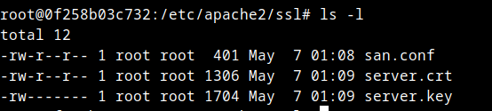

Este certificado SSL se puede usar para habilitar **HTTPS en Apache** para un entorno local o de pruebas. No está firmado por una entidad certificadora reconocida, por lo que los navegadores lo marcarán como "_no seguro_" pero es útil para el desarrollo.

#### Método 2: Obtener Certificado en un servidor Linux usando Let's Encrypt y Certbot
---

El objetivo de [Let’s Encrypt[(https://letsencrypt.org/es/how-it-works/) y el protocolo ACME es hacer posible configurar un servidor HTTPS y permitir que este genere automáticamente un certificado válido para navegadores, sin ninguna intervención humana. Esto se logra ejecutando un agente de administración de certificados en el servidor web.

✅ Requisitos previos

Antes de empezar, debemos asegurarnos que:

- Tenemos acceso SSH como usuario root o con privilegios de sudo.

- El puerto 80 (HTTP) y 443 (HTTPS) están abiertos en el firewall.

- Tenemos un nombre de dominio registrado apuntando a la IP pública del servidor.

Hasta ahora hemos hecho todos los ejercicios en nuestro servidor local `localhost`. Si queremos obtener un certificado en Let`s Encrypt debemos de tener un dominio registrado o bien nuestro servidor en un sitio de hosting.

Podemos obtener un dominio gratuito en webs como `duckdns.org` o `no-ip.org`. Vamos a crear uno

**📥 Paso 1: Registrar un dominio a nuestro nombre**.

Normalmente es necesario adquirir un dominio para nuestra organización. Si embargo podemos obtener un dominio y asociarlo a una IP dinámica de forma gratuita.

En esta ocasión he elegido [Duck DNS](https://www.duckdns.org/).

- Iniciamos sesión con una cuenta de Gmail, github, etc.

- Introducimos el nombre de dominio que queremos y comprobamos que está disponible. Lógicamente, nuestro nombre de dominio será un subdominio de Duck DNS. En mi caso he generado `ppsiesvalledeljerteplasencia.duckdns.org`. Además la asociará con la dirección ip que detecta en ese momento.


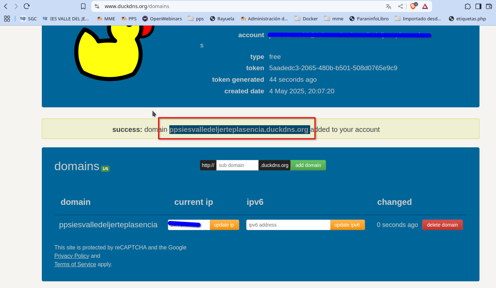

- Ahora que tenemos un nombre de dominio registrado, debemos modificar el `ServerName` del fichero de configuración de nuestro host virtual `/etc/apache2/sites-available/default-ssl.conf` o el fichero de configuración del host virtual que deseemos.


- Para poder acceder a ella tendremos que añadirla en nuestro ficherto /etc/hosts, y abrir posteriormente los puertos de nuestro router, pera ya lo veremos más adelante. Lógicamente, esto último no lo podemos hacer en nuestro centro, tendremos que limitarlo a hacerlo en su caso en nuestra casa.
 `


Podemos comprobar que funciona todo con el siguiente comando:

~~~
nslookup http://ppsiesvalledeljerteplasencia.duckdns.org/
~~~

Una vez registrado el dominio, procedemos con la obtención del certificado:

**📥 Paso 2: Instalar Certbot**

~~~
apt update
apt install certbot python3-certbot-apache
~~~


**🌐 Paso 3: Publicar nuestro servidor web.**

Crear un servidor en un sitio de hosting o bien si estamos usando nuestr servidor local, deberemos de abrir los puertos de nuestro router para que sea accesible desde el exterior.

Si no es accesible desde el exterior el siguiente paso nos dará un error.

**🔑 Paso 4: Obtener el certificado SSL**

~~~
certbot --apache
~~~
Durante el proceso:

- Se verificará que el dominio apunte correctamente al servidor.

- Se te pedirá un correo electrónico.

- Se te pedirá que aceptes la licencia.

- Se te pedirá permiso de uso de tu correo para fines de la organización.

- Si tienes creado los archivos de configuración de varios servidores, te pedirá que indiques para cuál o cuales de ellos lo quieres.

- Se te preguntará si deseas redirigir automáticamente de HTTP a HTTPS (recomendado).


**🌐 Paso 5: Verificar HTTPS**

Accede a tu sitio en el navegador usando: `https://tudominio.com`

Deberías ver el candado que indica que la conexión es segura.


**🔄 Paso 6: Renovación automática del certificado**

Let's Encrypt emite certificados válidos por 90 días. Certbot configura automáticamente la renovación.

Puedes probarla con:

~~~
sudo certbot renew --dry-run
~~~


## 2. Configurar Apache para usar TLS

Una vez que tengas el certificado y la clave privada, debes configurar Apache para utilizarlos.


Editar el archivo de configuración de Apache `default-ssl.conf`:

~~~
nano /etc/apache2/sites-available/default-ssl.conf
~~~

Lo modificamos y dejamos así:

~~~
<VirtualHost *:80>

    ServerName www.pps.edu

    ServerAdmin webmaster@localhost
    DocumentRoot /var/www/html

    ErrorLog ${APACHE_LOG_DIR}/error.log
    CustomLog ${APACHE_LOG_DIR}/access.log combined

</VirtualHost>

<VirtualHost *:443>
    ServerName www.pps.edu

    # activar uso del motor de protocolo SSL
    SSLEngine on
    SSLCertificateFile /etc/apache2/ssl/server.crt
    SSLCertificateKeyFile /etc/apache2/ssl/server.key

    DocumentRoot /var/www/html
</VirtualHost>
~~~

Date cuenta que hemos creado un **servidor virtual** con nombre **www.pps.edu**. A partir de ahora tendremos que introducir en la barra de dirección del navegador `https://www.pps.edu` en vez de `https://localhost`.


### Habilitar SSL y el sitio:
---

En el servidor Apache, activamos **SSL** mediante la habilitación de la configuración `default-ssl.conf`que hemos creado:

Fíjate que  tenemos todavía habilitado la configuración del sitio por defecto `000-default.conf`, y que en la configuración `default-ssl`estamos configurando tanto el puerto `http` **Puerto 80** como el puerto de `https`**Puerto 443**.

Por lo tanto deberíamos deshabilitar la configuración por defecto:

```apache
a2dissite 000-default.conf
```

Para habilitar ssl y la configuración de ssl realizamos:

```bash 
a2enmod ssl
a2ensite default-ssl.conf
service apache2 reload
```


### Resolución local de nombres: dns o fichero **/etc/hosts**

Nuestro navegador resuleve la dirección www.google.com o cualquier otra asociándole la ip donde se encuentra en el servidor, eso es debido a la resolución de servidores dns.

En el caso de nuestros sitios virtuales, si no están incluidos en los servidores dns, para hacer pruebas en nuestro ordenador, hemos de modificar las rutas en nuestro equipo para que pueda asociar estos nombres (ficticios) con la ip loc>

Debemos editar el fichero hosts para que nos devuelva la dirección del bucle local (127.0.0.1) cuando el navegador pida la url www.pps.net o cualquier otra asociada con un host virtual.

Este fichero está en /etc/hosts.

archivo `/etc/hosts`
``` 
127.0.0.1       pps.edu www.pps.edu
```

En los casos asociamos los nombres de los host virtuales a localhost tal y como se muestra en la imagen.

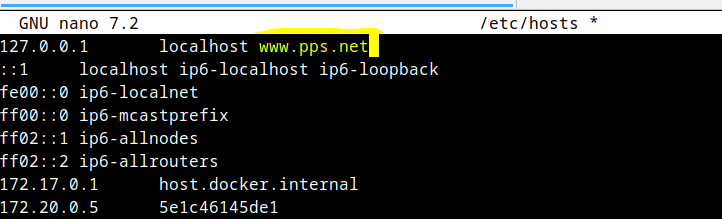

Además en el archivo `/etc/hosts` vemos cómo dirección de nuestro servidor apache. En nuestro caso `172.20.0.5`

No obstante puedes consultarlo en docker con el comando:

~~~
docker inspect lamp-php83 |grep IPAddress
~~~

Si queremos acceder a este servidor virtual desde otros equipos de la red, o si estamos utilizando docker y queremos acceder a ellos desde nuestro navegador, tenemos que añadir en el /etc/hosts una linea que vincule la dirección ip con >

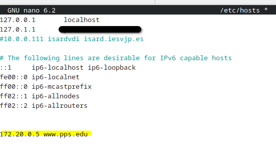

Ahora el servidor soportaría **HTTPS**. Accedemos al servidor en la siguiente dirección: `https://www.pps.edu`

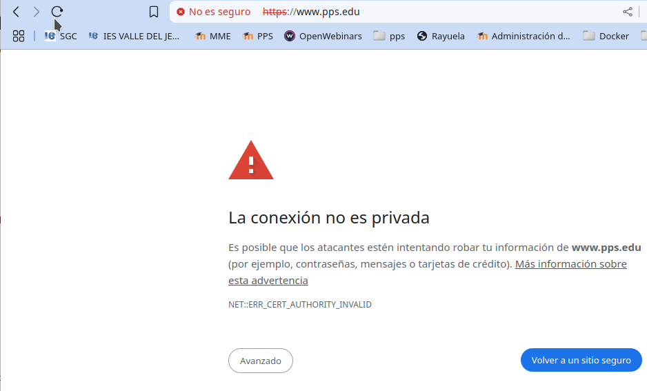

Nos dá un aviso de que es un servidor inseguro, por lo que pulsamos `avanzado`y `Acceder a sitio inseguro`.

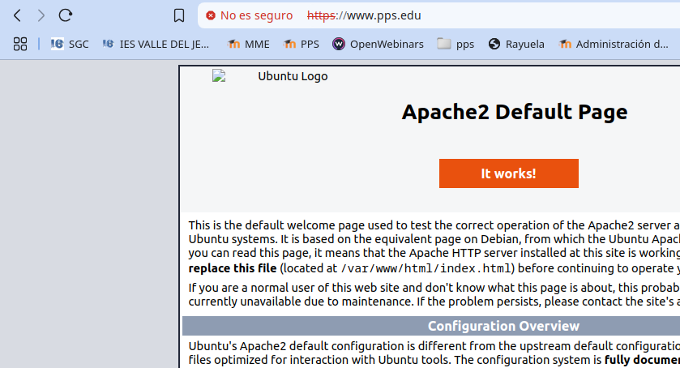
 

## 3. Verificación de la configuración TLS

### Desde línea de comandos

Puedes usar OpenSSL para verificar la conexión TLS:

```bash
openssl s_client -connect tu_dominio:443
```

Este comando muestra detalles del certificado, protocolos admitidos, y cifrados utilizados.


- **SSL Labs** de Qualys: [https://www.ssllabs.com/ssltest/](https://www.ssllabs.com/ssltest/)

Introduce tu dominio y te generará un informe completo con puntuación, algoritmos, versiones TLS activas y problemas potenciales.


### Desde herramientas online

Para asegurarse de que la configuración de TLS es segura, se puede comprobar el dominio en: SSL Labs Test. El servidor tiene que ser accesible desde internet. No funcionará en modo local si no abrimos los puertos de nuestro router.

<https://www.ssllabs.com/ssltest/>

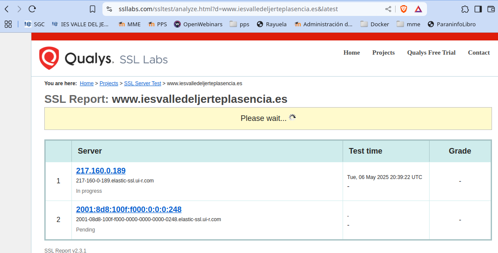

Además podemos obtener información extensa sobre el certificado y `SSL`.

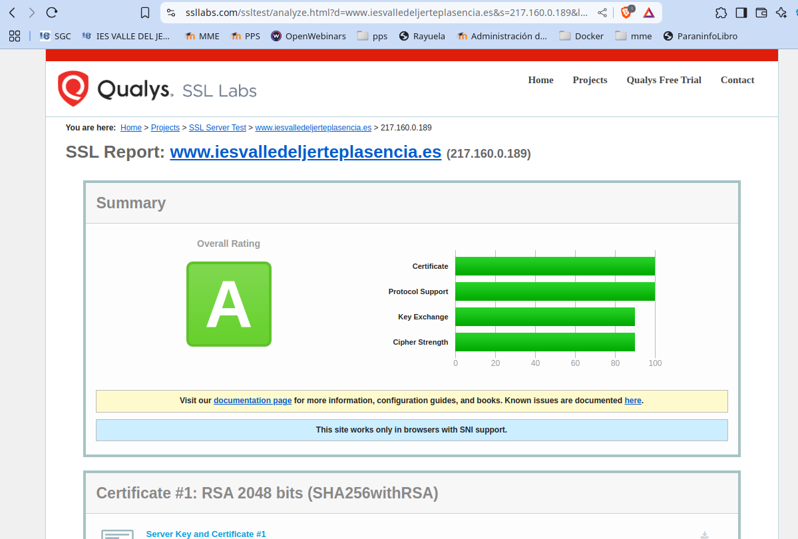


## 4. Mitigación de problemas

##  Deshabilitar versiones inseguras de TLS

Para evitar vulnerabilidades, en default-ssl.conf, en la sección de ssl, configurar:

archivo `/etc/apache2/sites-available/default-ssl.conf`
```apache
SSLProtocol TLSv1.2 TLSv1.3
SSLCipherSuite HIGH:!aNULL:!MD5
```
- `SSLCipherSuite HIGH:!aNULL:!MD5` Garantiza un cifrado SSL con un alta grado de protección.

También podemos eliminar las versiones antiguas con:

```apacheconf
SSLProtocol all -SSLv2 -SSLv3 -TLSv1 -TLSv1.1
```

Esto asegura que solo TLS 1.2 y 1.3 estén habilitados.

**En sistemas más actualizados, se puede reemplazar:**

```apache
SSLProtocol TLSv1.2 TLSv1.3
SSLCipherSuite HIGH:!aNULL:!MD5
```

por:

```apache
SSLOpenSSLConfCmd MinProtocol TLSv1.3
SSLOpenSSLConfCmd CipherString DEFAULT@SECLEVEL=2
```
Esto usa los ajustes por defecto del sistema con un buen nivel de seguridad (SECLEVEL=2 es el mínimo recomendado para producción).


**Notas importantes:**

• Esta opción requiere Apache 2.4.43 o superior y OpenSSL 1.1.1 o superior.

• Si se usa SSLOpenSSLConfCmd , es preferible no usar SSLProtocol, para evitar conflictos.

• Se puede usar también `SSLOpenSSLConfCmd CipherString` para definir el conjunto de cifrados (similar a `SSLCipherSuite` pero más moderno y compatible con OpenSSL 1.1.1+ y 3.0+).


## 🛡️ Nota de seguridad extra: HSTS (opcional pero recomendado)

**HSTS** es una política de seguridad que obliga al navegador a acceder siempre mediante HTTPS, incluso si el usuario escribe el dominio sin "https://".

Agrega este encabezado en la configuración del sitio:

```apacheconf
Header always set Strict-Transport-Security "max-age=31536000; includeSubDomains; preload"
```

Esto indica que:

- Se usará HTTPS por al menos 1 año (`max-age=31536000`)

- Incluye subdominios

- Se puede incluir en la lista de precarga de navegadores

Habilita el módulo `headers` si no está activo:

```bash
sudo a2enmod headers
sudo systemctl restart apache2
```


El fichero de configuración quedaría así:

```apache
<VirtualHost *:80>

    ServerName www.pps.edu

    ServerAdmin webmaster@localhost
    DocumentRoot /var/www/html

    ErrorLog ${APACHE_LOG_DIR}/error.log
    CustomLog ${APACHE_LOG_DIR}/access.log combined

</VirtualHost>

<VirtualHost *:443>
    ServerName www.pps.edu

    DocumentRoot /var/www/html

    #activar uso del motor de protocolo SSL
    SSLEngine on
    SSLCertificateFile /etc/apache2/ssl/server.crt
    SSLCertificateKeyFile /etc/apache2/ssl/server.key
    # solo usar versiones modernas
    SSLProtocol TLSv1.2 TLSv1.3
    # Forzar solo cifrados seguros
    SSLCipherSuite HIGH:!aNULL:!MD5
    # Activar HSTS
    Header always set Strict-Transport-Security "max-age=63072000; includeSubDomains; preload"
</VirtualHost>
```

> Esto obliga a los navegadores a recordar usar siempre HTTPS, protegiendo de ataques de tipo *downgrade*.

**Importante**: Asegúrate de que todo tu sitio funcione bien en HTTPS antes de aplicar HSTS.
---

##  Otras buenas prácticas

- **Redirigir HTTP a HTTPS** automáticamente, por ejemplo con:

```apacheconf
<VirtualHost *:80>
    ServerName www.ejemplo.com
    Redirect permanent / https://www.ejemplo.com/
</VirtualHost>
```

- **Certificados de 2048 bits o superiores**
- **Habilitar Forward Secrecy** (viene por defecto con TLS 1.3)
- **Revisar caducidad de certificados** y configurar alertas si es necesario
- **Evitar cifrados débiles**, configurando los parámetros `SSLCipherSuite` correctamente

---
## Verificación de funcionamiento de TLS

Se puede verificar de manera local que la configuración TLS está funcionando correctamente, especialmente útil cuando:

- No se dispone de un dominio público.

- Se está trabajando en un entorno de desarrollo o laboratorio.

- Se quiere confirmar que TLS 1.3 está habilitado y operativo antes de poner el servidor en producción.

```bash
openssl s_client -connect localhost:443 -tls1_3
```

Este comando:

• Intenta establecer una conexión TLS específicamente con la versión 1.3.

• Muestra un resumen de la negociación TLS, incluyendo:
   
	- La versión del protocolo usada.

	- El certificado presentado.

	- El conjunto de cifrado negociado.

Si se obtiene en la salida:
```Protocol
 : TLSv1.3
Cipher
 : TLS_AES_256_GCM_SHA384
....
```

entonces TLS 1.3 está activo y funcionando.

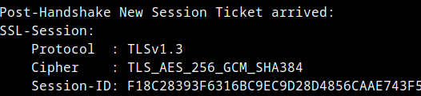

Con el siguiente comando basado en nmap, hacemos un escaneo y enumeramos todas las versiones de TLS y conjuntos de cifrado  que el servidor acepta.

```bash
nmap --script ssl-enum-ciphers -p 443 localhost
```

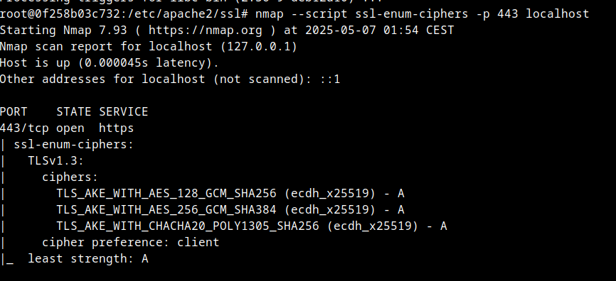

Requiere tener el paquete nmap instalado: 

``` bash
sudo apt install nmap
```

Esto confirma que el servidor acepta solo TLSv1.2 y TLSv1.3 (si se configuró correctamente la exclusión de versiones antiguas).


## ¿Cómo eliminar la advertencia del candado? (Opcional)

Si solo trabajas en local, no hay problema en ignorar la advertencia. Pero si se quiere que el navegador lo reconozca como seguro sin advertencias, dado que Firefox solo permite importar certificados de CA en la pestaña "Authorities", se debe generar un certificado raíz de CA y luego firmar el certificado con él.


4. Importar la CA en Firefox

Como estamos con docker,

Importar `server.crt` en la pestaña "Authorities" de Firefox:

1. Abrir Firefox e ir a `Ajustes` > `Privacidad & Seguridad`

2. En apartado `Seguridad`, en `Avanzado` y seleccionar `Gestionar certificados`

3. En la pestaña `Tus Certificados` y seleccionar `Importar`...

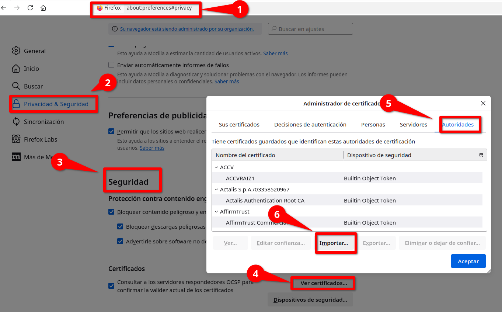

4. Como tenemos nuestro servidor en docker, pero tenemos un volumen montado para la configuración, podemos acceder a los certificados en la ruta `docker-compose-lamp/config/ssl/etc/apache2/ssl/server.crt`(donde docker-compose-lamp es la carpeta donde se encuentra el `docker-compose.yml` de nuestro escenario multicontenedor. Copia el Archivo `server.crt` a tu sistema de archivos para que no haya problema con los permisos y lo seleccionas ahí.

5. Marcar la casilla "Confiar en esta CA para identificar sitios web"


6. Guardar los cambios.

Firefox confiará en los certificados firmados por esta CA, y la advertencia debería desaparecer.

---


## ENTREGA

> __Realiza las operaciones indicadas__

> __Crea un repositorio  con nombre PPS-Unidad3Actividad17-Tu-Nombre donde documentes la realización de ellos.__

> No te olvides de documentarlo convenientemente con explicaciones, capturas de pantalla, etc.

> __Sube a la plataforma, tanto el repositorio comprimido como la dirección https a tu repositorio de Github.__


