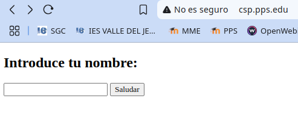
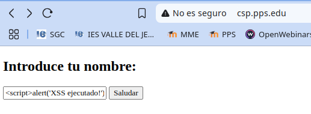
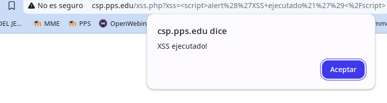
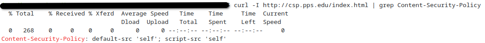
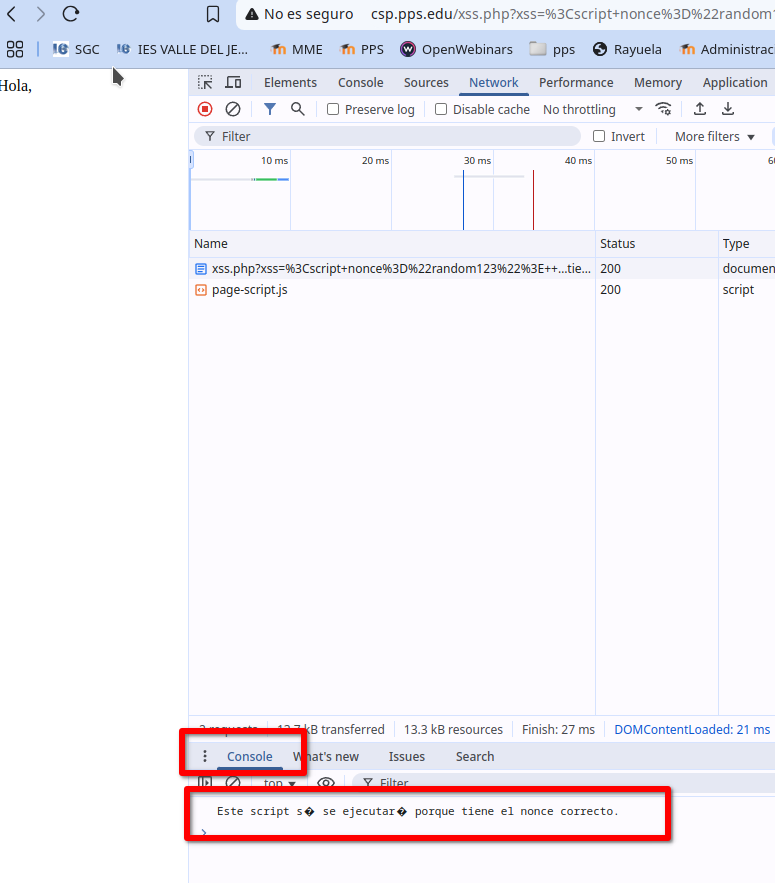

# Actividad-Content Security Policy (CSP)
Implementación y Evaluación de Content Security Policy (CSP) 

# 🛡️ Implementación y Evaluación de Content Security Policy (CSP)

[](#)
[](#)
[](#)

## 📌 Tema
**Aplicar CSP nos permite protección contra XSS e inyección de scripts**

## 🎯 Objetivo
Aplicar una Content Security Policy (CSP) restrictiva y evaluar su impacto.

---

## ❓ ¿Qué es CSP?

**CSP (Content Security Policy)** es un mecanismo de seguridad que limita los orígenes de scripts, estilos e imágenes en una aplicación web para evitar ataques como **XSS**.

---
## Iniciar entorno de pruebas

-Situáte en la carpeta de del entorno de pruebas de nuestro servidor LAMP e inicia el escenario docker-compose

~~~
docker-compose up -d
~~~

Cómo estamos utilizando un escenario docker-compose, para acceder a nuestra máquina tendremos que ejecutar:

~~~
docker exec -it lamp-php83 /bin/bash
~~~

Nuestro contenedor que contiene el servicio web, como ves se llama lamp-php83. Si la carpeta donde tienes el escenario tiene otro nombre diferente de lamp, tendrás que cambiar el nombre.


## 🔧 Implementación


### 1. Crear una página web vulnerable sin CSP

Para probar, vamos a crear una página vulnerable sin CSP.

Creamos en nuestro servidor un host virtual con nombre `csp.edu`. Lo primero creamos la carpeta y el resto de archivos:

~~~
mkdir /var/www/html/CSP
~~~

Archivo `/etc/apache2/sites-available/csp.conf`:
~~~
<VirtualHost *:80>

        ServerAdmin webmaster@localhost
        ServerName csp.pps.edu

        DocumentRoot /var/www/html/CSP

        ErrorLog ${APACHE_LOG_DIR}/error.log
        CustomLog ${APACHE_LOG_DIR}/access.log combined

</VirtualHost>

~~~

Habilitamos el host virtual y reiniciamos el servicio

~~~
a2ensite csp.conf
service apache2 reload
~~~

Comprobamos también que hemos añadido en `/etc/hosts` el nombre del host virtual:

```
127.0.0.1       csp.pps.edu      www.csp.pps.edu
```

Y creamos los archivos para probar.

El archivo index.html nos mostrará una caja de texto en la que podremos introducir nuestro nombre para que nos salude.

Archivo `index.html`:

```html
<!DOCTYPE html>
<html>
<head>
    <title>Prueba sin CSP</title>
</head>
<body>
    <h2>Introduce tu nombre:</h2>
    <form action="xss.php" method="GET">
        <input type="text" name="xss">
        <button type="submit">Saludar</button>
    </form>
</body>
</html>
```

Creamos un ficher xss.php que es llamado desde `index.html` con el nombre introducido. Con él vamos a probar si la web es vulnerable a ataques **XSS**.


Archivo `xss.php`:

```php
<?php 
    echo "Hola, " . $_GET['xss']; 
?>
```

Y, si no está, cambiamos el propietario de todo el directorio a www-data:

```
chown -R  www-data:www-data CSP/
```

Al acceder al servidor `http://csp.pps.edu` se nos mostrará algo así:




**Ataque XSS de prueba:**

Para probar si es vulnerable a ataques  **XSS** introducimos en el campo de saludo:

```html
<script>alert('XSS ejecutado!')</script>
```



Si el `alert()` se ejecuta, la página es vulnerable.



Puedes hacer pruebas con los ejemplos [que puedes encontrar en las sección de Pruebas de BYPASS al final del repositorio](#Pruebas-BYPASS)

---

### 2. Implementar CSP

Editamos el archivo de configuración del sitio virtual`/etc/apache2/sites-availabe/csp.conf`:

```apache
<VirtualHost *:80>

        ServerName csp.pps.edu
        ServerAdmin webmaster@localhost

        DocumentRoot /var/www/html/CSP

        ErrorLog ${APACHE_LOG_DIR}/error.log
        CustomLog ${APACHE_LOG_DIR}/access.log combined

        <IfModule mod_headers.c>
            Header always set Content-Security-Policy "default-src 'self'; script-src 'self'"
        </IfModule>
</VirtualHost>
```


**Significado:**

- `Header always set`: “Agrega este header HTTP siempre, sin importar el tipo de respuesta.” Hay otras variantes como set, append, unset, etc...

- `Content-Security-Policy`: Es el header que ayuda a proteger el sitio de ataques XSS.

- `default-src 'self'`:  Todos los recursos (imágenes, estilos, scripts, iframes, etc.) solo se pueden cargar desde el mismo origen que la página (misma IP/dominio y puerto).

- `script-src 'self'`: Específicamente los scripts solo pueden venir del mismo lugar.

⚠️ ¿Qué no permite? Cualquier script externo (como los de Google Analytics, jQuery CDN, etc.), y más importante: los scripts insertados directamente en el HTML

---

### 3. Habilitar `mod_headers` y reiniciar Apache

Habilitamos el módulo **headers** (si no está habilitado Apache ignora el bloque IfModule por completo) y recargamos el servicio **apache2** para que surtan efectos los cambios

```bash
a2enmod headers
service apache2 reload
```

---

### 4. Comprobar si CSP bloquea XSS

Accede a:

```
http://csp.pps.edu/
```

Intenta:

```html
<script>alert('XSS ejecutado!')</script>
```

El navegador debería bloquearlo y la consola del navegador (Pulsa F12 > "Consola") debería mostrar un error similar a:

```
Refused to execute script because 'script-src' directive disallows it.
```


---

## ✅ Mitigación y Buenas Prácticas

- Verifica CSP con:
  
```bash
curl -I http://csp.pps.edu/index.html | grep Content-Security-Policy
```

Si muestra la política CSP en la salida, Apache la está aplicando correctamente.




**Dónde aplicar CSP**

Dependiendo de dónde estén colocadas las cabeceras de **CSP** así será su alcance. Así si están colocados en:

  - `apache2.conf`: aplica a todo el servidor.

  - `.htaccess`: Se aplica sólo a la carpeta donde está incluido ese **.htaccess**.

  - `000-default.conf`: Se aplica sólo al VirtualHost principal.

  - Si Apache usa múltiples sitios (a2ensite), también se debe editar cada archivo en /etc/apache2/sites-available/.


Puedes hacer pruebas con los ejemplos [que puedes encontrar en las sección de Pruebas de BYPASS al final del repositorio](#Pruebas-BYPASS)

---

## 🔐 CSP Más Estricto para bloquear Scripts Inline y `eval()`

**Política avanzada:**

```apache
<IfModule mod_headers.c>
    Header always set Content-Security-Policy "default-src 'self'; script-src 'self' 'nonce-random123'; object-src 'none'; base-uri 'self'; frame-ancestors 'none'"
</IfModule>
```

**¿Qué hace esta política?**

- Solo permite scripts de la misma página `self`.

- Bloquea `eval()`, `setTimeout('code')` y `setInterval('code')`.

- Bloquea **scripts inline**, a menos que usen `nonce="random123"`.

- Bloquea `iframes` y contenido incrustado `frame-ancestors 'none'`.

- Evita la carga de `object` y `embed` (ataques con Flash o PDFs).

- Evita el uso de `<base>` externo (`base-uri 'self'`).


En resumen, impide iframes, objetos, y el uso de `<base>` externo.

Para probar hacemos los cambios:

Archivo ` /etc/apache2/sites-available/csp.conf`

```apache
VirtualHost *:80>

        ServerName csp.pps.edu
        ServerAdmin webmaster@localhost

        DocumentRoot /var/www/html/CSP

        ErrorLog ${APACHE_LOG_DIR}/error.log
        CustomLog ${APACHE_LOG_DIR}/access.log combined

        <IfModule mod_headers.c>
            Header always set Content-Security-Policy "default-src 'self'; script-src 'self' 'nonce-random123'; object-src 'none'; base-uri 'self'; frame-ancestors 'none'"
        </IfModule>
</VirtualHost>
```

Recargamos el servidor apache

```apache
service apache2 reload
```


**Ejemplo de script inline permitido con `nonce`:**

Insertamos en el campo el siguiente script:

```html
<script nonce="random123">
    console.log("Este script sí se ejecutará porque tiene el nonce correcto.");
</script>
```

Podemos ver en la consola del navegador,  que si se ha ejecutado:




---

## 🔒 CSP Máxima Seguridad (Recomendada para Producción)

Cambiamos las cabeceras por las siguientes:
```apache
<IfModule mod_headers.c>
    Header always set Content-Security-Policy "default-src 'self'; script-src 'self' 'nonce-ABC123'; style-src 'self' 'nonce-ABC123'; object-src 'none'; base-uri 'self'; frame-ancestors 'none'; upgrade-insecure-requests"
</IfModule>
```

**Mejoras:**

- Evita inline scripts y estilos CSS inseguros (style-src 'nonce-ABC123').

- Bloquea si la página intenta cargar contenido HTTP en un sitio HTTPS (upgrade-insecure-requests).

- Evita la carga de object, embed y frames.

- Mayor defensa contra inyecciones.

---

 🧪
## Pruebas BYPASS

1. Inline Script:
```html
<script>alert('XSS ejecutado!')</script>
```

2. Uso de `eval()`:
```html
<script>eval("alert('XSS ejecutado!')")</script>
```

3. Inyección de `iframe`:
```html
<iframe src="http://attacker.com"></iframe>
```

4. Evento malicioso en imagen:
```html

```

✅ Si todos son bloqueados, ¡la política CSP está funcionando!

---
