# Actividad - Explotación y Mitigación de Gestión Insegura de Sesiones
--- 
Tema: Secuestro de sesiones


Tenemos como **objetivo**:

> - Ver cómo se pueden hacer ataques en la gestión de las sesiones.
>
> - Analizar el código de la aplicación que permite ataques de Gestión insegura de sesiones.
>
> - Implementar diferentes modificaciones del codigo para aplicar mitigaciones o soluciones.


## ¿Qué es Session Management?
---
**Session Management** (gestión de sesiones) es un mecanismo que permite a las aplicaciones web rastrear y mantener el estado de los usuarios a lo largo de múltiples solicitudes HTTP. Una mala implementación puede exponer la aplicación a ataques como Session Hijacking (secuestro de sesión) o reutilización de tokens para suplantación de identidad.


## ACTIVIDADES A REALIZAR
---
> Lee detenidamente la sección de autenticación de la página de PortWigger <https://portswigger.net/web-security/authentication#what-is-authentication>
>
> Lee el siguiente documento sobre [Explotación y Mitigación de Gestión de sesiones inseguras](files/ExplotacionMitigacionGestionInseguraSesiones.pdf)
> 
> También y como marco de referencia, tienes [ la sección de correspondiente de Gestión de Sesiones  del **Proyecto Web Security Testing Guide** (WSTG) del proyecto **OWASP**.](https://owasp.org/www-project-web-security-testing-guide/latest/4-Web_Application_Security_Testing/06-Session_Management_Testing/README)
>


Vamos realizando operaciones:

### Iniciar entorno de pruebas

Situáte en la carpeta de del entorno de pruebas de nuestro servidor LAMP e inicia el escenario docker.

~~~
docker-compose up -d
~~~

### Archivo mostrar_sesion.php

Vamos a crear un archivo `php`para que nos muestre los datos de la sesión:

archivo `mostrar_sesion.php`
```php
?php
session_start();

$usuario = $_SESSION['user'] ?? "No autenticado";
$horaInicio = isset($_SESSION['inicio']) ? date("Y-m-d H:i:s", $_SESSION['inicio']) : "No iniciada";

echo "<h2> ^=^t^m Informaci  n de la sesi  n</h2>";
echo "<ul>";
echo "<li><strong>Usuario:</strong> " . htmlspecialchars($usuario, ENT_QUOTES, 'UTF-8') . "</li>";
echo "<li><strong>Sesi  n activa:</strong> " . (session_status() === PHP_SESSION_ACTIVE ? "S    ^|^e" : "No  ^}^l") . "</li>";
echo "<li><strong>Hora de inicio:</strong> " . $horaInicio . "</li>";
echo "<li><strong>Cookies:</strong><br><pre>" . print_r($_COOKIE, true) . "</pre></li>";
echo "</ul>";
// dependiendo  del archivo que estemos probando deberiamos cambiar abajo: sesion.php, sesion1.php, etc.
echo '<p><a href="sesion.php"> ^=^t^y Volver a sesion.php</a></p>';
?>
```
💡 ¿Qué permite este módulo?

- Ver si la sesión está activa.

- Mostrar el nombre del usuario autenticado.

- Ver la hora exacta en que se inició la sesión.

- Listar el contenido de las cookies asociadas.

Ten en cuenta que según al archivo de sesión que lo estemos aplicando, puede ser que no se muestren todos los datos.

Si lo utilizas con otro archivo diferente a `sesion.php` tienes que modificar el enlace. 

---

## Código vulnerable

Creamos el archivo vulnerable: **session.php**

~~~
<?php
session_start();

if (isset($_GET['user'])) {
    $_SESSION['user'] = $_GET['user'];
    echo "Sesión iniciada como: " . htmlspecialchars($_SESSION['user']);
    // Enlace al visor de sesi  n
    echo '<br><a href="mostrar_sesion.php"> ^=^t^m Ver detalles de la sesi  n</a>';
}
?>

<!DOCTYPE html>
<html lang="es">
<head>
    <meta charset="UTF-8">
    <title>Inicio de Sesión Inseguro</title>
</head>
<body>
    <h2>Iniciar sesión</h2>
    <form method="GET">
        <label for="user">Usuario:</label>
        <input type="text" id="user" name="user" required>
        <button type="submit">Iniciar sesión</button>
    </form>
</body>
</html>
~~~

Se nos muestra una entrada de texto para que introduzcamos nuestro usuario:

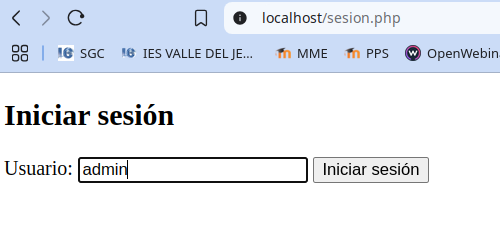

El formulario se envia como `http://localhost/sesion.php?user=admin` y con método get.

Nos informa que se ha iniciado sesión con el usuario introducido:

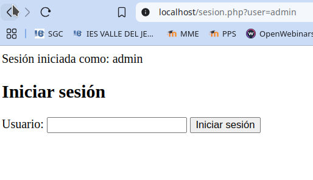


**¿Por qué es vulnerable?**

1. No se valida ni se sanea el parámetro `user`, permitiendo inyecciones.

2. No se regenera el identificador de sesión al iniciar sesión, permitiendo reutilización de sesiones.

3. No hay restricciones de seguridad en la cookie de sesión, facilitando ataques como `Session Hijacking` o `Session Fixation`.

4. La sesión puede ser manipulada fácilmente modificando la URL (por ejemplo añadiendo: `?user=SuperAdmin`) para acceder con cualquier usuario, incluso con usuarios privilegiados.

## Simulación de ataques y mejoras de seguridad en sesiones PHP

- Puedes probar ataque XSS introduciendo en el campo del usuario algo así como `<script>alert(1)</script>`.


---

### Explotación de Session Hijacking

Si un atacante obtiene una cookie de sesión válida, puede suplantar a un usuario legítimo.


1. Capturar la cookie de sesión activa desde el navegador de la víctima.

2. Usar esa misma cookie en otro navegador o dispositivo.

3. Si la sesión es válida y reutilizable, la aplicación es vulnerable.


**Pasos para obtener las `Coockies` en el navegador**

🔍 Vamos a Ver como podemos ver el encabezado **Set-Cookie** para acceder a los datos de sesión.

- Abre tu página en Chrome donde se ejecuta tu código PHP.

- Presiona **F12** o haz clic derecho y selecciona **"Inspeccionar"** para abrir las herramientas de desarrollador.

- Ve a la pestaña **""Network"** (Red).

- Selecciona la pestaña **"all"**


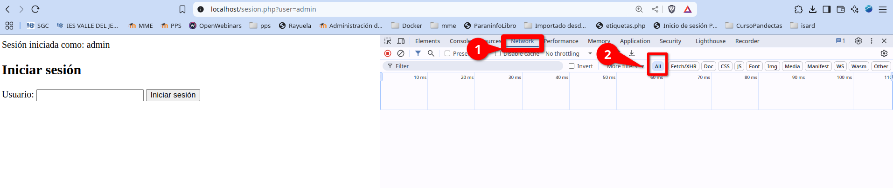


- Recarga la página (F5) con las herramientas abiertas.

- Busca en la lista de peticiones la que corresponda a tu archivo PHP (por ejemplo: **index.php, login.php, etc.**).

- Haz clic en esa petición.

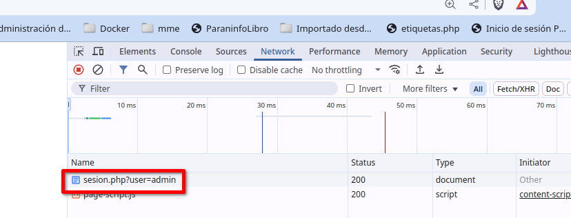


- Dentro del panel de detalles, selecciona la subpestaña **"Headers"** (Encabezados).

- Baja hasta la sección **"Response Headers"** (Encabezados de respuesta).

Ahí deberías ver una línea como: `Cookie` y dentro de ella una variable `PHPSESID` con su valor, en mi caso, `PHPSESSID=PHPSESSID=e6d541e8b64a3117ca7fbc56a4198b8c`

También tenemos justamente debajo el servidor dónde se ha almacenado `host   localhost`

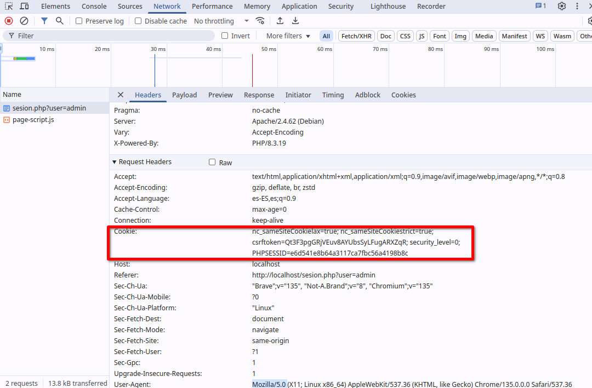


**Ataque detallado: Session Hijacking**

A continuación, se detalla cómo un atacante puede explotar este código vulnerable para secuestrar la sesión de unusuario legítimo.


1. El usuario legítimo inicia sesión

	1. El usuario accede a la web y pasa su nombre de usuario en la URL: 

	~~~
	http://localhost/session.php?user=admin
	~~~

	2. El servidor crea una sesión y almacena la variable: `$_SESSION['user'] = 'admin';`

	3. El navegador almacena la cookie de session: `Cookie: PHPSESSID=e6d541e8b64a3117ca7fbc56a4198b8c; path=/;`

	4. Ahora, cada vez que el usuario haga una solicitud, el navegador enviará la cookie: `Cookie: PHPSESSID=e6d541e8b64a3117ca7fbc56a4198b8c`

2.  El atacante roba la cookie de sesión
	
	El atacante necesita obtener el Session ID (PHPSESSID) de la víctima. Puede hacerlo de varias formas:

> **Robar Cookie mediante Captura de tráfico (MITM)**
>
> Si la web no usa HTTPS, un atacante puede capturar paquetes de red con herramientas como Wireshark:
>
>1. Iniciar Wireshark 
> ~~~
> sudo wireshark 
>~~~
>
>Se nos pide introducir una interfaz de red para capturar el tráfico. Como nosotros estamos virtuaizando, es posible que tengamos muchas, pero vamos a ver la actividad en las diferentes redes.
>
>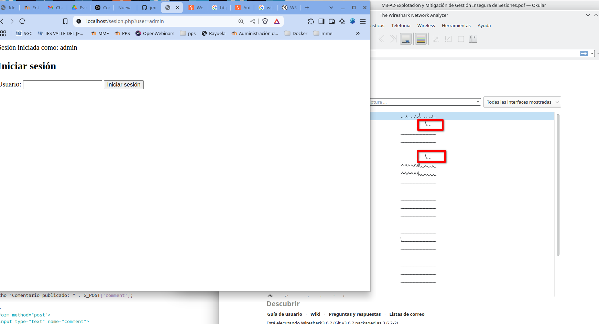
>
> En este momento puede enviar mi consulta a `http://localhost/session.php` y veré en que red se produce la actividad y la selecciono.
>
>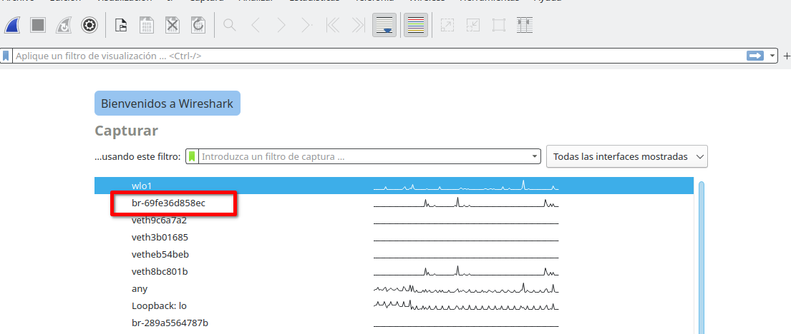
>
> Una vez que  estamos capturando el tráfico de la red, en filtro, ponemos `http.cookie` y nos mostrará el inmtercambio de paquetes donde tenemos esos datos.
>
>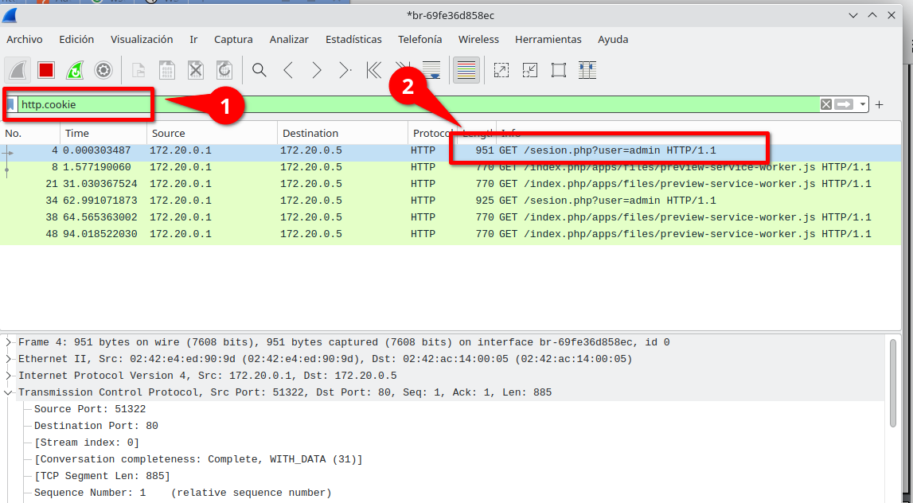
>
> Hacemos doble click sobre ese paquete y se nos abre una ventana con todos los datos. 
>
>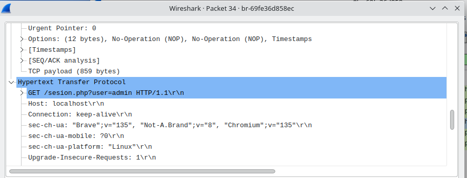
>
> Nos vamos al apartado **Hypertext Transfer Protocol**  y allí podemos ver la información de las variables.
>
>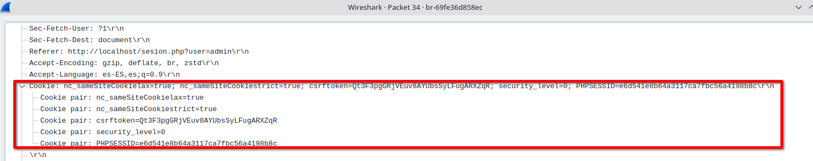
>
>Ya el atacante tiene los datos de nuestra sesión.


> **Robar Cookie mediante Ataque XSS (Cross-Site Scripting)**
>Si la aplicación tiene alguna vulnerabilidad XSS, el atacante puede inyectar un script para robar cookies. 
>
> Puedes ver cómo obtener los datos de sesión mediante ataque XSS en la actividad correspondiente: <https://github.com/jmmedinac03vjp/PPS-Unidad3Actividad5-XSS>


> **Robar Cookie mediante Sniffing en redes WiFi públicas**
>
> Si la víctima usa una WiFi pública sin HTTPS, su cookie puede ser interceptada con herramientas como Firesheep o Ettercap.
>
>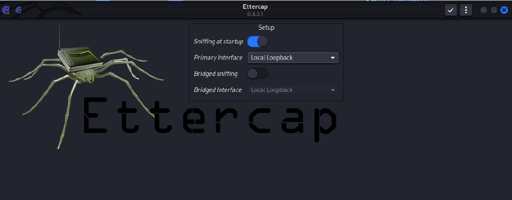
>


**Como utilizar la cookie robada**

Una vez que el atacante tiene la cookie de sesión (PHPSESSID=e6d541e8b64a3117ca7fbc56a4198b8c), la puede utilizar para suplantar a la víctima.

1. Editar cookies en el navegador: Abrir las herramientas de desarrollador (F12 en Chrome).

2. Ir a Application > Storage > Cookies.

3. Seleccionar https://localhost

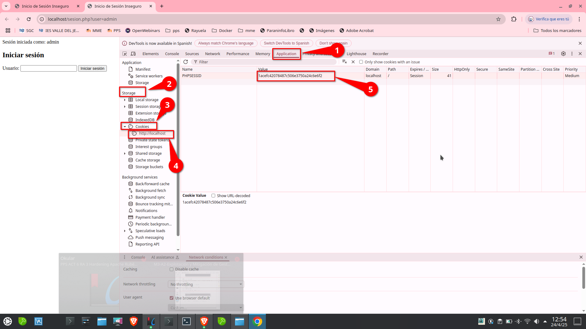

4. Modificar PHPSESSID y reemplazarlo por el valor robado.

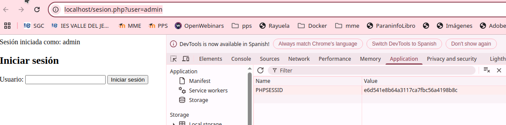

5. Enviar el Session ID en una solicitud.

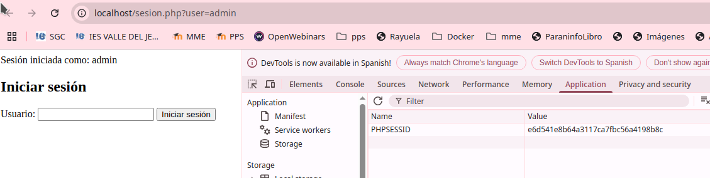

El atacante puede acceder directamente a la sesión de la víctima: http://localhost/session.php

Añadiendo manualmente la cookie con cURL:

~~~
curl -b "PHPSESSID=e6d541e8b64a3117ca7fbc56a4198b8c" https://localhost/sesion.php
~~~

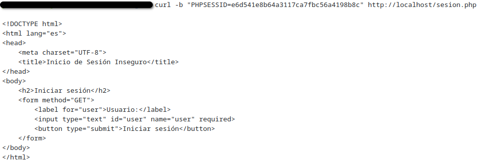

6. Acceso a la cuenta de la víctima

Ahora el atacante ya puede:

- Ver datos personales de la víctima.

- Realizar cambios en la cuenta (si hay opciones de perfil).

- Hacer compras o transacciones (si la web lo permite).

- Modificar la contraseña del usuario.

---

### Mitigación de problemas

Para evitar este ataque, hemos implementado varias medidas (las vemos una a una, tienes el código completo al final de la explicación de todas ellas):


**Prevenir vulnerabilidades `XSS`**

Usar `htmlspecialchars()` siempre que se muestre información del usuario:

```php
$_SESSION['user'] = htmlspecialchars($_GET['user'], ENT_QUOTES, 'UTF-8');
```


**Prevenir vulnerabilidades `Session Fixation`, regenerando el ID de sesión en cada inicio de sesión, además guarda en la sesión el valor recibido por `GET['user']`, sanitizándolo para evitar ataques XSS (Cross-Site Scripting).**

``` php
$_SESSION['user'] = htmlspecialchars($_GET['user'], ENT_QUOTES, 'UTF-8');
```

> - En el inicio de sesión borramos los datos de la sesión anterior y generamos una nueva.
>
> - Sanitizamos la entrada.

Veremos como cada vez que accedamos a la sesión nos generara un valor nuevo de PHPSESSID.


**Configurar la cookie de sesión de forma segura y tiempo de expiración de sesión**

~~~
// Configuración segura de la cookie de sesiónn
session_set_cookie_params([
    'lifetime' => 1800,
    'path' => '/',
    'domain' => 'pps.edu', //   IMPORTANTE! Esto solo funcionar   en pps.edu, no en localhost
    'secure' => true,
    'httponly' => true,
    'samesite' => 'Lax'
]);
~~~

> - La sesión sólo permanece abierta un tiempo determinado.
>
> - Anulamos ejecución de JavaScript
>
> - No permitimos sesion introducida directamente en URL, sólo a través de las cookies
>
> - Sólo funciona en el sitio especificado "pps.edu" no localhost ni ningún otro dominio.

**Validar la IP y User-Agent del usuario**

~~~
// Validaci  n de IP para evitar Session Hijacking
if (!isset($_SESSION['ip'])) {
    $_SESSION['ip'] = $_SERVER['REMOTE_ADDR'];
} elseif ($_SESSION['ip'] !== $_SERVER['REMOTE_ADDR']) {
    session_unset();
    session_destroy();
    $sesion_valida = false;
}
~~~

> - Si la IP desde dónde se estableció la sesión guardada es diferente de la solicitud que se realiza destruimos la sesión


**Usar HTTPS siempre**

Configurar un SSL/TLS para cifrar las cookies y evitar capturas MITM.

~~~
// Redirigir HTTP a HTTPS si el usuario accede por HTTP
if (!isset($_SERVER['HTTPS']) || $_SERVER['HTTPS'] !== 'on') {
	header("Location: https://" . $_SERVER['HTTP_HOST'] . $_SERVER['REQUEST_URI']);
exit();
}
~~~


Creamos el archivo `sesion1.php` con el siguiente contenido:

archivo `sesion1.php`
```php
<?php

// Bloquear acceso desde hosts no permitidos
$host_permitido = 'pps.edu';
if ($_SERVER['HTTP_HOST'] !== $host_permitido && $_SERVER['HTTP_HOST'] !== 'www.' . $host_permitido) {
    die("Acceso no autorizado: este script solo puede ejecutarse en $host_permitido");
}

// Mostrar errores durante pruebas
ini_set('display_errors', 1);
error_reporting(E_ALL);

// Redirigir HTTP a HTTPS si el usuario accede por HTTP
if (!isset($_SERVER['HTTPS']) || $_SERVER['HTTPS'] !== 'on') {
    header("Location: https://" . $_SERVER['HTTP_HOST'] . $_SERVER['REQUEST_URI']);
    exit();
}

// Configuraci  n segura de la cookie de sesi  n
session_set_cookie_params([
    'lifetime' => 1800,
    'path' => '/',
    'domain' => 'pps.edu', //   IMPORTANTE! Esto solo funcionar   en pps.edu, no en localhost
    'secure' => true,
    'httponly' => true,
    'samesite' => 'Lax'
]);

session_start();
session_regenerate_id(true); // Prevenci  n de session fixation

$sesion_valida = true;

// Validaci  n de IP para evitar Session Hijacking
if (!isset($_SESSION['ip'])) {
    $_SESSION['ip'] = $_SERVER['REMOTE_ADDR'];
} elseif ($_SESSION['ip'] !== $_SERVER['REMOTE_ADDR']) {
    session_unset();
    session_destroy();
    $sesion_valida = false;
}

// Verificar tiempo de inactividad (30 minutos)
if ($sesion_valida) {
    if (!isset($_SESSION['last_activity'])) {
        $_SESSION['last_activity'] = time();
    } elseif (time() - $_SESSION['last_activity'] > 1800) {
        session_unset();
        session_destroy();
        $sesion_valida = false;
    } else {
        $_SESSION['last_activity'] = time();
    }
}

// Procesar usuario si la sesi  n es v  lida
if ($sesion_valida) {
    if (!isset($_SESSION['user'])) {
        if (isset($_GET['user'])) {
            $_SESSION['user'] = htmlspecialchars($_GET['user'], ENT_QUOTES, 'UTF-8');
        } else {
            $_SESSION['user'] = "Desconocido";
        }
    
    $mensaje = " ^|^e Sesi  n iniciada como: " . $_SESSION['user'];
    // Enlace al visor de sesi  n
    echo '<br><a href="mostrar_sesion.php"> ^=^t^m Ver detalles de la sesi  n</a>';
} else {
    $mensaje = " ^z   ^o Error: sesi  n inv  lida por IP no coincidente o inactividad. Vuelve a iniciar sesi  n.";
}
?>
<!DOCTYPE html>
<html lang="es">
<head>
    <meta charset="UTF-8">
    <title>Inicio de Sesi  n Seguro</title>
</head>
<body>
    <h2>Iniciar sesi  n</h2>
    <p><?= $mensaje ?></p>
    <form method="GET">
        <label for="user">Usuario:</label>
        <input type="text" id="user" name="user" required>
        <button type="submit">Iniciar sesi  n</button>
    </form>
</body>
</html>
```


### Habilitar HTTPS con SSL/TLS (Apache)
---

Este apartado está explicado con más detalle en el repositorio sobre Hardening del servidor apache: <https://github.com/jmmedinac03vjp/PPS-Unidad3Actividad13-HardeningSevidorApache-HTTPS-HSTS.git>


En resumen 

- Crear Certificados:

- Modificar archivo de configuración de sitio virtual:

archivo `/etc/apache2/sites-available/default-ssl.conf`
```apache
<VirtualHost *:80>

    ServerName www.pps.edu

    ServerAdmin webmaster@localhost
    DocumentRoot /var/www/html

    ErrorLog ${APACHE_LOG_DIR}/error.log
    CustomLog ${APACHE_LOG_DIR}/access.log combined

</VirtualHost>

<VirtualHost *:443>
    ServerName www.pps.edu

    DocumentRoot /var/www/html

    #activar uso del motor de protocolo SSL
    SSLEngine on
    SSLCertificateFile /etc/apache2/ssl/server.crt
    SSLCertificateKeyFile /etc/apache2/ssl/server.key
    <Directory /var/www/html>
	AllowOverride All
	Require all granted
    </Directory>
</VirtualHost>
```

Date cuenta que hemos creado un **servidor virtual** con nombre **www.pps.edu**. A partir de ahora tendremos que introducir en la barra de dirección del navegador `https://www.pps.edu` en vez de `https://localhost`.

- Habilitar módulo `SSL`

```bash
a2enmod ssl
a2ensite default-ssl.conf
service apache2 reload
```

- Añadir el sitio en `/etc/hosts`

- Comprobar que está habilitado https en el navegador:

Abrir DevTools (F12 en Chrome o Firefox).

Ir a Application → Storage → Cookies → pps.edu.

Comprobar que la cookie de sesión tiene el flag Secure habilitado.

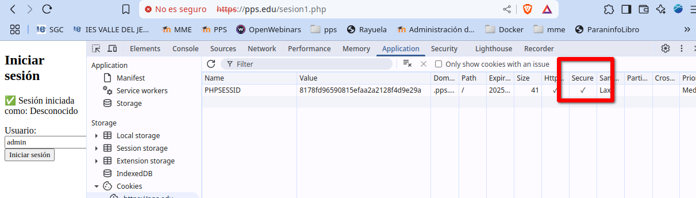


> Ahora el servidor soportaría **HTTPS**. Accedemos al servidor en la siguiente dirección: `https://pps.edu/sesion1.php`


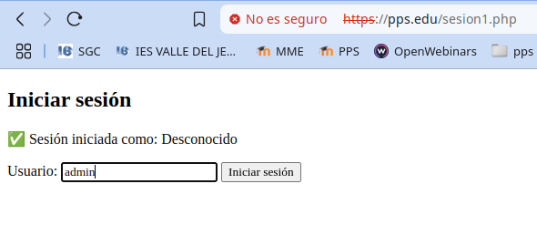


**🔒 Medidas de seguridad implementadass**

- Seguridad en sesiones:

	- Cookies seguras (HTTPS, HttpOnly, Only Cookies)

	- Regeneración de sesión

	- Validación de IP

	- Expiración por inactividad

	- Uso de`session_set_cookie_params()` en PHP 8.3 con array de opciones, para securizar cookies.


- Protección contra ataques:

	- Prevención de XSS con htmlspecialchars()

	- Protección contra secuestro de sesión (Session Hijacking)

	- Redirección a HTTPS para evitar ataques MITM

Este código refuerza la seguridad de sesiones en PHP y es una buena práctica para aplicaciones web que manejen autenticación de usuarios.


### 🛡️ 2. Mejoras de seguridad adicionales

#### ✅ A. Configuración de SameSite más estricta

```php
'samesite' => 'Strict' // Mayor protección CSRF (aunque puede afectar SSO)
```

#### ✅ B. Control de intentos fallidos (prevención fuerza bruta)

```php
if (!isset($_SESSION['intentos'])) {
    $_SESSION['intentos'] = 0;
}

if ($_SESSION['intentos'] >= 5) {
    die("⚠️ Demasiados intentos. Inténtalo más tarde.");
}

// En caso de fallo de autenticación:
// $_SESSION['intentos']++;
```

#### ✅ C. Cierre seguro de sesión

```php
if (isset($_GET['logout'])) {
    session_unset();
    session_destroy();
    header("Location: sesion1.php");
    exit();
}
```

Agregar un botón de cierre en HTML:

```html
<a href="?logout=1">Cerrar sesión</a>
```

---

Este conjunto de ejemplos permite ilustrar tanto las amenazas reales como las buenas prácticas en el manejo de sesiones en PHP, ideal para una clase o entorno de formación en seguridad web.

---


## CODIGO SEGURO

Archivo seguro `sesion2.php`
```PHP
<?php
// Redirigir HTTP a HTTPS
if (!isset($_SERVER['HTTPS']) || $_SERVER['HTTPS'] !== 'on') {
    header("Location: https://" . $_SERVER['HTTP_HOST'] . $_SERVER['REQUEST_URI']);
    exit();
}

// Configuración segura de cookies
session_set_cookie_params([
    'lifetime' => 1800,
    'path' => '/',
    'domain' => 'pps.edu',
    'secure' => true,
    'httponly' => true,
    'samesite' => 'Strict'
]);

session_start();

// Simulación de ataque por fijación de sesión
if (isset($_GET['fix_session_id'])) {
    session_id($_GET['fix_session_id']); // Sólo demostración
}

session_regenerate_id(true);

// Validación IP + User-Agent
if (!isset($_SESSION['ip']) || !isset($_SESSION['user_agent'])) {
    $_SESSION['ip'] = $_SERVER['REMOTE_ADDR'];
    $_SESSION['user_agent'] = $_SERVER['HTTP_USER_AGENT'];
} elseif ($_SESSION['ip'] !== $_SERVER['REMOTE_ADDR'] || $_SESSION['user_agent'] !== $_SERVER['HTTP_USER_AGENT']) {
    session_destroy();
    die("⚠️ Posible secuestro de sesión detectado.");
}

// Expiración por inactividad
if (!isset($_SESSION['last_activity'])) {
    $_SESSION['last_activity'] = time();
} elseif (time() - $_SESSION['last_activity'] > 1800) {
    session_unset();
    session_destroy();
    header("Location: sesion2.php?timeout=1");
    exit();
} else {
    $_SESSION['last_activity'] = time();
}

// Control de intentos (simulado)
if (!isset($_SESSION['intentos'])) {
    $_SESSION['intentos'] = 0;
}
if ($_SESSION['intentos'] >= 5) {
    die("⚠️ Demasiados intentos. Inténtalo más tarde.");
}

// Logout
if (isset($_GET['logout'])) {
    session_unset();
    session_destroy();
    header("Location: sesion2.php?loggedout=1");
    exit();
}

// Captura de usuario
if (isset($_GET['user'])) {
    $_SESSION['user'] = htmlspecialchars($_GET['user'], ENT_QUOTES, 'UTF-8');
}

$usuario = $_SESSION['user'] ?? null;
?>
<!DOCTYPE html>
<html lang="es">
<head>
    <meta charset="UTF-8">
    <title>Inicio de Sesión Seguro</title>
</head>
<body>
    <h2>Iniciar sesión</h2>
    <?php if (isset($_GET['timeout'])): ?>
        <p style="color:red;">⏳ La sesión ha expirado por inactividad.</p>
    <?php elseif (isset($_GET['loggedout'])): ?>
        <p style="color:green;">✅ Sesión cerrada correctamente.</p>
    <?php endif; ?>

    <?php if ($usuario): ?>
        <p>✅ Sesión iniciada como: <strong><?= $usuario ?></strong></p>
    	<p><br><a href="mostrar_sesion.php"> ^=^t^m Ver detalles de la sesi  n</a></br></p>
        <p><a href="?logout=1">Cerrar sesión</a></p>
    	// Enlace al visor de sesi  n
    <?php else: ?>
        <form method="GET">
            <label for="user">Usuario:</label>
            <input type="text" id="user" name="user" required>
            <button type="submit">Iniciar sesión</button>
        </form>
    <?php endif; ?>
</body>
</html>
```


## ENTREGA

> __Realiza las operaciones indicadas__

> __Crea un repositorio  con nombre PPS-Unidad3Actividad14-Tu-Nombre donde documentes la realización de ellos.__

> No te olvides de documentarlo convenientemente con explicaciones, capturas de pantalla, etc.

> __Sube a la plataforma, tanto el repositorio comprimido como la dirección https a tu repositorio de Github.__

