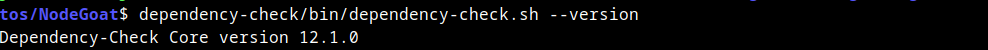
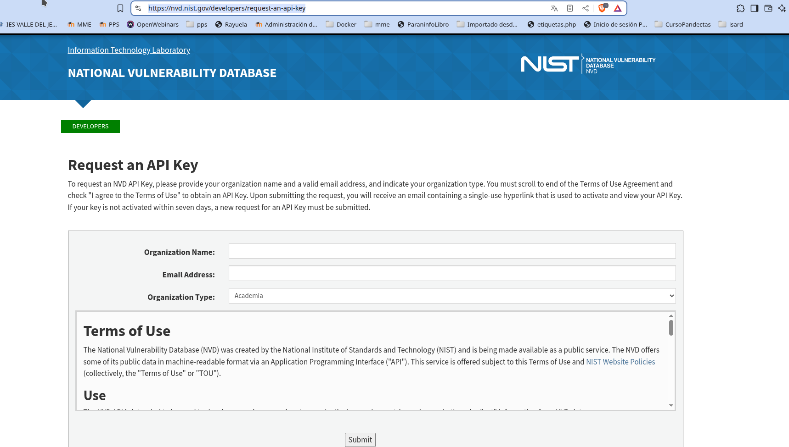
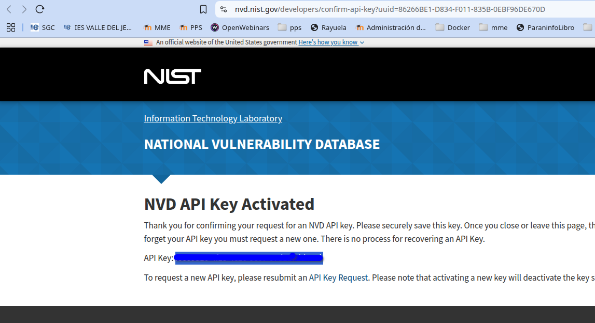
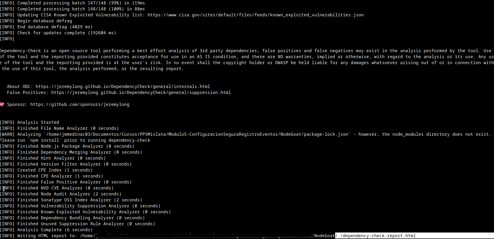
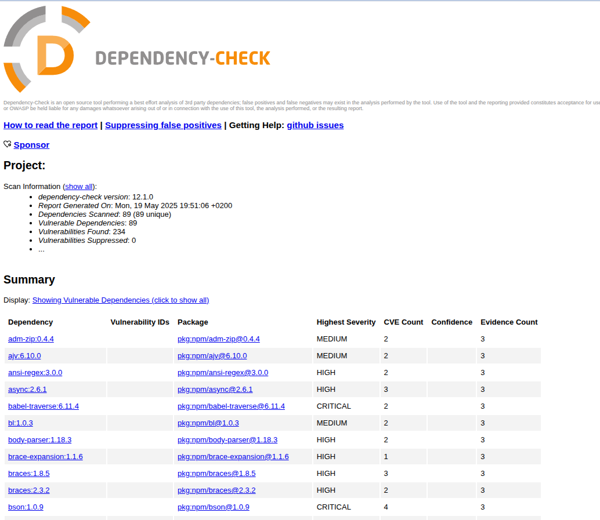
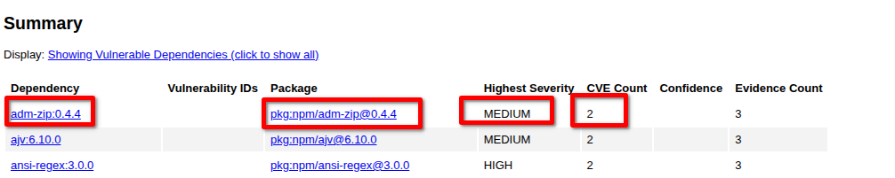
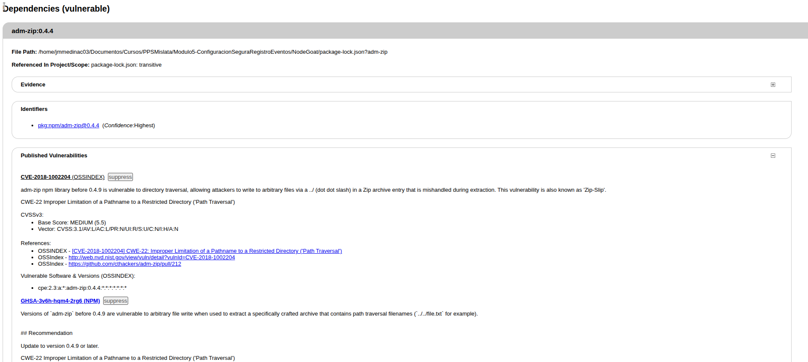

# Actividad 3: Análisis de Dependencias con Dependency-Check

**Tema:** Detección de librerías y paquetes vulnerables  
**Objetivo:** Usar Dependency-Check para analizar dependencias en un proyecto

---

## ¿Qué es Dependency-Check?

[Dependency-Check](https://owasp.org/www-project-dependency-check/) es una herramienta de código abierto de OWASP que permite identificar dependencias vulnerables en un proyecto al compararlas con bases de datos de vulnerabilidades conocidas, como la National Vulnerability Database (NVD).

Su propósito es ayudar a los desarrolladores y equipos de seguridad a detectar y mitigar riesgos asociados con el uso de librerías desactualizadas o inseguras.

---

## Instalar OWASP Dependency-Check

Ejecutar los siguientes comandos en la terminal:

```bash
wget https://github.com/jeremylong/DependencyCheck/releases/download/v12.1.0/dependency-check-12.1.0-release.zip

unzip dependency-check-12.1.0-release.zip
```

Para confirmar que la instalación fue exitosa, ejecuta:

```bash
dependency-check/bin/dependency-check.sh --version
```

Si la instalación es correcta, se debería mostrar la versión de la herramienta en la terminal.



---

## Solicitamos una key en la API de NVD

Si solicitamos un token en la API de la NVD: <https://nvd.nist.gov/developers/request-an-api-key> el proceso de escaneo será más rápido. 
Para ello accedemos a la página de solicitud e introducimos nuestros datos.



En el correo electrónico recibiremos un enlace para la confirmación. Después de validarla tendremos nuestro `key`. La guardamos para utilizarla en nuestra línea de comandos:



## Analizar un proyecto en Node.js

Para verificar vulnerabilidades en las dependencias de un proyecto basado en Node.js, crea el archivo `package-lock.json` de ejemplo con dependencias vulnerables:

Puedes [descargarlo desde aqui.](files/poackage-lock.json)

archivo `files/package-lock.json`
```json
{
  "name": "example-project",
  "version": "1.0.0",
  "lockfileVersion": 2,
  "requires": true,
  "dependencies": {
    "lodash": {
      "version": "4.17.15",
      "resolved": "https://registry.npmjs.org/lodash/-/lodash-4.17.15.tgz",
      "integrity": "sha512-...==",
      "dev": false
    },
    "express": {
      "version": "4.17.1",
      "resolved": "https://registry.npmjs.org/express/-/express-4.17.1.tgz",
      "integrity": "sha512-...==",
      "dev": false
    },
    "debug": {
      "version": "2.6.9",
      "resolved": "https://registry.npmjs.org/debug/-/debug-2.6.9.tgz",
      "integrity": "sha512-...==",
      "dev": false
    }
  }
}
```

También, y como hemos descargado el proyecto Node-Goat de OWASP [en la actividad de Análisis Estático de Código](https://github.com/jmmedinac03vjp/PPS-AnalisisEstaticoCodigoSAST) puedes utilizarl este.

Mis capturas las he realizado con OWASP NodeGoat
Y ejecutar Dependency-Check:

```bash

./dependency-check/bin/dependency-check.sh --nvdApiKey XXXX-XXXX.XXXXXX --scan package-lock.json --format HTML
```

Explicación:

- `--nvdApiKey` la key proporcionada por NVD
- `--scan package-lock.json`la ubicación del archivo package-lock.json del proyecto a escanear.
- `--format` HTML el formato del informe

Cuando se ejecuta se descargan los registros de la NVD (National Vulnerability Database). 

Si no usamos la nvdApiKey, tardará más, o sea que como son muchos, tarda un rato, o sea que paciencia¡¡¡




## Análisis del informe

Nos vamos a la ubicación del archivo donde se ha guardado el informe, en nuestro caso `dependency-check-report.html` y vemos los resultados:


Podemos observar que al ser una aplicación vulnerable tenemos muchas dependencias con riesgos:



Además podemos ver información del paquete afectado, la gravedad del riesgo y el número de CVE que pueden explotarlo.

Ejemplo de vulnerabilidad detectada:

> **adm-zip:0.4.4**		**pkg:npm/adm-zip@0.4.4**	Riesgo **MEDIUM** La libreria `adm-zip` de `npm` Es vulnerable al ataque Path transversal




Además podemos obtener una amplia información sobre el problema de esa dependencia.



---

## Mitigación y Mejores Prácticas

- Para reducir los riesgos de seguridad en el proyecto, actualizar dependencias vulnerables con la última versión disponible.  
  Se pueden usar herramientas integradas como:

  - **Node.js:** `npm audit fix`  
  - **Python (pip):** `pip list --outdated`

Mantener las dependencias actualizadas es clave para prevenir ataques basados en vulnerabilidades conocidas.
