# Actividad - Análisis Estático de APK con MobSF: InsecureBankv2

Este repositorio contiene una guía paso a paso para realizar un análisis estático de una aplicación Android vulnerable, **InsecureBankv2**, utilizando la herramienta **Mobile Security Framework (MobSF)**.

## Índice

1. [¿Qué es MobSF?](#1-qué-es-mobsf)  
2. [Obtener InsecureBankv2](#2-obtener-insecurebankv2)  
3. [Instalar MobSF](#3-instalar-mobsf)  
4. [Acceder a MobSF](#4-acceder-a-mobsf)  
5. [Análisis estático con MobSF](#5-análisis-estático-con-mobsf)  
6. [Interpretación de resultados](#6-interpretación-de-resultados)  

---

## 1. ¿Qué es MobSF?

**Mobile Security Framework (MobSF)** es una herramienta automatizada todo en uno para análisis de seguridad de aplicaciones móviles (Android/iOS/Windows). MobSF permite realizar análisis **estático**, **dinámico** y **basado en API**, y está especialmente diseñado para pruebas de seguridad móviles en entornos DevSecOps.

### Características principales:

- Análisis estático de APK, AAB, IPA y código fuente.
- Análisis dinámico (sandbox automatizado).
- Análisis de binarios y API REST.
- Informes detallados de seguridad y recomendaciones.

> Sitio oficial: https://mobsf.github.io/docs/

---

## 2. Obtener InsecureBankv2

**InsecureBankv2** es una aplicación vulnerable desarrollada con fines educativos para practicar análisis y explotación de fallos en apps móviles.

### Pasos:

1. Clona el repositorio oficial:
   ```bash
   git clone https://github.com/dineshshetty/Android-InsecureBankv2.git
   ```

2. Compila el APK con Android Studio o utiliza una versión precompilada (si está disponible).
  Puedes descargarla desde el repositorio git del desarrollador: <https://github.com/dineshshetty/Android-InsecureBankv2/blob/master/InsecureBankv2.apk>
> ⚠️ **Nota:** Esta aplicación es intencionadamente insegura. No la instales en dispositivos personales o en entornos de producción.

---

## 3. Instalar MobSF

Puedes ejecutar MobSF localmente utilizando Docker o de forma manual. A continuación, se muestra el método recomendado (Docker):

### Opción 1: Usar Docker (recomendado)

```bash
git clone https://github.com/MobSF/Mobile-Security-Framework-MobSF.git
cd Mobile-Security-Framework-MobSF
docker build -t mobsf .
docker run -it -p 8000:8000 mobsf
```

También puedes hacerlo directamente  levantando la imagen de dockerhub:

```bash
docker run -it --rm -p 8000:8000 opensecurity/mobile-security-framework-mobsf:latest
```
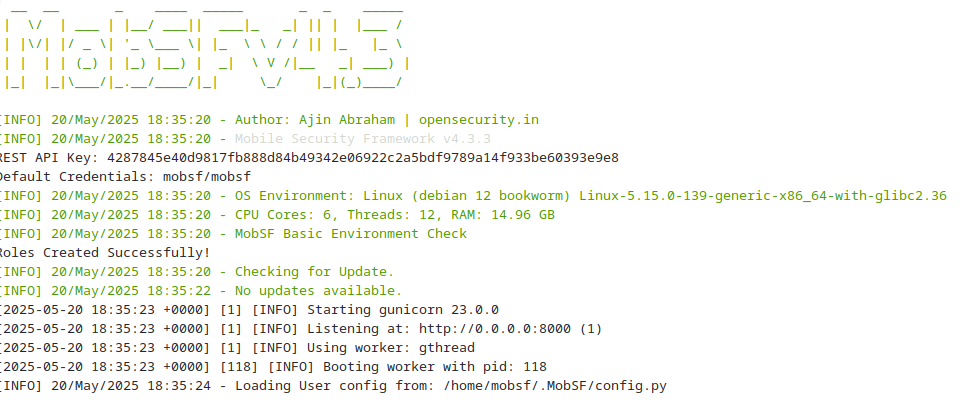

Como hemos creado un contenedor interactivo, `docker run -it`, el terminal quedará abierto. En él podremos ver 

### Opción 2: Instalación manual

Sigue la guía oficial en: https://mobsf.github.io/docs/#/installation

---

## 4. Acceder a MobSF

Una vez iniciado MobSF (ya sea por Docker o manualmente), accede a través de tu navegador:

> <http://localhost:8000>

En la pantalla de autenticación usamos el usuario `mobsf` y la contraseña por defecto: `mobsf`.


Verás la interfaz web de MobSF, lista para analizar APKs.


---

## 5. Análisis estático con MobSF

### Pasos:

1. Accede a `http://localhost:8000`.
2. Arrastra el archivo `InsecureBankv2.apk` o selecciónalo manualmente.

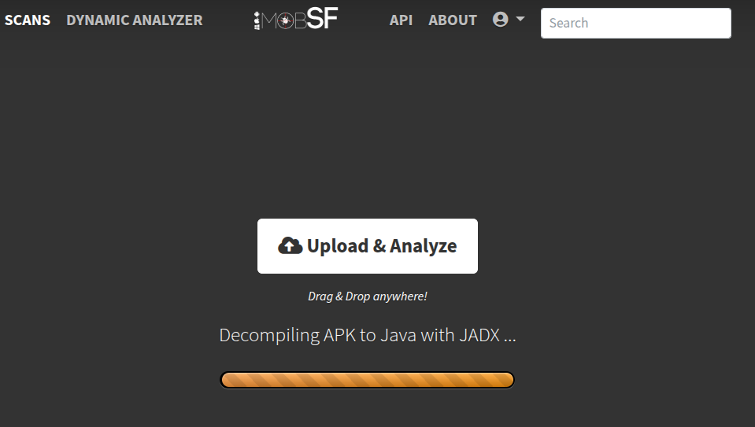

3. Espera a que se complete el análisis (unos segundos/minutos).
4. Se generará un informe detallado automáticamente.

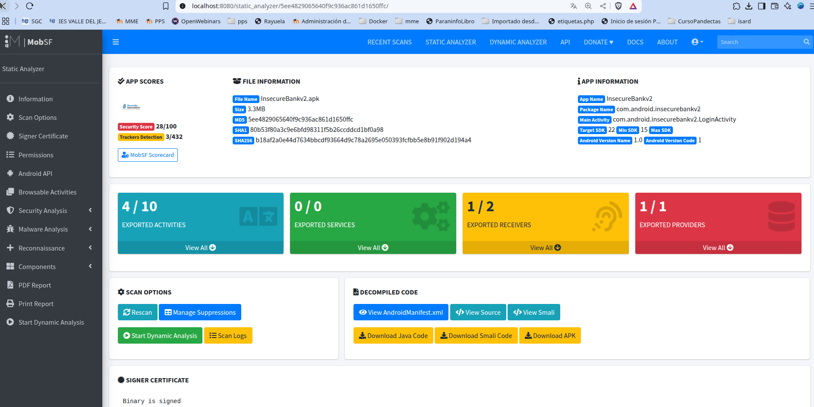

---

## 6. Interpretación de resultados

MobSF genera un informe con múltiples secciones, entre ellas:

- **Manifest Analysis**: Revisión de permisos, actividades exportadas, etc.
- **Code Analysis**: Identificación de código inseguro, API peligrosas, strings sensibles.
- **Security Score**: Puntuación general basada en vulnerabilidades encontradas.
- **Recommendations**: Buenas prácticas y sugerencias para corregir los fallos detectados.
- **Tracker/Library Detections**: Librerías de terceros potencialmente inseguras.

> Revisa especialmente los apartados que marcan hallazgos en rojo o con severidad alta.


Veamos la información sección por sección:


### 6-1 Information

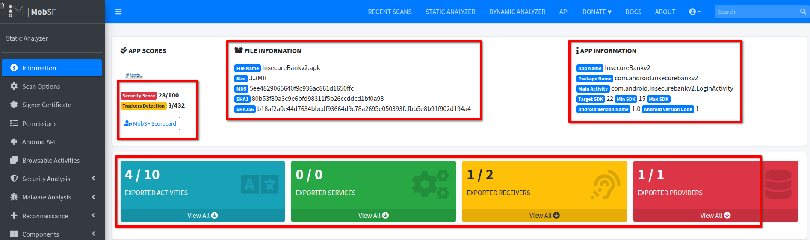

Aquí podemos ver információn sobre el **archivo** (nombre, tamaño, funciones hash) y del **paquete** (nombre del paquete, y versión de SKD soportadas y versión del paquete).

También podemos ver información sobre puntuación de seguridad, donde vemos que es una puntuación muy baja 28/100.

Si le damos al enlace `MobSF Scorecard` podemos ver la información básica resumida de forma visual.

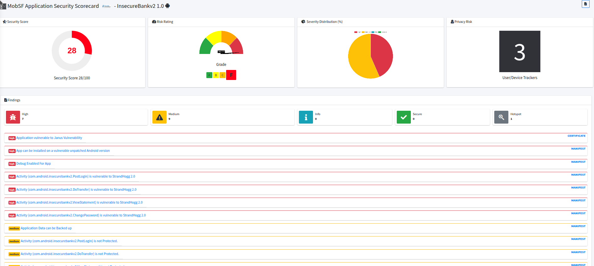


### Scan Options

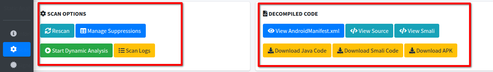

Tenemos dos secciones:
- **Scan Options** con opciones para 
	- Reescanear la aplicación.
	- Hacer análisis dinámico.
	- Ver los logs generados. Podemos filtrarlos para buscar los que queramos e incluso descargarlos.

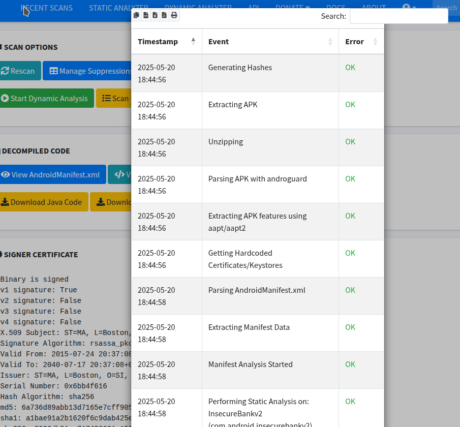

- **Decompiled code** donde podemos ver/descargar:
	- El `AndroidManifest.xml`
	- Las fuentes `.java` del paquete
	- Las fuentes `.smali` del paquete (Smali es una representación en lenguaje de bajo nivel del código de bajo nivel Dalvik)
	- El paquete `apk`


### Singned Certificate

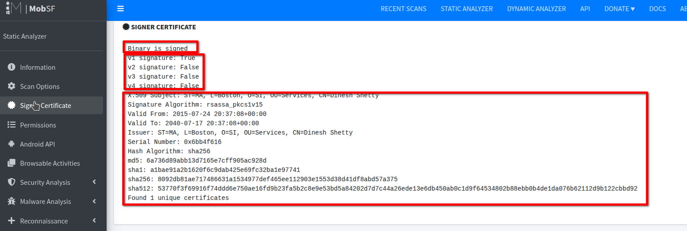

  Aquí obtenemos información de certificado de quien firma el paquete, así como detalles de la firma y certificado:
- Si el paquete está firmado.
- Firma de diferentes versiones app Android ([puedes ver maś información sobre firma de apps Android aquí](https://source.android.com/docs/security/features/apksigning?hl=es-419)
- Detalles de las firmas del paquete.

En nuestro caso vemos que sólo está verificada la versión


### Permisions


  En esta sección podemos ver los permisos solicitados por la aplicación a Android. Podemos ver en la siguiente tabla información sobre el permiso y su clasificación en normal o peligrosa

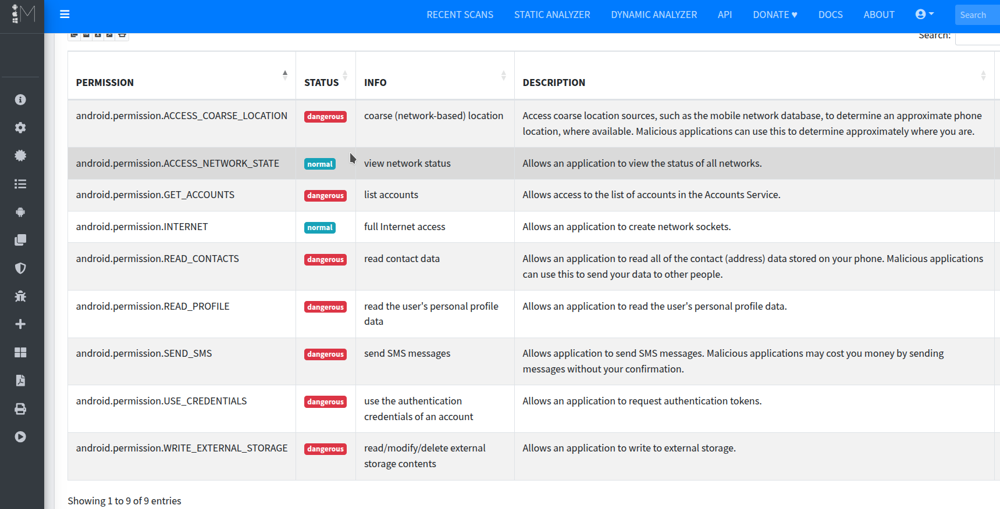

| PERMISO                                   | CLASIFICACIÓN | INFORMACIÓN                          | DESCRIPCIÓN                                                                                                                                                   |
|-------------------------------------------|----------------|---------------------------------------|---------------------------------------------------------------------------------------------------------------------------------------------------------------|
| android.permission.ACCESS_COARSE_LOCATION | peligroso       | ubicación aproximada (por red)        | Permite acceder a fuentes de ubicación aproximadas, como la red móvil, para determinar una ubicación estimada del dispositivo. Aplicaciones maliciosas pueden usar esto para saber dónde estás. |                  
| android.permission.ACCESS_NETWORK_STATE   | normal          | ver el estado de la red               | Permite a la aplicación ver el estado de todas las redes.                                                                                                     |                  
| android.permission.GET_ACCOUNTS           | peligroso       | listar cuentas                        | Permite acceder a la lista de cuentas en el servicio de cuentas del dispositivo.                                                                              |                  
| android.permission.INTERNET               | normal          | acceso completo a Internet            | Permite a la aplicación crear conexiones de red.                                                                                                              |                  
| android.permission.READ_CONTACTS          | peligroso       | leer datos de contactos               | Permite leer todos los datos de contactos almacenados en el dispositivo. Aplicaciones maliciosas pueden usar esto para enviar tus datos a terceros.          |                  
| android.permission.READ_PROFILE           | peligroso       | leer el perfil del usuario            | Permite leer los datos del perfil personal del usuario.                                                                                                       |                 
| android.permission.SEND_SMS               | peligroso       | enviar mensajes SMS                   | Permite enviar mensajes SMS. Aplicaciones maliciosas podrían hacerte incurrir en gastos enviando mensajes sin tu autorización.                               |                  
| android.permission.USE_CREDENTIALS        | peligroso       | usar credenciales de autenticación    | Permite solicitar tokens de autenticación.                                                                                                                    |                 
| android.permission.WRITE_EXTERNAL_STORAGE | peligroso       | leer/modificar/eliminar almacenamiento externo | Permite escribir en el almacenamiento externo.                                                                                                                 |       


### Security análisis

Aquí encontraremos información sobre los problemas de seguridad encontrados en diferentes secciones:
- Seguridad de la Red
- Análisis del Certificado
- Análisis del AndroidManifest.xml
- Análisis del código
- Análisis de los binarios.
- Análisis NIAP
- Análisis de los Archivos
- Análisis de la BBDD.

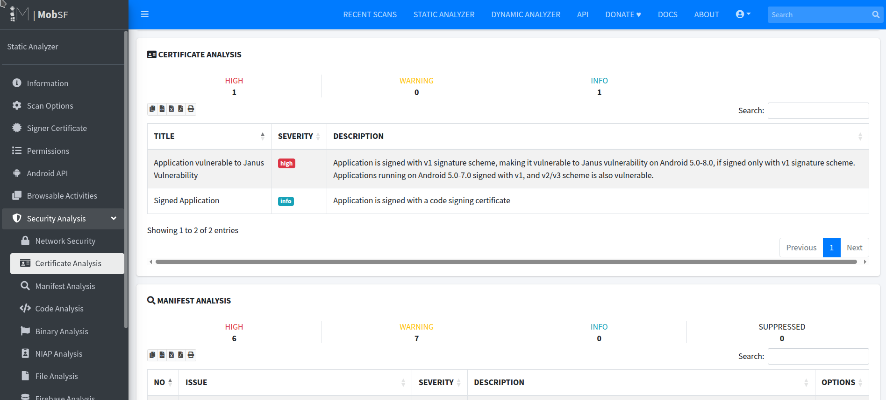


En el caso del **Análisis del certificado**, nos informa, que aunque está firmado, sólo tiene la firma V1, por lo que es vulnerable a la **Vulnerabilidad Janus** de Android,que permite la modificación de aplicaciones sin afectar su firma.

Si vemos el **Análisis del AndroidManifest** vemos 13 problemas de segurida, 6 de ellos con criticidad alta por ejemplo:

- La aplicación se puede instalar en una versión vulnerable de Android sin parches Android 4.0.3-4.0.4, [minSdk=15]
- Depuración Habilitada Para la Aplicación [android:debuggable=true]
- Actividad (com.android.insecurebankv2.PostLogin) es vulnerable a StrandHogg 2.0
- Actividad (com.android.insecurebankv2.PostLogin) no está protegido.[android:exported=true]

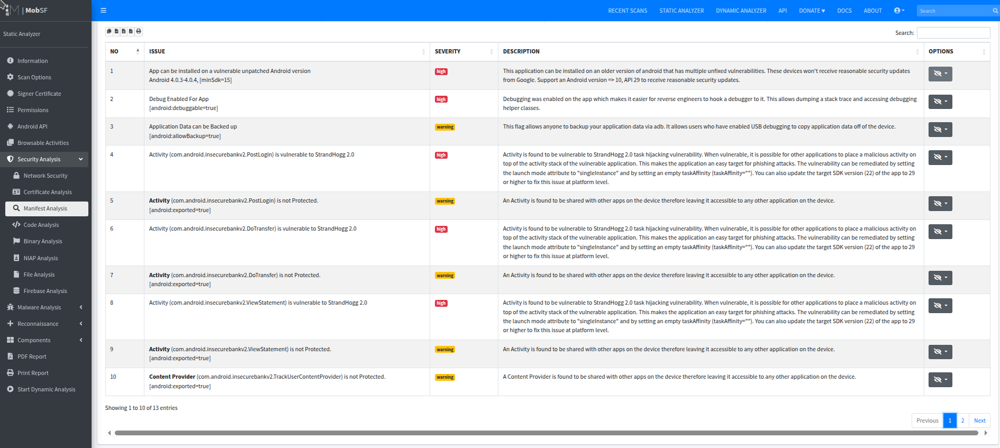


### Análisis de Malware

Dentro de este apartado podemos encontrar información variada. 
En nuestro caso, en la sección de **Abused Permisions** nos indica que abusamos de 7 permisos. Este abuso puede ser utilizado por diferente Malware.

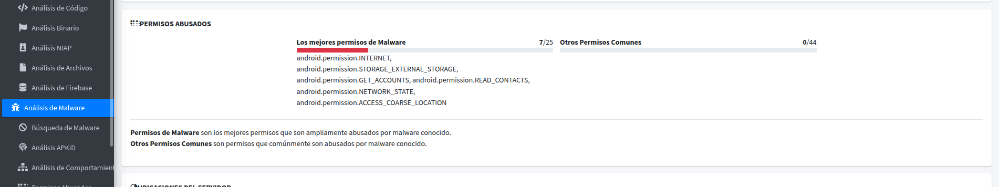


### Reconnaisasance

Aquí podemos ver información de :

- **URLs** con las URLs que van a recopilar información.
- **Haardcoded Secrets** Con los posibles contraseñas, tokens etc que aparecen en el código
- **Strings** con las cadenas de caracteres presentes en el código. Podemos visualizarlas.


### Components

Aquí podemos ver todos los componentes de la aplicación:

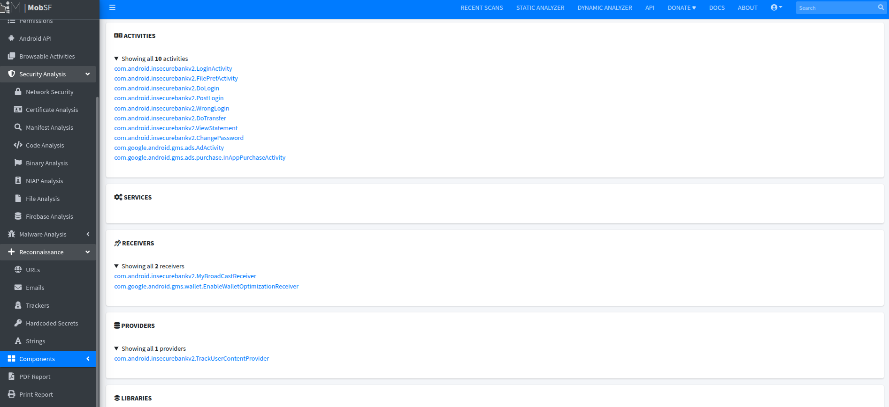

- **Activities**
- **Services**
- **Receivers**
- **Providers**
- **Librerias**
- **Archivos**


### Informe

Por último podemos visualizar o descargar el informe o reporte completo en formato pdf.

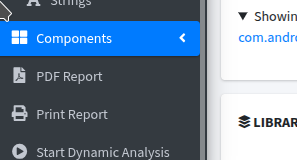


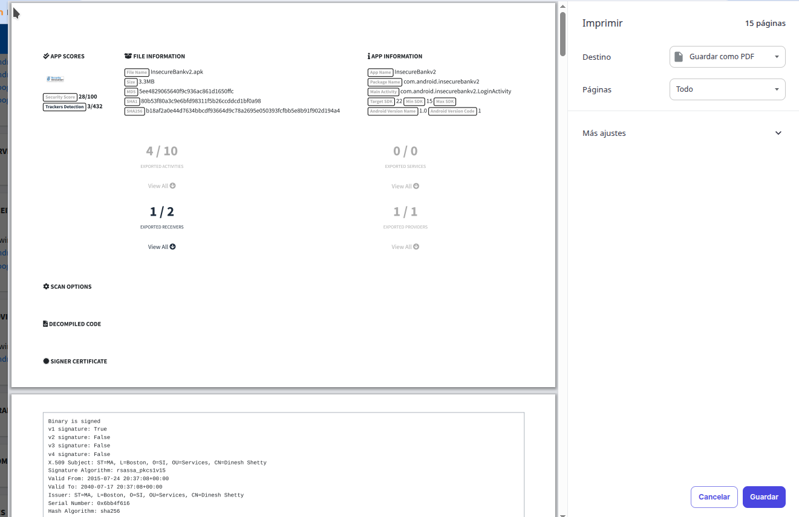

---

## 📘 Recursos adicionales

- [MobSF Documentation](https://mobsf.github.io/docs/)
- [OWASP Mobile Top 10](https://owasp.org/www-project-mobile-top-10/)
- [InsecureBankv2 GitHub](https://github.com/dineshshetty/Android-InsecureBankv2)
-
---

## ⚠️ Disclaimer

Este proyecto se proporciona solo con fines educativos. El uso de herramientas como MobSF debe realizarse únicamente sobre aplicaciones propias o con autorización explícita.

---

## Autor

Repositorio creado por José Miguel Medina, para prácticas de análisis de seguridad móvil en el contexto de PPS (Puesta en Producción Segura).
