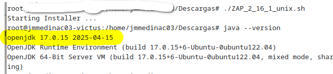
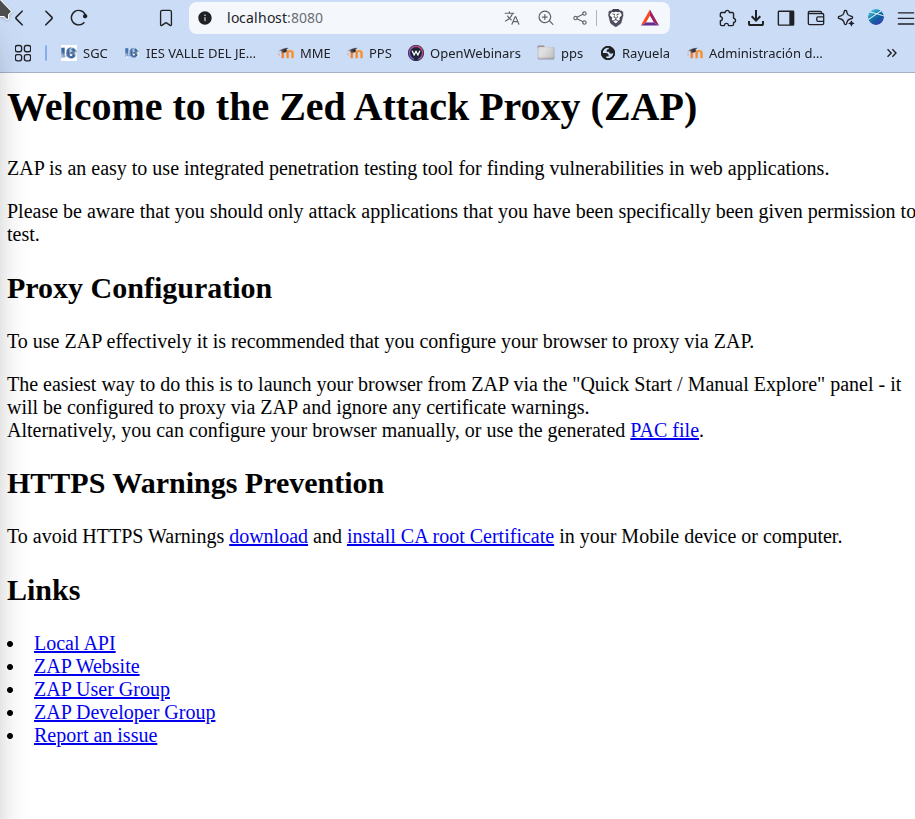

# 🔍 Actividad - Escaneo de Seguridad con OWASP ZAP

## 🧠 Tema
Identificación de vulnerabilidades con **OWASP ZAP**.

## 🎯 Objetivo
Usar **OWASP ZAP** para encontrar y corregir vulnerabilidades en una aplicación web.

## 🛠️ ¿Qué es OWASP ZAP?

**ZAP (Zed Attack Proxy)** es una herramienta de escaneo de seguridad dinámica (DAST) que detecta vulnerabilidades como:

- Cross-Site Scripting (XSS)
- Inyección SQL (SQLi)
- Configuraciones inseguras

🔗 Sitio oficial: [https://www.zaproxy.org/](https://www.zaproxy.org/)

---

## 📦 Instalación de OWASP ZAP

Aquí se explica el procedimiento para instalar `ZAP` en linux basados en Debian/Ubuntu. Para otros Sistemas Operativos consulte.

- Descargamos ZAP desde su página de descargas <https://www.zaproxy.org/download/>

En mi caso he descargado `Linux Installer` que descarga un archivo de instalación ´ZAP_2_16_1_unix.sh`.

- Verificar Java: Necesitamos tener al menos la versión 17 de java, por lo que comprobamos la versión de java:

```bash
sudo java --version
```


Si tienes versiones de java mas antiguas debes instalar una versión posterior a la 17.

- Instalamos `java 17`

```bash
sudo apt-get update
sudo apt-get upgrade
sudo apt install openjdk-17-jdk
sudo apt install openjdk-17-jre
sudo java --version
```

- Instalamos `ZAP`:
```bash
sudo chmod 755 ZAP_2_16_1_unix.sh
sudo ./ZAP_2_16_1_unix.sh
```
.
Se nos va a instalar como aplicación con nombre `ZAP`
### ✅ Verificar la instalación

```bash
zap.sh -daemon -port 8080 -host 127.0.0.1
```
Podemos acceder al proxy creado en:
```
http://localhost:8080/
```

Aquí además del proxy podemos encontrar guías rápidas, documentación, etc.



---

## 🚀 Ejecutar un escaneo contra una aplicación web

### Aplicación objetivo: OWASP Juice Shop

Pasos para lanzar el escaneo:

1. Abrir **OWASP ZAP** desde el menú de tu sistema operativo o desde el terminal con:

```bash
zap.sh
```
.
2. Ingresar la URL de la aplicación vulnerable:  
   `http://localhost:3000`
3. Seleccionar **"Escaneo Automático"** y ejecutar el análisis.

---

## 🛡️ Ejemplos de vulnerabilidades detectadas

- Reflected XSS:    `/search?q=<script>alert('XSS')</script>`

- Posible inyección SQL:  
  `/login`

---

## 🧰 Mitigación y Mejores Prácticas

- Revisar el informe generado por ZAP y corregir las vulnerabilidades.
- Automatizar escaneos en pipelines de **CI/CD** para prevenir fallos antes del despliegue.

---
## 🧰 OWASP ZAP CLI

### Instalación
```bash
sudo apt install zaproxy -y
```
Nikto puede programarse para ejecutarse automáticamente en un cronjob o script CI/CD.
Ejemplo de cronjob en Linux (ejecuta Nikto diariamente a las 2 AM):
### Escaneo rápido
```bash
zaproxy -cmd -quickurl http://localhost:4000 -quickout scan_result.html
```

---

## ⚙️ CI/CD con ZAP

### GitHub Actions
`.github/workflows/zap_scan.yml`:

```yaml
name: DAST Scan
on: push

jobs:
  zap_scan:
    runs-on: ubuntu-latest
    steps:
      - name: Instalar OWASP ZAP
        run: sudo apt-get install zaproxy -y

      - name: Ejecutar escaneo
        run: zaproxy -cmd -autorun zap_scan.yaml

      - name: Guardar reporte
        uses: actions/upload-artifact@v3
        with:
          name: ZAP-Report
          path: zap_report.html
```

`zap_scan.yaml`:
```yaml
jobs:
  - type: spider
    parameters:
      url: "http://localhost:4000"
      maxDuration: 2
  - type: activeScan
    parameters:
      url: "http://localhost:4000"
      recurse: true
      maxDuration: 5
  - type: report
    parameters:
      template: traditional-html
      reportFile: zap_report.html
      reportTitle: "ZAP Scan Report"
```

---

### GitLab CI/CD

`.gitlab-ci.yml`:
```yaml
stages:
  - dast

zap_scan:
  stage: dast
  image: owasp/zap2docker-stable
  script:
    - zap.sh -cmd -autorun zap_scan.yaml
  artifacts:
    paths:
      - zap_report.html
```

---

### Jenkins Declarativo

`Jenkinsfile`:
```groovy
pipeline {
  agent any
  stages {
    stage('Download OWASP ZAP') {
      steps {
        sh 'sudo apt-get install zaproxy -y'
      }
    }
    stage('Run OWASP ZAP Scan') {
      steps {
        sh 'zaproxy -cmd -autorun zap_scan.yaml'
      }
    }
    stage('Save Report') {
      steps {
        archiveArtifacts artifacts: 'zap_report.html', fingerprint: true
      }
    }
  }
}
```

---

## 📚 Créditos


> 📘 Esta actividad forma parte del módulo de análisis de seguridad en aplicaciones web.
