# Actividad - IniciacionKubernetes
Siguiendo el vídeo de Pelardo Nard sobre KUBERNETES De NOVATO a PRO!   https://youtu.be/DCoBcpOA7W4


Sigue el vídeo del canal de Pelardo Nard sobre <https://youtu.be/DCoBcpOA7W4>

- Si quieres, puedes clonar el repositorio de peladonerd para poder ver archivos de configuración.
Estos archivos están en la carpeta `kubernetes/35`. 

```bash
git clone https://github.com/pablokbs/peladonerd.git
cd  peladonerd/kubernetes/35/

```

- Comprueba si tienes kubectl instalado en tu equipo:

```bash
kubectl version --client=true
```
 

- Instala kubernetes kubectl (si no está instalado)

	- en windows 
		<https://kubernetes.io/es/docs/tasks/tools/included/install-kubectl-windows/>
	- en linux <https://kubernetes.io/es/docs/tasks/tools/included/install-kubectl-linux/> 

- Instalamos también `MiniKube`:
<https://minikube.sigs.k8s.io/docs/start/>

```bash
curl -LO https://storage.googleapis.com/minikube/releases/latest/minikube_latest_amd64.deb
sudo dpkg -i minikube_latest_amd64.deb
```
- Iniciamos `MiniKube`
```bash
minikube start
```
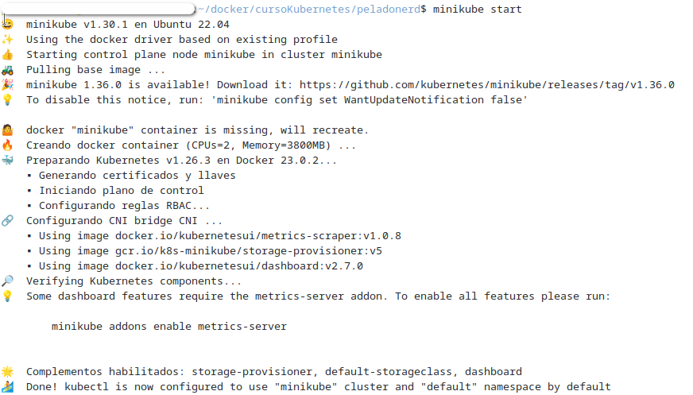

 Tendrás la siguiente estructura de archivos:

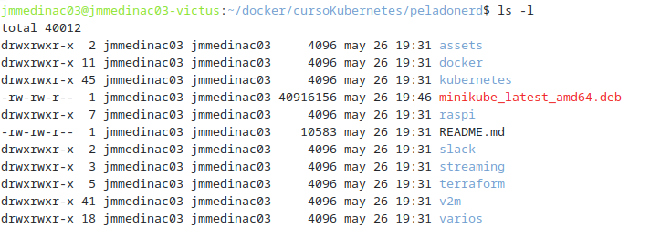

- Comprobamos estructura de nodos creados

```bash
kubectl get nodes
```
 


---

## Instalar Cluster de 3 nodos con MiniKube

En el video, `PedoNerd` utiliza un cluster con `Digital Ocean`. Nosotros vamos a intentar emularlo con `MiniKube`


Minikube tradicionalmente corre un solo nodo, pero puedes lanzar múltiples nodos (en la misma máquina virtual) con:

```bash
minikube start --nodes 3 -p multinodo
```

Esto crea un clúster con:

- 1 nodo de control (multinodo-m01)

- 2 nodos workers (multinodo-m02, multinodo-m03)

### 🔧 Paso a paso

1. Iniciar un clúster de 3 nodos
```bash
minikube start --nodes 3 -p multinodo
```

📝 -p multinodo es el nombre del perfil (puedes elegir otro).

2. Verifica los nodos
```bash
kubectl get nodes
```
Saldrá algo así:

```pgsql
NAME             STATUS   ROLES           AGE   VERSION
multinodo-m01    Ready    control-plane   1m    v1.XX.X
multinodo-m02    Ready    <none>          1m    v1.XX.X
multinodo-m03    Ready    <none>          1m    v1.XX.X
```

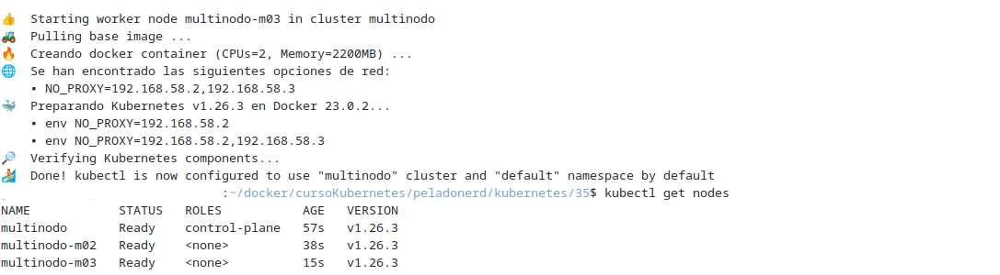


### Comprobación del perfil de Minikube

Podemos tener diferentes perfiles de MiniKube pero sólo uno activo.

-Para ver los perfiles que tenemos 
```bash
minikube profile list
```

- Para cambiar el perfil al multinodo que hemos creado:

```bash
minikube profile multinodo
```

Y ya debe de aparecer como activo.


## Uso de kubectl
- Para ver la lista de acciones o comandos posibles:

```bash
kubectl --help
``` 

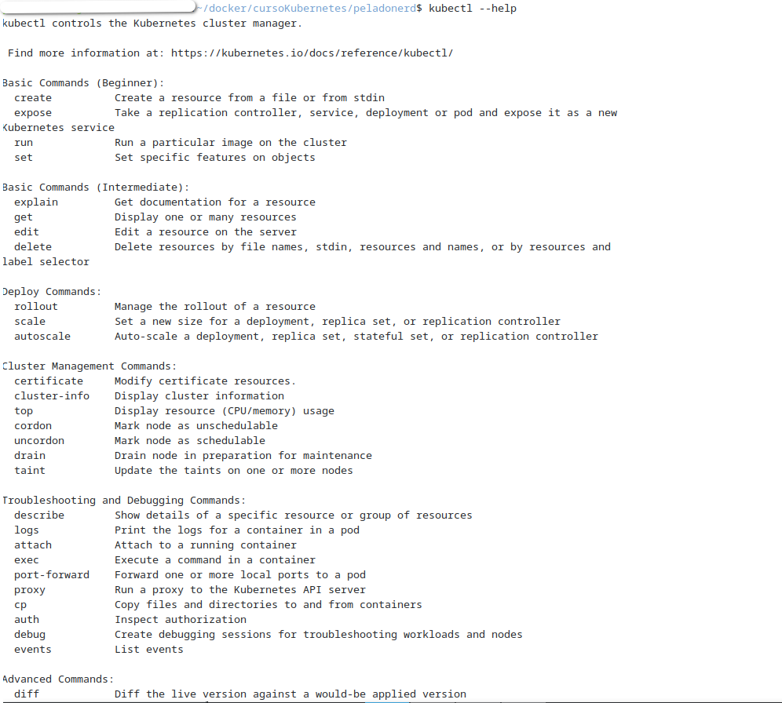

- Obtnemos configuración.
```bash
kubectl config get-contexts 
``` 


(min 20)

- Obtenemos los namespaces

```bash
kubectl get ns
``` 
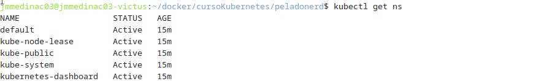

- Ver Pods

```bash
kubectl -n kube-system get pods
``` 
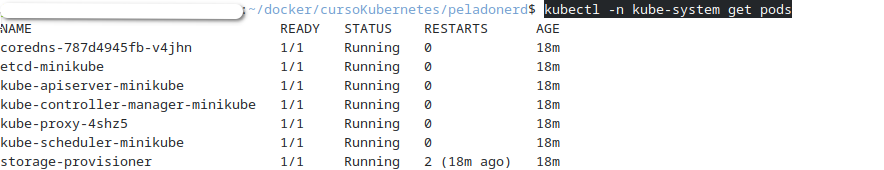

```bash
kubectl -n kube-system get pods -o wide
``` 

(min 24:30)
- Borramos un pod, en este caso el pod `proxy`, OJO¡¡¡ que  el número no coincide, pon el que tengas en tu equipo:

```bash
kubectl -n kube-system delete pod kube-proxy-4shz5 
``` 
Vemos como después de unos minutos volvemos a comprobar y se ha recreado un `pod proxy` nuevo:
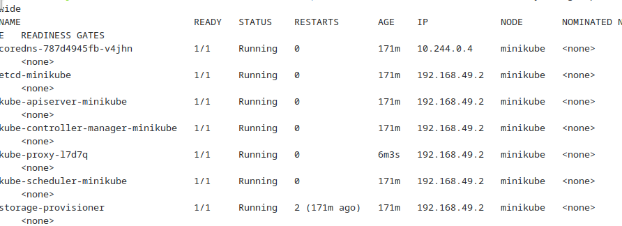
 En mi caso nos ha creado uno nuevo: `kube-proxy-l7d7q ` 

(min. 26)
Nos cambiamos a la carpeta `kubernetes/35` donde tenemos diferentes archivos de configuraciones.


´´´bash
cd kubernetes/35
```
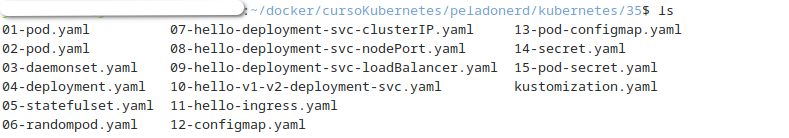

Para ver la configuración de un manifiesto de pods para `nginx`

archivo `01-pod.yaml`
```bash
cd kubernetes/35
nano 01-pod.yaml
```

 Para aplicar el manifiesto y crear el sistema:

```bash
kubectl apply -f 01-pod.yaml
kubectl get pods
```

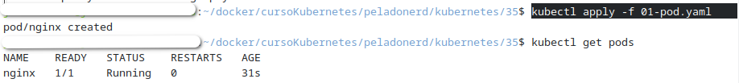

(min 28:55)
- Conectarnos a un terminal interactivo en la máquina nginx
```bash
kubectl exec -it nginx -- s
```
y por ejemplo vemos los procesos que están corriendo en la instancia de `nginx`.

```bash
ps fax
```
Para salir `exit`

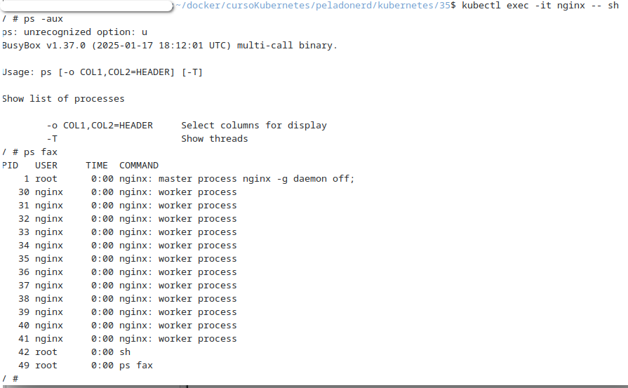

-  Comprobamos `pods` que tenemos, matamos proceso y vemos que no se genera de nuevo ya que no hemos creado configuración para ello.

```bash
kubectl get pods
kubectl delet pod nginx
```

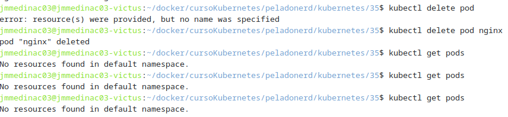

(min 30:25)
- Ver configuración de pod02.
archivo `01-pod.yaml`

```bash
nano 02-pod.yaml
```

 Para aplicar el manifiesto y crear el sistema:
```bash
kubectl apply -f 02-pod.yaml
kubectl get pods -o yaml

```
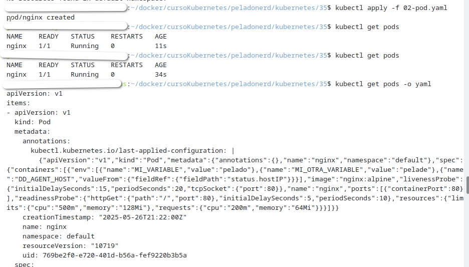

- borrar pods nginx
```bash
kubectl delete pod nginx
```

---

## Deployment

(min 40:40)

vemos el archivo del `deployment`

```bash
nano 04-deployment.yaml
```

```bash
nano 04-deployment.yaml.
kubectl apply -f 04-deployment.yaml.
kubectl get pods 
```
kubectl get pods 
```
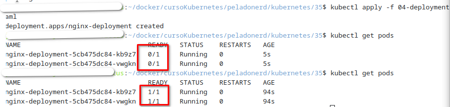

```bash
nano 04-deployment.yaml.
kubectl get pods 
```

- Borramos uno de los dos pods, para ver como `kubernetes` lo levanta. ¡¡¡OJO¡¡¡ que el tuyo tiene otro `hash`
```bash
kubectl delete pod nginx-deployment-5cb475dc84-kb9z7 
kubectl get pods 
```

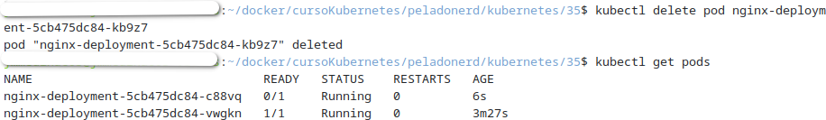

- Borramos el `Deployment`
```bash
kubectl get delete -f 04-deployment.yaml.
```

---

## Daemon Set

(min 43:00)

```bash
nano 03-daemonset.yaml
kubectl apply -f 03-daemonset.yaml
kubectl get pods -o wide `
```
- Borramos uno de los dos pods, para ver como `kubernetes` lo levanta. ¡¡¡OJO¡¡¡ que el tuyo tiene otro `hash`
```bash
kubectl delete pod nginx-deployment-5cb475dc84-kb9z7 
kubectl get pods 
```
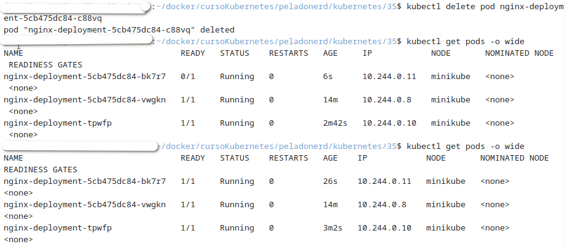

```bash
nano 03-daemonset.yaml.
kubectl get pods 
```
- Borramos el `DaemonSet`
```bash
kubectl get delete -f 03-daemonset.yaml.
```
-

---

## State Full Set

(min 46:00)

En el tutorial ve los volumenes con el `Template` `StorageClass` de `Digital Ocean` nosotros vamos a utilizar el `storageClass` `standard`.

** Adaptación de StatefulSet para Minikube**

Este punto explica cómo adaptar un `StatefulSet` de Kubernetes diseñado para DigitalOcean a un entorno local usando Minikube.

El archivo original `05-statefulset.yaml` utiliza un `StorageClass` llamado `do-block-storage` que es exclusivo de DigitalOcean, y por tanto no está disponible en Minikube.

Debemos asegurarnos que Minikube tiene el provisioner habilitado para crear volúmenes dinámicamente, por lo que puedes ejecutar este comando para ver qué StorageClass tienes y si tiene un PROVISIONER válido:

```bash
kubectl get storageclass
```
Y luego:

```bash
kubectl describe storageclass standard
```
Deberías ver algo como:

`Provisioner: k8s.io/minikube-hostpath`

Si has intentado ejecutar el `05-statefulset.yaml` debes de borrar el `volumen creado`

```bash
kubectl delete pvc csi-pvc-my-csi-app-set-0 
```
Minikube viene con un `StorageClass` por defecto llamado `standard`, por lo tanto debemos cambiar el `do-block-storage` por `standard`

1. Cambiar el `Storage` en  `05-statefulset.yaml`. Utilizamos el comando de `bash` `sed`.

```bash
sed -i 's/storageClassName: do-block-storage/storageClassName: standard/' 05-statefulset.yaml
```

2. Aplica el manifiesto:

```bash
kubectl apply -f 05-statefulset.yaml
```

- Vemos los datos del pod con `describe`

```bash
kubectl describe pod my-csi-app-set-0 
```

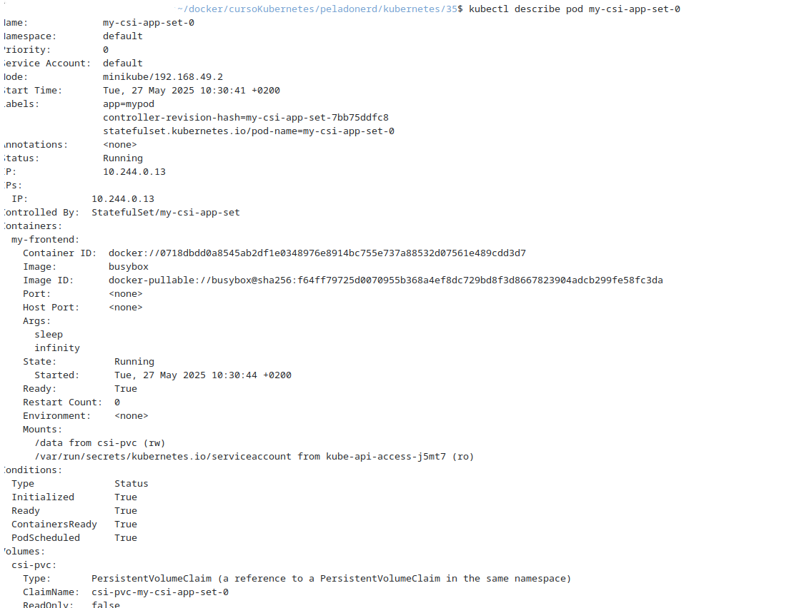

 y vemos también los eventos de pod 

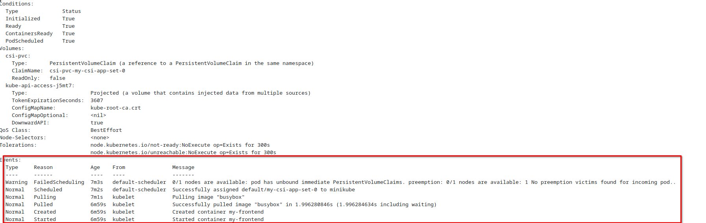


- Verificar el resultado

Puedes comprobar el estado de los pods y volúmenes con:

```bash
kubectl get pods
kubectl get pvc
kubectl get pv
```
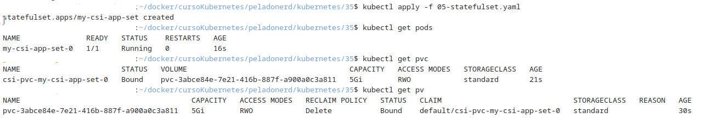

- verificar datos del ` pvc`

```bash
kubectl describe pvc csi-pvc-my-csi-app-set-0 
```
- Comprobamos estado de `statatefullset`

```bash
kubectl get sts
```
- borramos el `statefullset`
```bash
 kubectl delete sts  my-csi-app-set 
```
- Se ha borrado el `sts` pero no el volumen asociado. Comprobamos la existencia de pvc
```bash
kubectl get pvc
```
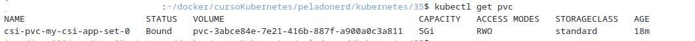

- Ahora podemos Borrar el volumen creado y comprobar que se ha borrado
```bash
kubectl delete pvc csi-pvc-my-csi-app-set-0 
kubectl get pvc
```
---

##Servicio Cluster IP (Servicio por defecto)

(min 55:45 )

- vemos `el randompod`
```bash
cat 06-randompod.yaml 
```
y lo ejecutamos:
```bash
kubectl apply -f 06-randompod.yaml  
```

- Vemos el `deployment` `07-hello-deployment-svc-clusterIP.yaml` 

```bash
nano 07-hello-deployment-svc-clusterIP.yaml 
```
- Ejecutamos el `deployment` y comprobamos la creación de todos los elementos existentes:

```bash
kubectl apply -f 07-hello-deployment-svc-clusterIP.yaml
kubectl get all
```
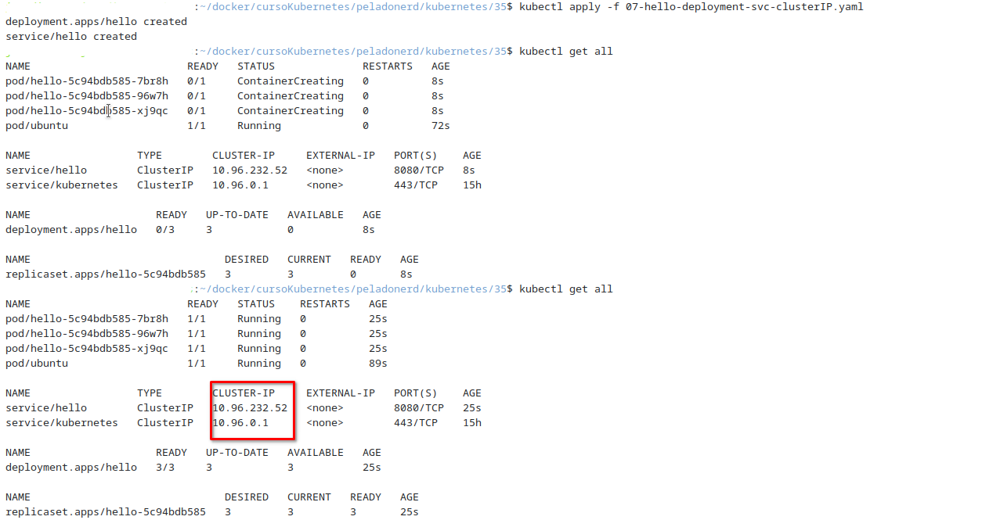

- Vemos información sobre el `service hello`

```bash
kubectl describe svc hello 
```

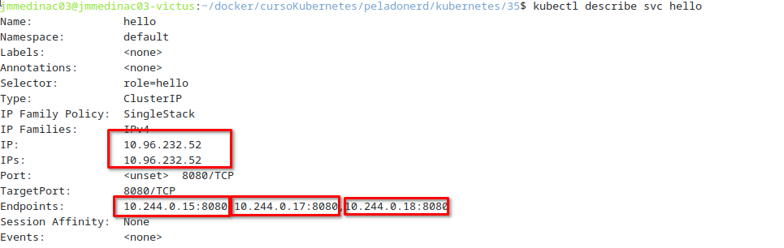


- Como otras veces, podemos probar a matar uno de ellos y comprobar como se regenera. ¡¡¡OJO que debes de sustituir el hash por uno tuyo¡¡¡
```bash
kubectl delete pod hello-5c94bdb585-96w7h
kubectl describe svc hello
```
Vemos como ha cambiado la ip de uno de ellos 

**Comprobación de red**

(min 1:00:03)
- accedemos al pod ubuntu
```bash
kubectl exec -it ubuntu -- sh
```
- Instalamos `iputils-ping` y `curl`, ya que no están instalados:

```bash
apt update
apt install iputils
apt install curl
```
- Y realizamos un ping a uno de
```bash
ping hello
```
- Y hacemos un curl para descargar el contenido de la página de inicio de <http://hello:8080>
```bash
curl http://hello:8080
```
Vemos como si hacemos varias peticiones, nos responden diferentes máquinas:

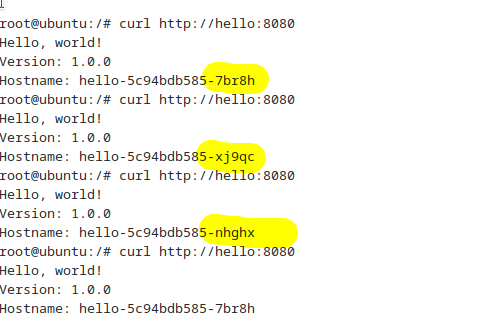


-  Salimos del contenedor y ubuntu y borramos el `statefullset`
```bash
exit
```
```bash
kubectl delete -f 07-hello-deployment-svc-clusterIP.yaml 
```

---

## Servicio nodeport
(min 1:04:40)

Vemos el archivo del manifiesto:

```bash
nano 08-hello-deployment-svc-nodePort.yaml 
```
```bash
kubectl apply -f 08-hello-deployment-svc-nodePort.yaml 
kubectl get all
kubectl get nodes -o wide
```
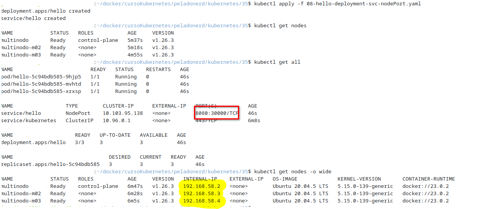
- Accedemos a las diferentes máquinas por el puerto 30000. ¡¡¡OJO¡¡¡ Deberás cambiar las ips por las tuyas¡¡¡
```bash
curl http://192.168.58.2:30000
curl http://192.168.58.3:30000
curl http://192.168.58.4:30000
```

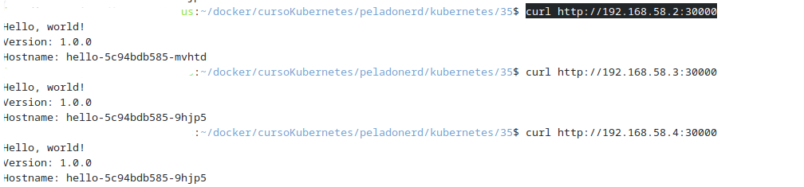
- Elimiando el `deployment`

```bash
kubectl -f 08-hello-deployment-svc-nodePort.yaml 
```

## Servicio loadbalancer

(min 1:07:30)

Vemos el archivo del manifiesto:

```bash
nano 09-hello-deployment-svc-loadBalancer.yaml  
```

Este servicio de `Digital Ocean` nos va a proporcionar una ip pública para acceder a los servicios.
Minikube no tiene un provisionador de LoadBalancer real como los cloud providers.

- Primero cambiamos el manifest:

```bash
sed -i '' 's/type: NodePort/type: LoadBalancer/' 09-hello-deployment-svc-loadBalancer.yaml
```

### ¿Cómo simular un LoadBalancer en Minikube?

- Usar minikube service (la más sencilla)
Minikube tiene una utilidad para exponer servicios NodePort fácilmente en el navegador o abrir un túnel:

- Abrimos un tunnel de minikube

```bash
minikube tunnel
```
El comando minikube tunnel debe estar activo en segundo plano o en una terminal separada. No es instantáneo.

- Si lo cierras, el EXTERNAL-IP volverá a <pending>.

- Déjalo ejecutándose en una terminal. Deja esa terminal abierta y no interrumpas el proceso.


- Ejecutamos el `deployment`
```bash
kubectl apply -f 09-hello-deployment-svc-loadBalancer.yaml 
```

Comprobamos con:
```bash
kubectl get all
minikube service hello
```

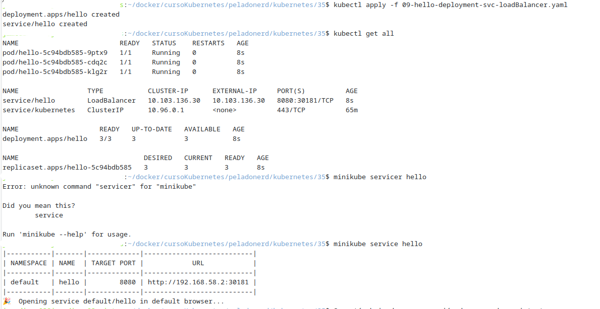

`minikube service hello`: Este comando busca el servicio hello, por lo que se nos muestra una ip y un puerto:

Abre tu navegador con la IP y puerto correspondiente

Simula un "external IP"

También puedes obtener solo la URL sin abrir el navegador:

bash```
minikube service hello --url
```
Nos devuelve `http://192.168.58.2:30181/` (en mi caso).

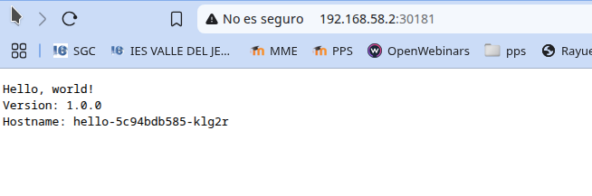

- Podemos ver más información sobre `nodos` y `servicio`.

```bash
kubectl get nodes -o wide
kubectl get svc
```
Hagamos un curl también a la dirección del servicio:

```bash
curl http://10.103.136.30:8080/
curl http://10.103.136.30:8080/
curl http://10.103.136.30:8080/
curl http://10.103.136.30:8080/
```
Y vemos como está balanceando las peticiones.

Paramos el deployment:
- Interrumpimos el `minikube tunnel` con `ctrl+c` en el terminal donde se estuviera ejecutando  
- Paramos deployment:

```bash
kubectl delete -f 09-hello-deployment-svc-loadBalancer.yaml 
```

## Ingress: Tráfico basado en rutas.

 (min 1:09:50)

La explicación sobre `ingress` la hace basado en los servicios de `Digital Ocean` nosotros vamos a realizarlo con `MiniKube`

### Activar Ingress en Minikube

Por defecto `ìngress` no viene en `minikube` pero lo podemos habilitar gracias a los plugins:

```bash
minikube addons enable ingress
kubectl get pods -n ingress-nginx

```
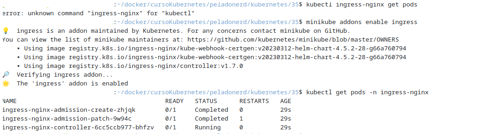


- En ingress también se utiliza internamente un `load balancer` por lo tanto tenemos que abrir nuevamente el tunnel de `MiniKube`

```bash
minikube tunnel
```

Recuerda no cerrar ese terminal para dejarlo en segundo plano.
### Seguimos con los servicios

- Vemos el manifiesto que contiene el donde crearemos dos servicios `v1` y `v2`

```bash
nano 10-hello-v1-v2-deployment-svc.yaml 
```
- Ejecutamos el `deployment` y comprobamos la creación de todos los elementos existentes:
```bash
kubectl apply -f 10-hello-v1-v2-deployment-svc.yaml 
kubectl get all
```
Vemos que se han creado 6 contenedores y dos servicios, el `v1` y el `v2`.


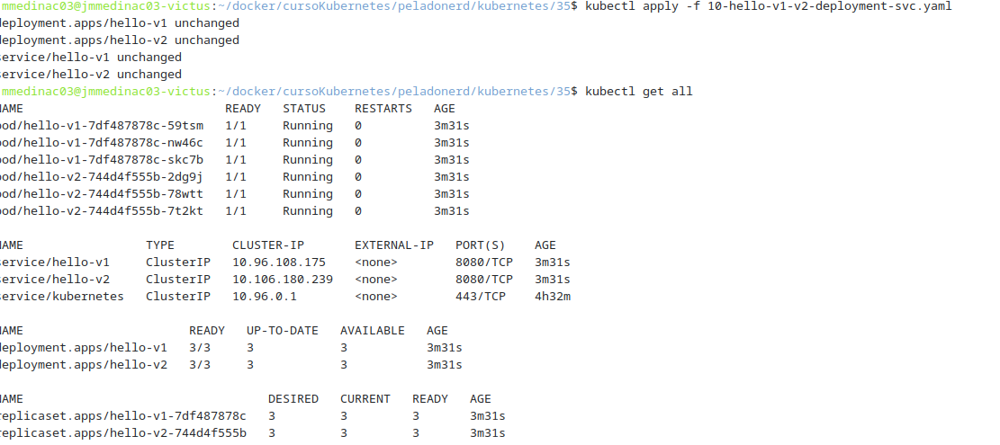

- Vemos el manifiesto que contiene el `ingress`

```bash
nano 11-hello-ingress.yaml  
```

- Ejecutamos el `deployment` y comprobamos la creación de todos los elementos existentes:
```bash
kubectl apply -f 11-hello-ingress.yaml 
kubectl get ingress
```


Vemos que se ha creado el ingress `hello-app`

Aquí no se nos va a mostrar la `ip externa`, pero la podemos obtener con:

```bash
minikube ip
```

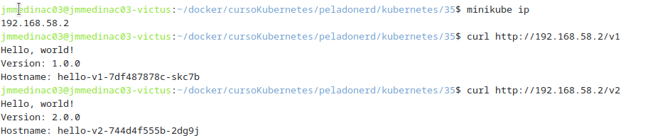

- Además en la captura podemos observar cómo dependiendo de si queremos ir a `v1` o `v2`, el `ingress` nos redirigirá a un nodo u otro
```bash
curl http://192.168.58.2/v2
curl http://192.168.58.2/v1

```
Podemos ver información de los servicions `ingress` con 

```bash
kubectl -n ingress-nginx get svc
```

### Eliminamos nuestro deployment
```bash
kubectl delete -f 11-hello-ingress.yaml 
kubectl delete -f 10-hello-v1-v2-deployment-svc.yaml 
```


## Configmap

(min 1:18:43)
- Vemos el manifiesto de `configmap` y el de `pod` que vamos a usar:
```bash
nano 12-configmap.yaml 
nano 13-pod-configmap.yaml
```

- Aplicamos los dos comprobamos los `pods`

```bash
kubectl apply -f 12-configmap.yaml 
kubectl apply -f 13-pod-configmap.yaml 
kubectl get pods
```

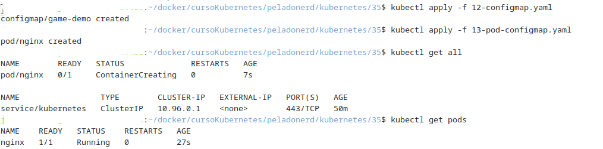

- Nos conectamos al pod `nginx`

```bash
kubectl exec -it nginx -- sh
```
- Para ver la variables de entorno y ver como tenemos la variable

```bash
env
ls /config
cat /config/game.properties
```
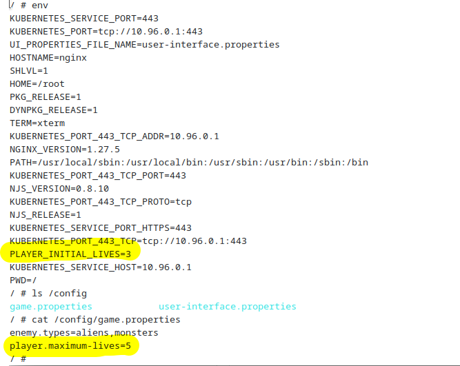

- Eliminamos el `deployment`:

```bash
kubectl delete -f 12-configmap.yaml 
kubectl delete -f 13-pod-configmap.yaml 
```

---

## Secrets-

(min 1:21:40)
- Vemos el manifiesto de `configmap` y el de `pod` que vamos a usar:
```bash
nano 14-secret.yaml  
nano 15-pod-secret.yaml 
```

- Aplicamos los dos comprobamos los `pods`

```bash
kubectl apply -f 14-secret.yaml 
kubectl apply -f 15-pod-secret.yaml 

kubectl get pods
```


- Nos conectamos al pod `nginx`

```bash
kubectl exec -it nginx -- sh
```
- Para ver la variables de entorno y ver como tenemos la variable

```bash
env
```
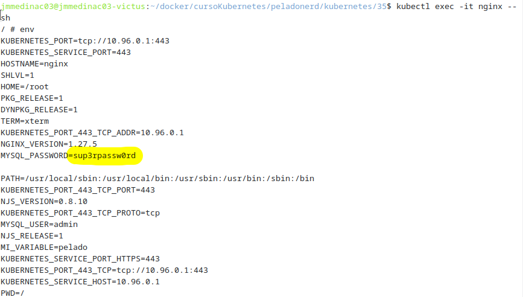

Vemos como nos aparece la contraseña en claro

- Elimiando el `deployment`

```bash
kubectl delete -f 14-secret.yaml  
kubectl delete -f 15-pod-secret.yaml 
```

---

## Customization

(min 1:25:15)
Para realizar esa `kustomización` tenemos que instalar `Kustomize` 
Es una herramienta de gestión de configuración nativa de Kubernetes, que permite personalizar archivos YAML sin duplicarlos. Kubernetes la integra desde kubectl v1.14+, pero también puedes usarla como comando separado.

- Instalamos `kustomize`

```bash
snap install kustomize
```

- Vemos el manifiesto de `configmap` y el de `pod` que vamos a usar:
```bash
nano kustomization.yaml 
```

- Creamos el `deployment`

```bash
kustomize build . 
```

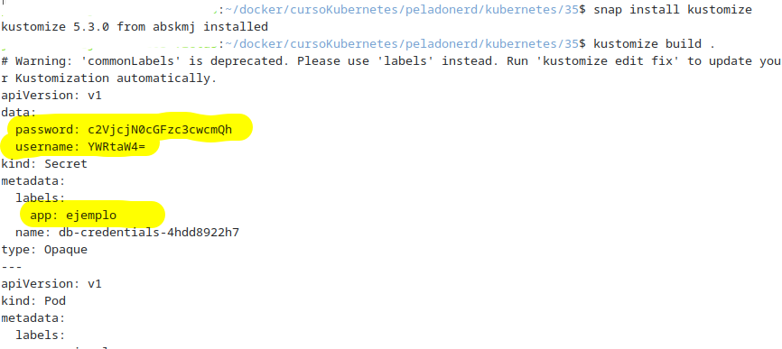

- Si queremos ejecutarlo y levantarlo:


```bash
kustomize build . | kubectl apply -f -
```

- Elimiando el `deployment`

```bash
kubectl delete pods nginx
```

---
## Stern
Puedes encontrar información en la página del desarrollador:
<https://github.com/stern/stern>

## 🧽 Dejando todo "niquelao"

Para borrar el clúster luego:
```bash
minikube delete -p multinodo
```


